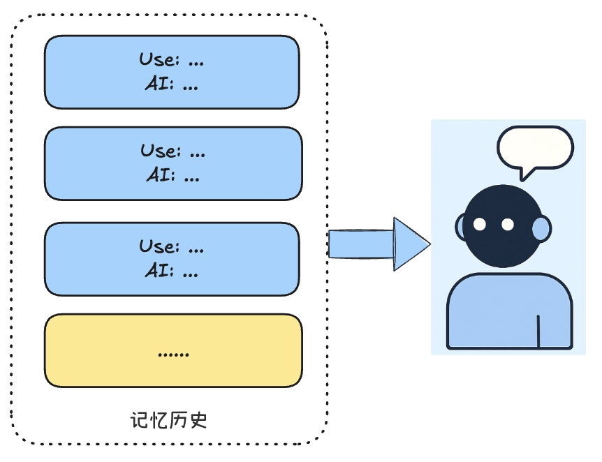
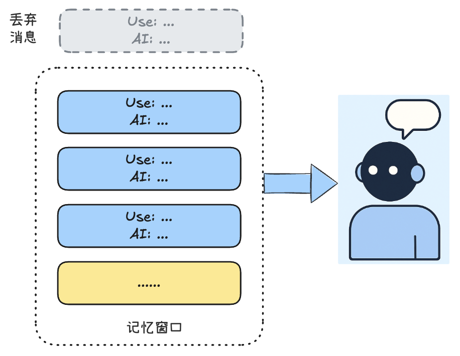
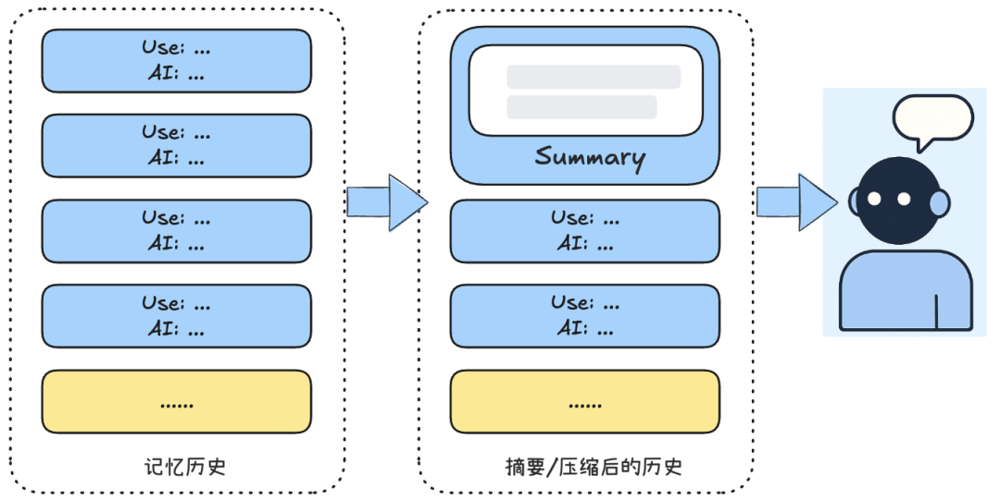
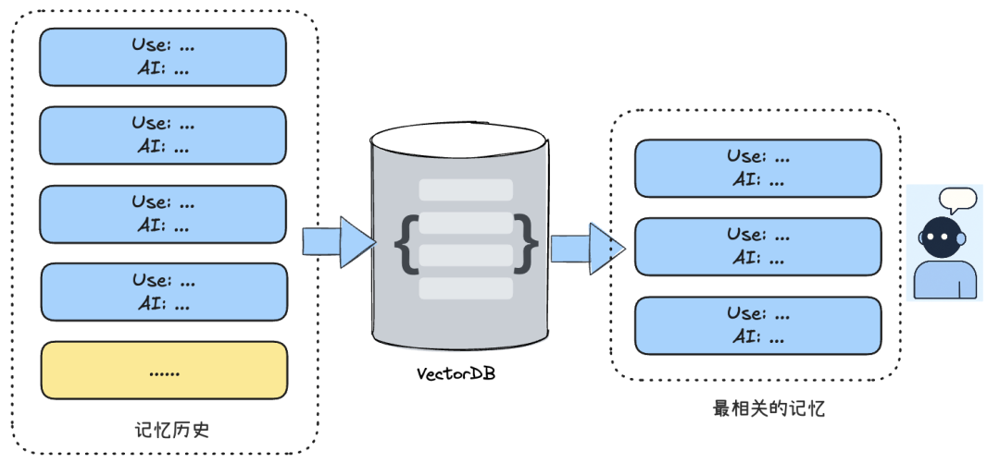
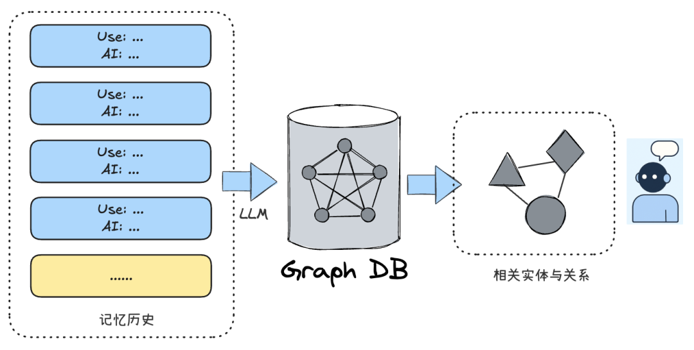
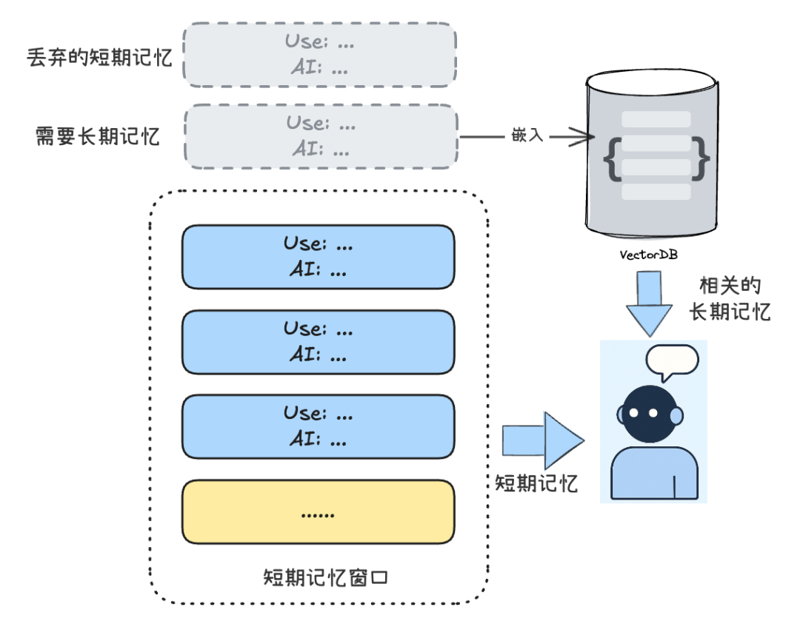
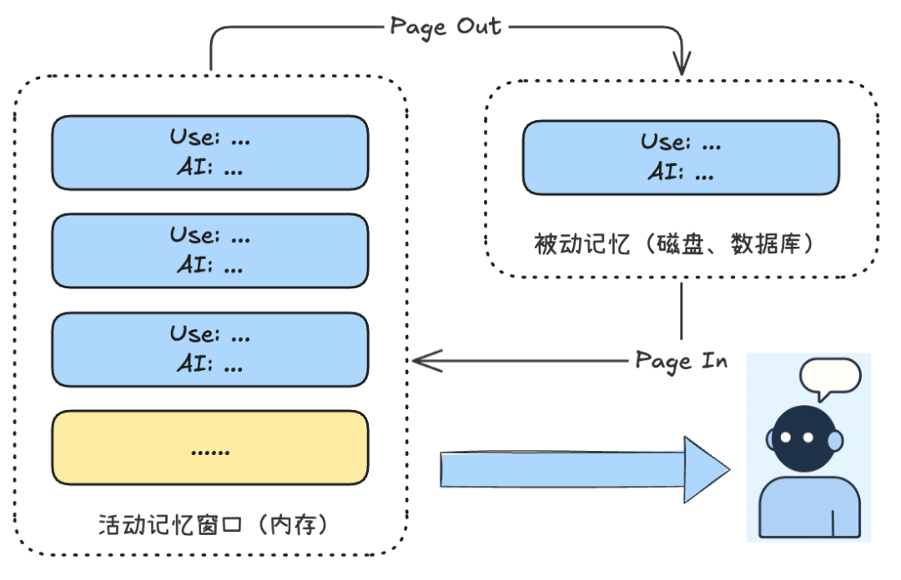
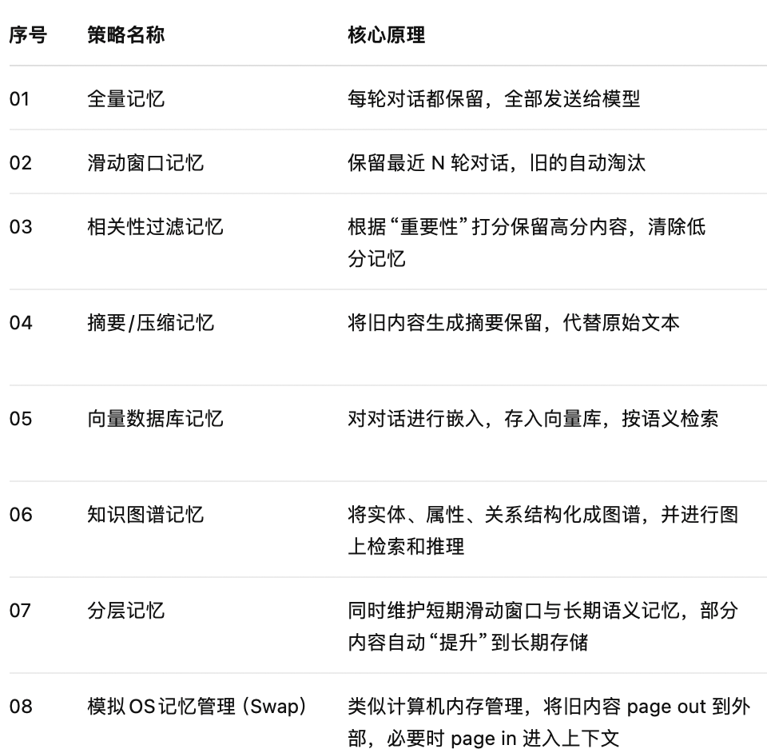

#  一文全解析：AI 智能体 8 种常见的记忆（Memory）策略与技术实现  
 Datawhale   2025-08-11 22:32  
  
记忆（Memory）是AI智能体必备的能力之一。随着对话轮数与深度的增加，如何让AI智能体“记住”过去的上下文，是实现精准理解与个性化AI系统的关键。由于LLM存在上下文长度限制，如果不对记忆进行优化  
，  
长对话很容易带来两个问题：  
- 遗忘早期信息，导致理解偏差  
  
- 过度消耗大量计算资源与成本  
  
  
尽管有Mem0等优秀的开源框架，我们仍然有必要从原理上来理解不同的Memory策略，这有助于在项目中评估、选择与实现最合适的Memory方案。本文将剖析8种常见的AI记忆方案，分析其原理、特点和场景，并用模拟代码帮助理解。  
1. 全量记忆：不遗忘任何内容  
  
1. 滑动窗口：固定长度的截断  
  
1. 相关性过滤：遗忘次要信息  
  
1. 摘要/压缩：提炼关键信息  
  
1. 向量数据库：语义检索记忆  
  
1. 知识图谱：结构化记忆  
  
1. 分层记忆：短期与长期结合  
  
1. 类OS内存管理：模拟Swap原理  
  
  
**01**  
  
全量记忆：不遗忘任何内容  
  
全量记忆模式是最基础、最容易实现的记忆策略。其核心理念是不遗忘任何历史上下文  
，每轮对话都将用户输入与智能体响应完整记录，并在后续请求中将全部历史上下文一并发送  
给LLM进行推理。  
  
  
  
**【基本实现】**  
  
**将每轮对话按顺序累积在“对话历史”中，每次回复时都将完整历史作为上下文提供给模型。以下是简单的模拟代码：**  
  
  
  
  
  
为了帮助理解，本文针对每种模式简单的模拟实现基本的“添加记忆”与“检索记忆”的过程。实际应用需自行完善。  
  
  
  
  
```
history = []

def add_message(user_input, ai_response):
    turn = {
        "user": user_input,
        "assistant": ai_response
    }
    history.append(turn)

def get_context(query):
    return concat_all(history)  
```  
  
【特点分析】  
  
优点：  
实现简单，无需复杂算法；完整保留了所有细节，信息不丢失。****  
  
**缺点：**  
   
对话稍长可能会触发上下文长度上限，模型需要处理越来越多的文本，导致响应变慢且成本升高。一旦超过模型上下文窗口，早期内容不得不被截断，重要信息可能丢失。此外，长期保留大量不相关旧信息也可能干扰模型判断。  
  
【适合场景】  
  
 仅适用于对话轮次很少或者内容短的场景，比如简单QA或一次性问答。在这些情况下，全量记忆确保即使用户提及之前的话题，智能体也不会遗漏。但很显然在大多数实际应用中，这种策略不可持续。  
  
  
**02**  
  
滑动窗口：固定长度记忆  
  
针对全量记忆的弊端，最简单的改进是**限制记忆长度：**  
人类对话中，我们往往只关注最近的信息，旧话题慢慢就淡忘了。滑动窗口策略正是模仿这种特性：只保留最近的若干轮对话，将更早的内容遗忘，以控制上下文长度。  
  
  
  
  
【基本原理】  
  
维护一个固定大小的队列作为对话窗口，每当有新对话加入时，如果超过窗口大小，就从队首移除最旧的一条。模拟实现代码如下：  
```
memory = []
WINDOW_SIZE = 3  # 最多保留 3 轮完整对话

def add_message(user_input, ai_response):
    turn = {
        "user": user_input,
        "assistant": ai_response
    }
    memory.append(turn)

    if len(memory) > WINDOW_SIZE:
        memory.pop(0)  # 移除最早一轮问答

def get_context(query):
    return concat_all(memory)  # 返回最近几轮对话 
```  
  
  
这样，无论对话多长，传给模型的上下文始终是最近的N次交互记录 。窗口向前滑动，新进旧出，实现对过往对话的截断。  
  
  
【特点分析】****  
  
**优点：**  
   
实现非常简单，开销低，不需要引入外部存储；确保模型上下文始终在设定大小内，响应速度和成本相对可控 。****  
  
**缺点：****健忘性强**  
，一旦窗口滑过，旧信息就永久丢失，无法支持真正的长期记忆 。如果用户稍后又提及早前内容，智能体因已遗忘就无法关联。此外窗口大小也难以抉择：太小会过早遗忘历史，太大又降低了节省上下文的意义。  
  
【适用场景】  
  
滑动窗口适用于**短对话场景或对历史依赖不强的任务。例如FAQ助手、简单闲聊机器人等，不需要长久记住早先话题 。本质上你需要考虑取舍：通过遗忘来换取性能和成本，但不适合需要长程依赖的对话。**  
  
  
**03**  
  
相关性过滤：遗忘次要信息  
  
人类会选择性记忆，对无关紧要的事很快忘掉。类似地，智能体的记忆也可以有所取舍**：优先保留重要信息，丢弃无用细节。相关性过滤策略就是****基于信息的重要程度来管理记忆**  
，而不是简单的抛弃旧记忆。  
  
  
  
【基本原理】  
  
系统为每条记忆分配一个“重要性”或“相关性”评分（Score），根据评分高低决定保留或清除。当新信息进入，导致容量超限时，自动删除评分最低的记忆 。  
  
评分可以依据多种因素：与当前对话主题的相关程度、最近被提及的频率、信息本身的重要度（例如包含用户关键偏好的句子打高分）等。  
  
实现时，可用一个列表或优先队列按分值排序。模拟如下：  
```
memory = []
MAX_ITEMS = 25

def add_message(user_input, ai_response):
    item = {
        "user": user_input,
        "assistant": ai_response,
        "score": evaluate(user_input, ai_response),
    }
    memory.append(item)

    if len(memory) > MAX_ITEMS:
        # 找出得分最低的项
        to_remove = min(memory, key=lambda x: x["score"])
        memory.remove(to_remove)

def get_context(query):
    # 返回按对话顺序排列的高分记忆
    return concat_all(sorted(memory, key=lambda x: x["order"]))
```  
  
【特点分析】  
  
**优点：**  
   
保证**关键知识不会遗忘**  
，因为重要内容打分更高。相比盲目的窗口截断，这种策略更“智能”，能腾出空间的同时尽量不丢关键信息。****  
  
**缺点：**  
 如何准确评估“重要性”是难点，可能需要额外模型计算语义相关度或预定义规则。评分机制不完善时，可能误判重要性，删错记忆。此外，它不像滑动窗口那样可预测，会给调试和理解上带来复杂性。  
  
【适用场景】  
  
**适合信息密集且需要筛选**  
的场景，如知识型对话机器人或研究助理工具。在这些应用中，用户提供的大量信息需要智能体加以取舍。例如：一个智能医学助手从患者冗长描述中挑出病史要点存储。  
  
  
  
  
**04**  
  
摘要/压缩：提炼关键信息  
  
有没有办法在不丢失重要信息的前提下缩短对话长度？摘要  
策略由此诞生。其动机是像人类做笔记一样，将冗长的对话内容去除无用的信息（寒暄、闲聊、重复信息等），浓缩成关键要点（事实、关键数据、兴趣爱好等）保存 。这样既保留了核心信息，又能大量节省上下文窗口空间，缓解记忆无限增长的问题。  
  
在实际实现中，可以结合滑动窗口策略：超出窗口的对话才进行摘要与压缩。  
  
  
  
  
【基本原理】  
  
在对话过程中定期将**较早的对话内容生成摘要与压缩**  
，并用这个摘要代替原始详细内容存入记忆。摘要可以由一个LLM生成。例如，每当对话超过预定长度（窗口大小）时，把最早的几轮对话拿出来总结，模拟如下：  
```
memory = []
summary = None
MAX_LEN = 10  # 最多保留 10 轮问答

def add_message(user_input, ai_response):
    turn = {
        "user": user_input,
        "assistant": ai_response
    }
    memory.append(turn)

    if len(memory) > MAX_LEN:
        old_turns = memory[:-5]
        summary_text = summarize(old_turns)
        summary = merge(summary, summary_text)
        memory.clear()
        memory.append({"summary": summary})
        memory.extend(memory[-5:])

def get_context(query):
    return concat_all(memory)  # 返回摘要 + 最近对话轮
```  
  
  
这里示意了一  
种**运行摘要**  
的机制：持续累计和更新一个摘要来代表早期的对话历史。每当记忆长度超标，就把早期内容做摘要和压缩，再与后续对话共同作为新的上下文 。这样，模型上下文始终包含“近期对话 + 旧对话摘要”。  
  
【特点分析】  
  
**优点：**  
   
大幅节省上下文长度，**长期记忆能力强**  
——理论上，通过不断摘要，早期信息的要点可一直保留 。同时，摘要内容精炼，有助于模型聚焦关键信息。****  
  
**缺点：**  
 摘要质量取决于LLM，也可能遗漏细节或引入信息偏差。如果摘要不准确，后续智能体基于摘要的生成可能出错。此外生成摘要本身需要耗费额外计算，对实时对话有延迟影响。  
  
【适用场景】  
  
摘要记忆适用于**长对话且需要保留上下文要点**  
的场景  
：智能体需记住用户的关键信息（姓名、喜好、诉求等）但不必逐字记住用户每句话。比如  
一个AI心理陪伴助手。AI可以采用摘要策略，每次对话结束后将本次谈话要点总结存储。下次可以通过之前的摘要回顾用户曾提到的主要问题和情绪变化，从而提供连续性的回应。  
  
  
**05**  
  
向量数据库：语义检索记忆  
  
对于**海量长期记忆**  
，一个理想方案是将知识存入一个**外部数据库**  
，在需要时再调取。这类似人类查笔记或资料库。向量数据库记忆策略利用**向量化嵌入（Embedding），将对话内容在向量库存储，并在需要时通过语义检索相关记忆 。其动机在于突破LLM上下文窗口限制，实现近乎无限的外部长时间记忆**  
。  
  
  
  
【基本原理】  
  
将每次对话嵌入后存入向量数据库如 Chroma、Pinecone 等 。当需要记忆时，把当前对话内容也向量化，并在数据库中搜索**语义相近**  
的记忆片段，将最相关的若干条取出，添加到模型的上下文。模拟如下  
：  
  
```
# 初始化向量存储
memory = VectorStore()

def add_message(user_input, ai_response):
    turn = {
        "user": user_input,
        "assistant": ai_response
    }
    embedding = embed(turn)
    memory.add(embedding, turn)

def get_context(query):
    q_embedding = embed(query)
    results = memory.search(q_embedding, top_k=3)
    return concat_all(results)  # 返回语义最相关的对话轮
```  
  
【特点分析】  
  
**优****点：****语义级别的智能检索**  
，能根据内容语义而非关键词匹配相关记忆 。存储容量大，向量数据库可无限扩展，以支持真正的长期记忆，且检索效率高。****  
  
**缺点：**  
   
依赖嵌入模型质量，若向量表示不好，检  
索结果也可能风马牛不相及 。向量存储与搜索有一定的计算代价，当记忆库很大时，每次相似度计算也会消耗算力 。另外需要部署维护额外的数据库服务，增加系统复杂度。  
  
【适用场景】  
  
**需要长期记忆的对话系统**  
，如个性化助理等。这类系统往往需要记住用户跨会话提供的信息，也非常适合在聊天之外存储知识或**用户背景（因为有向量库）**  
，让记忆检索具备类似RAG的效果。比如**：**  
 一个法律咨询AI，当用户提问复杂法律问题时，AI可以同时检索出相关的记忆和法律知识，用来做增强生成。  
  
**06**  
  
知识图谱：结构化记忆  
  
纯粹依赖向量相似度的记忆系统往往将知识视作**离散内容**  
，缺乏对知识之间关系的理解 。知识图谱记忆策略旨在以**结构化**  
方式存储和组织记忆信息，通过显式的实体、属性和关系来增强智能体的长期结构化记忆和推理能力 。  
  
  
  
  
【基本原理】  
  
智能体将对话和交互中提及的**实体**  
、**属性和关系这样的事实信息**  
提取出来，逐步构建起一个知识图谱。比如对话中有“小刘加入了阿里巴巴公司”，那么提取三元组：(  
小刘  
, 就职于,   
阿里巴  
公司)。除此之外，还可以记录事件发生的时间等（形成**时序知识图谱**  
以处理随时间变化的知识  ）。  
  
当需要记忆检索时，智能体可以**查询知识图谱**  
：比如先找到相关联的节点、沿关系链追溯信息，甚至进行路径上的逻辑推理，最后将查询或推理出的信息加入上下文。  
```
graph = KnowledgeGraph()  # 初始化知识图谱对象
def add_message(user_input, ai_response):
    # 将一轮对话转化为结构化三元组 (实体1, 关系, 实体2)
    full_text = f"User: {user_input}\nAI: {ai_response}"
    triples = extract_triples(full_text)  # LLM提取三元组
    for s, r, o in triples:
        graph.add_edge(s.strip(), o.strip(), relation=r.strip())
def get_context(query):
    # 提取查询中可能涉及的实体
    entities = extract_entities(query)
    context = []
    for e in entities:
        context += graph.query(e)  # 查询图谱中与实体相关的信息
    return context
```  
  
【特点分析】  
  
**优点：**  
 将记忆结构化后，智能体能进行更精细的检索和推理 。结构化**记忆**  
使AI不再只按相似度找段落，而是可基于图谱回答复杂问题（如基于多跳关系推理）。知识图谱还具有可解释性，查询路径清晰可追溯，这在需要准确溯源的应用中很有价值。****  
  
**缺点：**  
 构建和维护成本高：需要借助LLM抽取知识，可能出错或不完整；图谱规模大时也会面临查询性能和存储问题。同时，知识图谱擅长明确事实推理，但对于模糊语义的匹配可能还需要配合向量搜索。  
  
【适用场景】  
  
**适合知识密集型应用和需要跨事件推理的智能体**  
。例如企业客户支持AI需要理解用户历史提问与账户、订单等信息的关联，或科研助理AI需要梳理论文中的概念关系等。  
  
**07**  
  
分层记忆：短期与长期结合  
  
人类记忆是有层级分工的：有的内容转瞬即忘（如刚听到的一句话），有的会短时间记住（如今天开会要点），而真正重要的内容（如家庭住址、生日）会长期保留。  
  
分层记忆策略  
旨在构建类似“人脑”的记忆结构：将不同类型、重要程度的信息存入不同层级的存储系统，让智能体在面对不同场景时都能“对症下药”。  
  
  
  
  
【基本原理】  
  
该策略将记忆系统划分为多个层级：  
- 工作记忆（短期）  
：保存最近几轮对话，更新频繁、容量小，通过滑动窗口维护。  
  
- 长期记忆（可检索）  
：将重要信息嵌入后保存，支持跨会话、长期检索。  
  
- 提升机制  
：比如，当用户在对话中说出类似“记住我XXX”、“我总是”、“我过敏”等关键信息时（也可借助LLM），系统会将这轮信息提升  
进长期记忆，以供未来使用。  
  
  
检索时，系统会从短期记忆获取当前上下文，再从长期记忆中基于语义相关性搜索历史记忆，组合出丰富的提示内容交给LLM处理。  
  
这种策略本质上是  
滑动窗口+向量库+ 重要性判断  
的组合策略。  
```
short_term = SlidingWindow(max_turns=2)        # 最近几轮对话
long_term = VectorDatabase(k=2)                # 可检索的长期嵌入记忆
promotion_keywords = ["记住", "总是", "从不", "我过敏", "我的ID是", "我喜欢", "我讨厌"]

def add_message(user_input, ai_response):
    short_term.add(user_input, ai_response)

    # 如果用户的输入中包含提示记忆的关键词，则提升至长期记忆；实际中策略可以更复杂 
    if any(keyword in user_input for keyword in promotion_keywords):
        summary = summarize(user_input + ai_response)
        vector = embed(summary)
        long_term.add(vector, summary)

def get_context(query):
    # 获取短期上下文
    recent = short_term.get_context()

    # 向长期记忆查询相关内容
    vector_query = embed(query)
    related = long_term.search(vector_query)

    # 拼接上下文作为提示输入
    return f"【长期记忆】\n" + concat(related) + "\n\n【当前上下文】\n" + concat(recent)
```  
  
【特点分析】  
  
优点：  
可以结合短期记忆与长期记忆优势，  
近期信息及时响应，历史信息可按需检索；而且即使短期记忆滚  
动遗忘，但长期的重要记忆依然可查。  
  
缺点：这种策略实现上更复杂，需要涉及多个模块（窗口管理、嵌入、召回等）；且调优成本更高，比如关键词或重要性的判断  
、嵌入质量、检索精准性、组合上下文策略均需调试。  
  
【适用场景】  
  
适合需要长期上下文感知  
的智能体系统。比如企业客服Agent，用户先前的订单、偏好需要记住；再或者个人助理类AI，跨天甚至跨月记住日程安排、家庭成员信息；或者教学/医疗场景中需要回顾过往重要的问答、诊断建议、学习习惯等。  
  
**08**  
  
类OS内存管理：模拟记忆Swap  
  
在计算机中，操作系统通过“主内存 + 硬盘”的组合机制高效地管理有限的物理内存（RAM）与大容量但较慢的磁盘（Disk）。如果借鉴这种机制，也可以为智能体构建一种类OS内存管理的记忆系统：  
将有限的上下文窗口当作RAM使用，而将超出上下文的信息保存到外部存储中（Page Out），必要时再“交换”回来（Page In）。  
  
  
  
这种模式与分层记忆模式有点类似，但区别在于：  
- 分层记忆只将关键信息进入二级记忆；而这里只要是窗口外的就会Page Out  
  
- 分层记忆从二级存储直接检索相关记忆，而这里需要Page In后变成活动记忆  
  
  
【基本原理】  
  
该策略分为两个层级：  
- 活动记忆  
：使用一个滑动窗口，保存最近的对话。访问速度快，但容量有限。  
  
- 被动记忆  
：当活动记忆满了，最旧的内容会被“交换”至外部存储。这些信息虽然不直接在模型当前上下文中，但仍可随时检索。  
  
  
这种策略有一个“页故障”的机制  
：当用户提问中包含关键词，而这些关键词所需的信息不在当前RAM中，系统就会触发“Page Fault”，从被动记忆中搜索匹配内容，并“page in”上下文，再供LLM使用。  
  
该策略本质上模拟了  
OS的虚拟内存管理原理  
，即“冷热数据分层”的上下文利用。模拟如下：  
```
active_memory = Deque(maxlen=2)   # 快速但小的上下文窗口
passive_memory = {}               # 持久存储的被动记忆
turn_id = 0                       # 每轮对话唯一标识

def add_message(user_input, ai_response):
    global turn_id
    turn = f"User: {user_input}\nAI: {ai_response}"

    if len(active_memory) >= 2:
        old_id, old_turn = active_memory.popleft()
        passive_memory[old_id] = old_turn  # pageout到被动存储

    active_memory.append((turn_id, turn))
    turn_id += 1

def get_context(query):
    context = "\n".join([x[1] for x in active_memory])  # 当前活动记忆上下文
    paged_in = ""

    #这里共关键词模拟判断需要pagein的记忆，实际应用策略更复杂 
    for id, turn in passive_memory.items():
        if any(word in turn.lower() for word in query.lower().split() if len(word) > 3):
        #需执行page in的动作，略 
        paged_in += f"\n(Paged in from Turn {id}): {turn}"
           
    return f"### Active Memory (RAM):\n{context}\n\n### Paged-In from Disk:\n{paged_in}"
```  
  
【特点分析】  
  
**优点：****该策略最大优势在于**结构清晰且符合计算机原理  
。它通过将对话拆分成“热数据（当前上下文）”和“冷数据（外部存储）”两层管理，有效缓解上下文窗口限制，同时还能在关键时刻回忆过去的重要信息，大大提高记忆系统的灵活性和扩展性。  
  
缺点：  
实现上需要模拟“page in/out”逻辑，并确保触发时机（比如根据关键词或向量相似）的准确性。如果触发机制设计不佳，可能会出现信息召回不及时或漏召的情况，从而影响对话连贯性。同时，“分页”机制要求设计良好的上下文拼接逻辑。  
  
【适用场景】  
  
适用于上下文窗口受限但又需要长期记忆的智能体系统。它能够在保持对话响应速度的同时，保留大量历史信息，适合低延迟对话、时间跨度较大的任务型助手，以及需要随时回溯旧信息的场景：当用户提出涉及过往内容的问题时，系统可以像操作系统一样将“被交换出去”的记忆及时“唤醒”，实现高效又节省资源的记忆管理。  
  
最后我们简单总结以上的8种记忆策略：  
  
  
  
本文参考Github项目：  
  
https://github.com/FareedKhan-dev/optimize-ai-agent-memory  
  
  
  
**一起“点赞”三连↓**  
  
