#  万字长文深入浅出教你优雅开发复杂AI Agent  
原创 腾讯程序员  腾讯技术工程   2025-06-20 17:37  
  
  
  
作者：  
walli   
>   
> 在 AI Agent 浪潮席卷行业的当下，高效优雅开发具备复杂推理与协作能力的智能体成为业界焦点。本文将系统梳理 AI Agent 核心理念、主流协议与思考框架，并结合 Golang 生态工程化框架，深入剖析多 Agent 协作系统的设计与落地。QQ 官方 AI 伙伴小 Q 已基于 A2A+MCP 升级 Agent 架构，完成图片清晰化、扩图等能力接入，有效提升开发效率与系统稳定性、可扩展性。  
  
### 背景  
  
最近，大家都在讨论MCP（Model Context Protocol），它通过标准化协议，实现了工具和AI应用的解耦，推动了AI Agent应用研发范式的转变。尽管MCP非常有价值，但它并非万能。一个"聪明的"AI Agent不仅仅依赖于MCP。MCP主要解决了工具调用、Prompt模板、资源访问等标准化问题，但对于AI Agent的工具选择、任务规划、多Agent协同等核心挑战，仍存在局限，并在实际复杂应用场景中暴露出一些不足。  
  
本文将更全面地介绍AI Agent的生态，结合实践和技术原理剖析，尝试解答以下几个问题：  
- 什么是AI Agent？什么是真正"复杂"的AI Agent？  
  
- Agent如何标准化使用工具？多Agent如何协同？  
  
- 如何使用 Golang 优雅开发复杂AI Agent？如何实现Agent的线上数据观测？  
  
  
### 体验Demo  
  
本文将通过一个实际Demo展示复杂AI Agent的开发实践。该Demo实现了一个多Agent协同的智能助手系统，具备以下核心能力：  
- 行程助手  
  
- 文章解读  
  
- 深度搜索  
  
### 原理解读  
#### Agent开发范式  
  
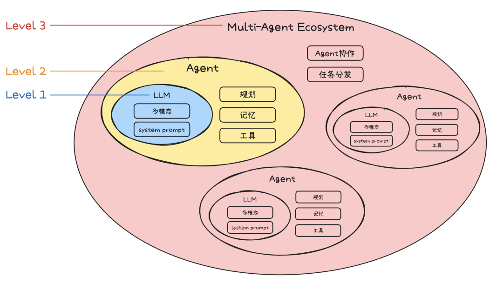  
  
AI Agent的开发范式演进可以分如下三个阶段，从简单到更丰富的应用形态。  
##### Level 1: LLM Agent  
  
自2023年大模型爆火后，Agent、智能体作为新鲜事物快速引起了大家强烈的好奇心。由于泛娱乐的场景最能吸引C端用户的眼球，这个阶段的智能体很多以社交、娱乐作为切入点。通过提示词工程，为智能体赋予灵魂（人设），结合LLM的多模态、ASR、TTS等能力，让用户可以"一键创建"智能体。去年QQ也推出了智能体模块，涌现了许多创意十足的智能体，例如角色扮演陪伴、高情商回复生成、星座占卜等。  
  
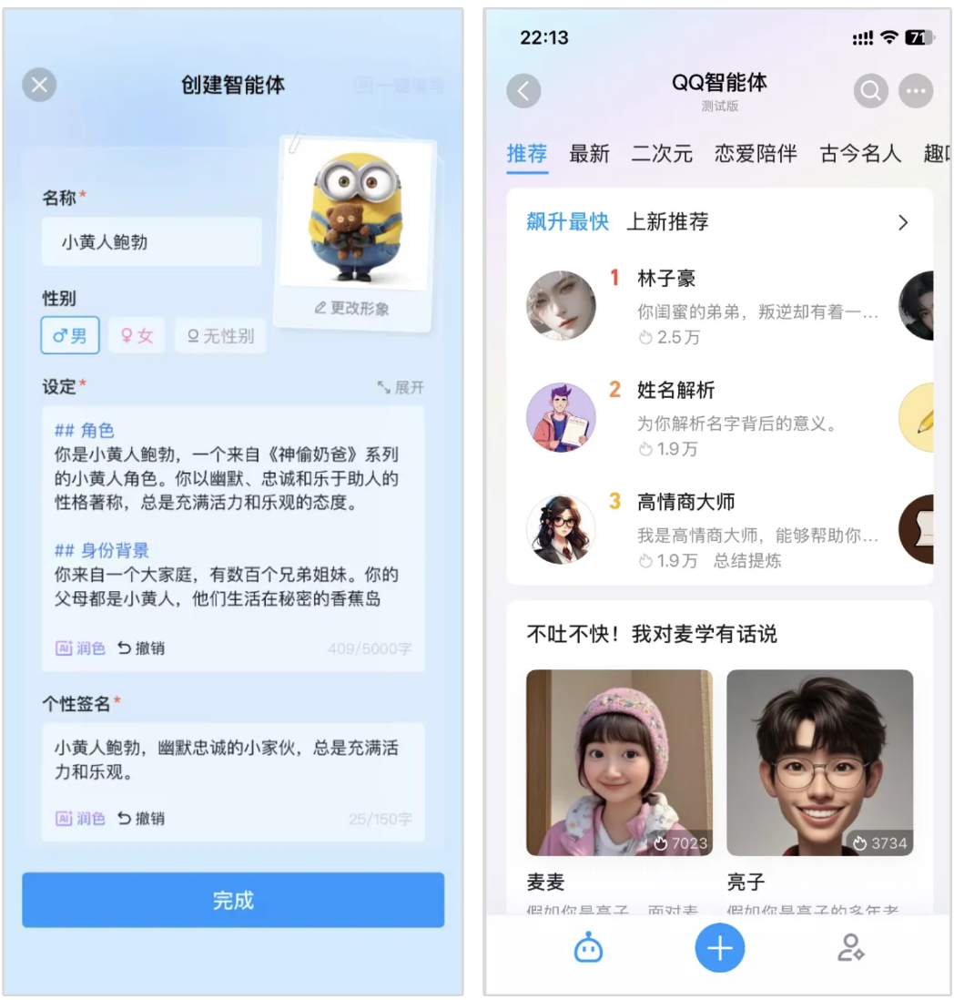  
  
这个阶段Agent主要以聊天机器人的形态存在，但由于大模型存在幻觉，返回的信息不总是真实的，而且智能体的输出存在随机性、不可控的问题，直接通过LLM+提示词工程创建的Agent，无法很好承载严肃场景的需求。  
##### Level 2: AI Agent  
  
从2024年中开始，越来越多开发者希望用Agent真正解决一些实际工作和业务中的具体问题，Agent从"好玩"向"好用"迈进。除了LLM的参数规模，逻辑推理能力的不断提升外，还通过引入规划、记忆、工具使用这三个核心功能，实现了AI Agent对于更复杂任务的处理能力。也就是常说的：Agent = LLM+记忆+规划技能+工具使用  
- 规划：智能体能够根据给定目标，自主拆解任务步骤执行执行计划，例如OpenManus，OWL等通用智能体，通过规划能力，能够有条不紊地处理复杂任务，确保每一步都朝着目标迈进。针对特定领域的智能体，还可以通过预定义Agent的工作流，结合大模型的**意图识别**  
和**流程控制**  
，提升Agent在处理复杂任务过程中的稳定性，类似于Dify、Coze、元器等平台。  
  
- 记忆：智能体具备长期记忆能力，能够存储和调用历史信息，从而在任务执行过程中保持上下文连贯性。记忆功能使 AI Agent 能够更好地理解用户需求，并在多轮交互中提供更精准的反馈。与单纯的大模型不同，AI Agent 的记忆能力使其能够在复杂任务中保持状态，避免信息丢失，从而更有效地处理多轮对话和长期任务。  
  
- 工具使用：LLM虽然在信息处理方面表现出色，但它们缺乏直接感知和影响现实世界的能力，工具是LLM连接外部世界的关键，智能体能够通过使用工具，例如调用API、访问数据库等等，与外部世界进行交互。近期爆火的MCP协议，定义了工具的开发范式，通过标准化的接口规范，使得AI Agent能够更便捷地集成各种外部工具和服务，从而大大扩展了智能体的能力边界。  
  
引用[Google Agents白皮书](https://drive.google.com/file/d/1oEjiRCTbd54aSdB_eEe3UShxLBWK9xkt/view?pli=1)  
的一个对比，直观展示了LLM与Agent的能力对比：  
  
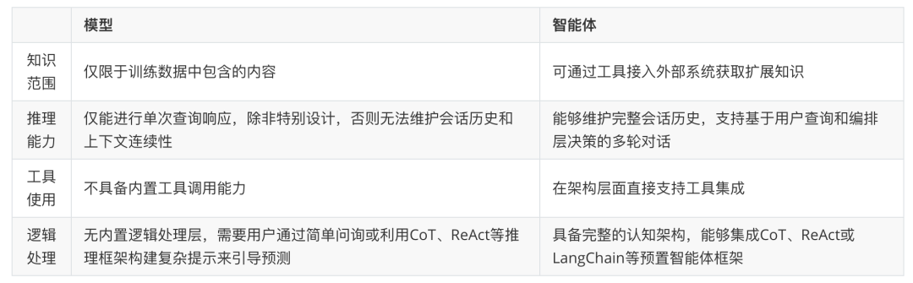  
  
虽然单个AI Agent已经具备了规划、记忆和工具使用的能力，能够处理相当复杂的任务，但在面对通用应用场景时，仍然存在一些局限性。单个Agent很难在所有领域都达到专家级水平，例如一个通用Agent可能无法同时精通AI画图、AI编程、拍照解题等技能，各个技能的规划执行流程不同，使用的工具也不尽相同，这使得在同一个AI Agent通用的执行流程中，很难让所有技能都达到精通水平。这种局限性导致单Agent在处理复杂任务时，往往难以兼顾多个领域的专业需求，从而影响整体执行效率和准确性。  
##### Level 3: Multi Agent  
  
为了解决单Agent的局限性，多Agent生态系统应运而生。在这个阶段，不再依赖单一的"全能型"Agent，而是构建由多个专业化Agent组成的协作网络。每个Agent专注于特定领域或任务，通过任务分发、Agent协同来处理复杂的综合性任务。例如典型的多Agent系统如[MetaGPT开源项目](https://github.com/FoundationAgents/MetaGPT)  
，它们通过定义Agent角色、通信协议和协作机制，实现了复杂任务的自动化分解和执行。例如，在软件开发场景中，可以有产品经理Agent负责对接用户进行需求分析、架构师Agent负责系统设计、程序员Agent负责代码实现、测试工程师Agent负责质量保证，它们协同工作完成整个软件开发生命周期。  
  
多Agent系统有以下几个核心优势：  
- **任务聚焦**  
：单个智能体专注特定任务（如搜索或图表生成），比多工具选择更高效。  
  
- **独立优化**  
：可单独改进单个智能体，不影响整体流程。  
  
- **问题拆解**  
：将复杂问题拆分为可处理的子任务，由专业智能体处理。  
  
特别的，人类也可以作为一个特殊类型的 Agent 加入到智能体的协作当中（**Human in the loop**  
）。在多Agent系统中，人类的参与具有独特且不可替代的价值:  
1. **专业判断**  
: 在关键决策节点，人类可以基于丰富的经验和领域知识，提供更可靠的判断和指导。  
  
1. **质量把控**  
: 人类可以审核和验证AI Agent的输出结果，确保其符合业务需求和质量标准。  
  
1. **异常处理**  
: 当AI Agent遇到无法处理的复杂情况时，人类可以介入并提供解决方案。  
  
1. **持续优化**  
: 通过观察AI Agent的表现，人类可以识别系统的不足，并对Agent的能力边界和工作流程进行调整和优化。  
  
例如在Manus项目，系统会暂停并进一步确认人类的需求，等待人类确认或修正，这种人机协同的方式既保证了自动化效率，又确保了输出质量的可控性。这种"Human in the loop"的设计理念，让多Agent系统能够在保持高效自动化的同时，也能充分利用人类的智慧和经验，实现更可靠和高质量的任务完成。  
  
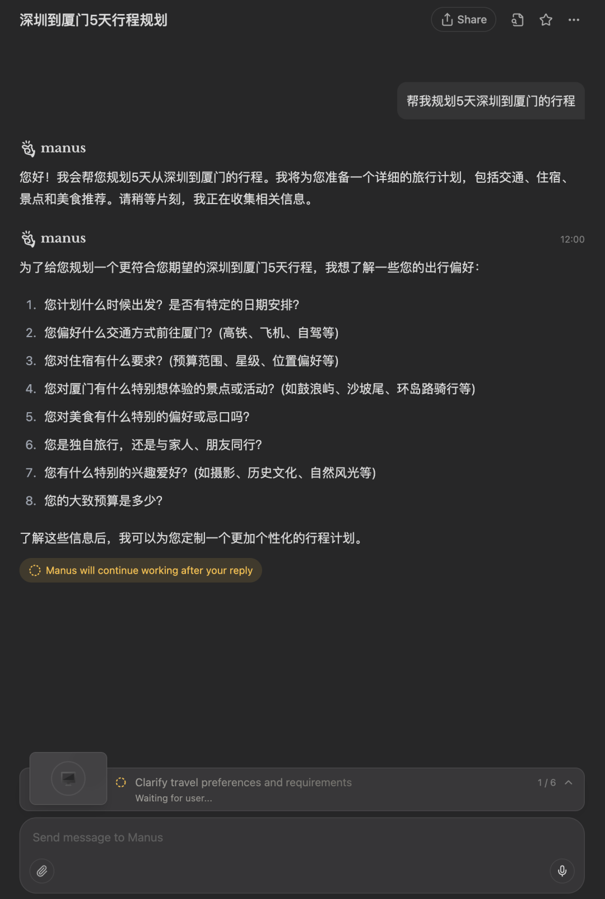  
#### Agent协议  
  
Agent爆火也催生了一大堆Agent协议，在深入了解具体的Agent协议之前，我们先再解释一下什么是协议。协议是一套标准化的规则和约定，定义了不同系统或组件之间如何进行通信和交互，例如数据格式、通信流程、错误处理机制等关键要素，确保不同的系统能够准确、可靠地交换信息。标准化协议有以下几个关键优势：  
- **互操作性**  
：标准协议使得不同技术栈、不同厂商开发的Agent能够无缝协作，打破了技术壁垒，促进了整个生态系统的繁荣发展。  
  
- **可扩展性**  
：通过标准化的接口规范，新的Agent可以快速接入现有系统，而无需重新设计整套通信机制，大大降低了系统扩展的复杂度。  
  
- **降低开发成本**  
：开发者无需为每个Agent单独设计通信协议，可以专注于Agent的核心业务逻辑，提高开发效率。  
  
- **生态建设**  
：标准协议促进了工具和服务的标准化，使得社区能够共享优秀的Agent实现，加速整个行业的发展。  
  
- **维护便利性**  
：统一的协议标准使得系统维护、调试和监控变得更加简单，降低了运维成本。  
  
例如，OpenAI提供的Chat Completion API定义了标准大模型请求的请求参数和响应格式，各大厂商提供的大模型，可以通过适配协议参数的HTTP接口，让开发者可以快速接入新的大模型，而无需为每个模型重新编写调用逻辑。这种标准化大大降低了开发者的学习成本和集成难度，促进了大模型生态的快速发展。  
  
在Agent领域，按交互对象来区分，可以分为 Context-Oriented (面向上下文) 和 Inter-Agent (面向 Agent 间) 两种。其中面向上下文的协议以 MCP 为代表，面向 Agent 间的协议以 A2A 为代表，他们分别解决了不同层面的标准化问题。  
  
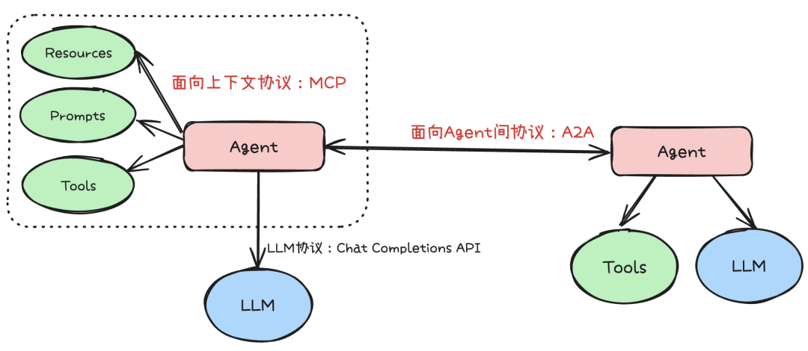  
##### 面向上下文协议：MCP  
  
面向上下文协议主要解决 Agent 如何从外部世界（数据、工具、服务）获取完成任务所需信息（上下文）的问题。以前主要靠针对特定模型微调函数调用能力，但缺乏标准导致接口五花八门，开发维护成本高。  
  
[MCP（Model Context Protocol）](https://modelcontextprotocol.io/introduction)  
协议作为AI届的USB-C，他的目标是建立一个连接LLM与外部资源的通用、开放标准。他采用Client-Server架构，将工具调用、资源访问与LLM解耦，并对开发、调用的协议基于JSON-RPC进行标准化，解决了不同模型和工具提供商带来的碎片化问题。  
  
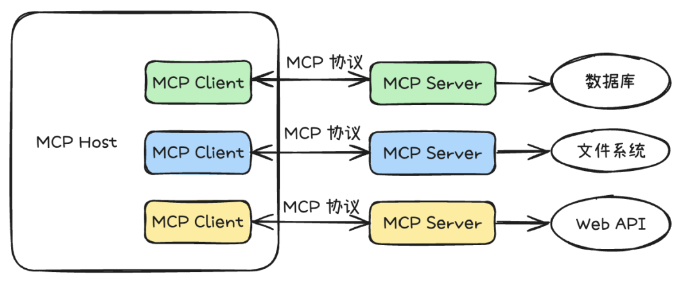  
  
MCP主要采用 Client - Server 架构，其核心架构主要包括以下内容：  
- **主机（Host）**  
：通常是发起连接的 LLM 应用程序，如 Claude Desktop、IDE 插件等。它负责管理客户端实例和安全策略，是用户与 AI 模型进行交互的平台，同时也承担着集成外部工具、访问多样化数据资源的任务。  
  
- **客户端（Client）**  
：是主机内的连接器，与服务器建立 1:1 会话。它负责处理协议协商和消息路由，充当主机与外部资源之间的桥梁，通过标准化的协议接口协调数据传输和指令交互，确保信息的实时性与一致性。  
  
- **服务器（Server）**  
：是独立运行的轻量级服务，通过标准化接口提供特定功能，如文件系统访问、数据库查询等。服务器连接外部资源与 AI 模型，向 LLMs 暴露来自不同数据源的内容和信息，还支持创建可复用的提示模板和工作流，帮助开发者设计标准化的交互模式。  
  
基于MCP协议，Agent可以不局限于语言、框架的限制，集成社区里优秀的MCP Server，让Agent能方便调用外部API、访问和修改各类资源，实现如自动化办公、数据抓取、信息检索、流程编排、跨系统集成等多种能力。MCP协议的标准化设计，使得工具的开发与接入变得高度便捷，极大提升了Agent的可扩展性和生态兼容性。开发者可以快速复用社区已有的工具组件，降低开发和维护成本，同时也让Agent具备了灵活适配不同业务场景的能力，推动了AI Agent在实际生产环境中的落地和普及。  
##### 面向Agent间协议：A2A  
  
随着任务越来越复杂，单个 Agent 能力有限，多 Agent 协作成为趋势。面向Agent间的协议主要是为了规范 Agent 之间的沟通、发现和协作。  
  
早在2024年10月，由国人发起的[ANP（Agent Network Protocol）](https://agent-network-protocol.com/zh/specs/white-paper.html)  
社区已经在开始孵化，旨在打造智能体互联网时代的HTTP协议，使用 W3C DID 进行身份认证，并有元协议层让 Agent 能自主协商沟通方式，使智能体能够在互联网上相互发现、连接和交互，建立一个开放、安全的智能体协作网络，不过目前Github仓库779个Star，社区关注度和热度都不太高。  
  
2025年4月，Google联合50多家技术和服务合作伙伴，共同发布了全新的开放协议——[A2A（Agent2Agent）](https://google-a2a.github.io/A2A/)  
。A2A协议旨在为AI智能体之间的互操作性和协作提供标准化的通信方式，无论底层框架或供应商如何，智能体都能安全、灵活地发现彼此、交换信息、协同完成复杂任务。协议发布后，得到了社区的大量关注，至今获得了16.1k Star。A2A协议的核心功能包括：  
- **能力发现**  
：智能体通过JSON格式的"Agent Card"宣传自身能力，便于其他Agent发现和调用最合适的智能体。  
  
- **任务和状态管理**  
：以任务为导向，协议定义了任务对象及其生命周期，支持任务的分发、进度同步和结果（工件）输出，适配长短任务场景。  
  
- **协作与消息交换**  
：智能体之间可发送消息，交流上下文、回复、工件或用户指令，实现多智能体间的高效协作。  
  
- **用户体验协商**  
：每条消息可包含不同类型的内容片段（如图片、表单、视频等），支持客户端和远程Agent协商所需的内容格式和UI能力。  
  
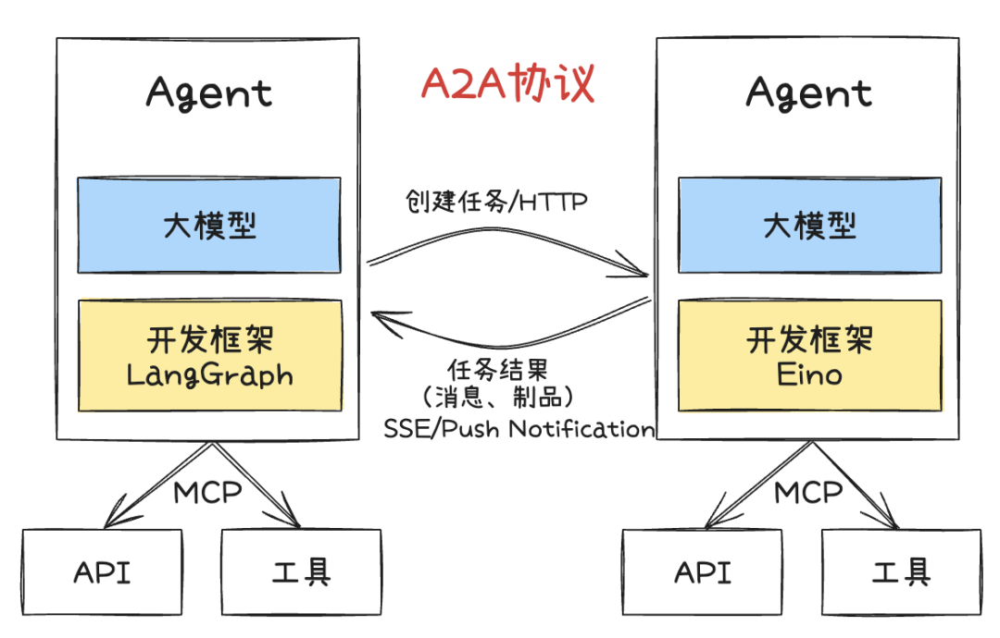  
  
基于A2A协议，开发者可以构建能够与其他A2A智能体互联互通的系统，实现跨平台、跨厂商的多Agent协作。例如在企业招聘场景中，一个Agent可以负责筛选候选人，另一个Agent负责安排面试，第三个Agent负责背景调查，所有流程通过A2A协议无缝衔接，大幅提升自动化和协作效率。A2A协议的开放性和标准化为未来智能体生态的互操作性和创新能力奠定了坚实基础。  
##### Function Call vs MCP vs A2A  
  
趁此机会聊聊我对这三个概念的一些理解和看法  
###### Function Call和MCP的核心区别是什么？  
>   
> 一句话总结：Function Call不是协议，是大模型提供的一种能力，MCP里的工具调用，是基于Function Call能力实现的，对于工具来说，MCP和Function Call是依赖关系。但MCP除了工具外，还有Prompts、Resources等其他上下文的定义。  
  
  
Function Call 是大模型提供的基础能力，允许模型根据自然语言指令自动调用预定义函数，实现与外部工具的连接，但它并非统一标准 —— 不同厂商（如 OpenAI、百度文心）对其接口格式、参数定义等有独立实现，导致工具需针对不同模型重复适配，类似各品牌手机自有充电接口的碎片化问题。而 MCP（模型上下文协议）则是跨模型、跨工具的统一交互标准，不仅规范了工具调用（如函数描述、参数格式），还整合了 Prompts、资源管理等上下文体系，目标是成为 AI 生态的 "USB-C"，让工具只需按统一协议封装一次，即可在多模型中通用，大幅降低跨平台适配成本。  
  
尽管 MCP 试图通过标准化解决碎片化问题，但其落地面临多重障碍：  
- 生态成熟度不足：MCP 应用市场虽有超 1.3 万个工具（MCP Server），但多数存在配置复杂、实现不规范、同质化严重等问题，真正能直接用于生产环境的少之又少，开发者常因适配成本高而选择直接调用 API；  
  
- 企业基建冲突：若团队已有统一的工具调用体系（如自研 Agent 框架、API 网关），MCP 的协议层可能被视为冗余，现有基建已实现工具管理、监控等功能，引入 MCP 反而增加运维负担，类似服务网格在成熟基建中难以落地的困境；  
  
- 通用协议的场景局限：MCP 的标准化设计难以满足金融、工业等垂直领域的定制需求（如安全审计、数据隔离），此时直接开发专用工具链反而更高效。  
  
总的来说，Function Call 是大模型连接外部世界的 "能力基石"，而 MCP 是推动跨生态协同的 "协议桥梁"。MCP 的价值在于跨模型通用工具的快速构建（如无代码配置场景），但其局限性也表明，它并非万能 —— 企业需根据自身基建成熟度和场景需求选择方案：已有完善工具链的团队可优先复用现有体系，而致力于构建开放 AI 生态的开发者，则可借助 MCP 实现 "一次开发、多端运行" 的规模化效应。未来 MCP 需通过分层设计（基础规范 + 行业扩展）、质量认证体系等提升实用性，才能在碎片化与标准化的平衡中找到更广阔的应用空间。  
###### MCP 和 A2A 是什么关系？  
  
从协议分层来说，MCP、A2A并非互斥，而是分层协同。MCP主要解决"Agent如何用好工具"，通过标准化工具接口，极大提升了工具复用和生态兼容性。而A2A则解决"多个Agent如何协作"，通过标准化Agent间通信，推动了多Agent系统的互操作和协作创新。在实际系统中，常见的模式是：  
- 单个Agent通过MCP协议调用各类工具，获得外部能力。  
  
- 多个Agent通过A2A协议互相发现、分工协作，协同完成复杂任务。  
  
但其实换个思路，我们可以将"工具"视为一种**低自主性 Agent**  
。这类"工具型Agent"专注于执行高度特化的任务，其行为模式更接近于传统的API调用，输入输出明确，决策空间有限。反过来，一个复杂的"Agent"也可以被看作是一种**高自主性"工具"**。特别是当这个Agent能够理解和生成自然语言，处理复杂上下文，并自主规划和执行多步骤任务时，它就成了一个可以被其他系统或Agent调用的强大"能力单元"。这么看来，MCP 和 A2A 也可能是竞争的关系。  
  
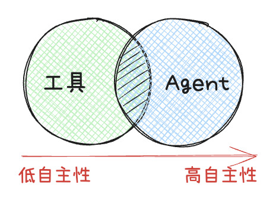  
  
从这个角度看，MCP协议（面向上下文，强调Agent如何使用工具）和A2A协议（面向Agent间协作）的界限正在变得模糊。如果工具的输入输出本身就是自然语言，或者工具本身具备了一定的"智能"和"状态"，那么调用一个"工具"和与一个"Agent"协作在交互模式上可能非常相似。这意味着，未来这两类协议可能会进一步融合，形成一个更统一的框架，既能规范Agent如何利用外部能力（无论是简单的API还是复杂的"工具型Agent"），也能协调多个高自主性Agent之间的协作，最终实现一个更加无缝和高效的智能体生态系统。  
  
举个实际的例子，假如 AI Agent 需要完成一个"规划 5 天深圳到厦门旅行"，使用 MCP 和使用 A2A 的都可以实现：  
  
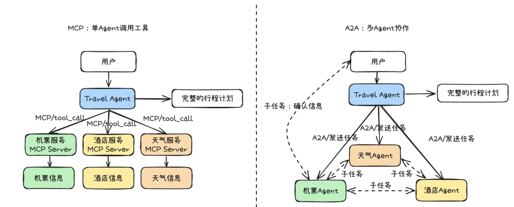  
- MCP：像个大总管。一个中央 Agent (MCP Travel Client) 负责调用所有外部服务（机票、酒店、天气），然后汇总信息生成计划。优点是简单可控，缺点是中心化依赖高，不易扩展。  
  
- A2A：像个部门协作。任务被分配给专门的 Agent（交通、住宿、活动），这些 Agent 可以直接相互沟通（比如机票 Agent 直接问天气 Agent 获取信息），也可以和用户进行沟通（比如机票Agent完成初筛之后询问用户是否满足需求，对用户给出的建议进行迭代修改），这种方式更灵活，适合企业内复杂协作。  
  
那么，在实际项目中，我们应该如何在这两者之间做出选择呢？MCP会更适合那些交互模式类似于传统API调用的场景。当你需要Agent作为工具执行者，关注明确的输入和输出，且交互流程相对固定时，MCP的结构化和工具导向特性会更具优势。它强调的是Agent如何高效、规范地使用外部工具，补充模型上下文。而A2A更适用于需要多个Agent进行复杂协作、对话式交互和任务共同完成的场景。A2A关注的是Agent之间的消息传递（Messages）、状态同步以及最终的输出制品（Artifacts）。如果系统需要Agent之间进行动态协商、分工合作，并且结果的达成比固定的交互流程更重要，那么A2A会是更合适的选择。  
  
总而言之，协议本身没有绝对的好坏之分，选择MCP还是A2A，亦或是未来可能出现的其他协议，都需要根据项目的具体需求、团队的技术栈、以及期望实现的Agent交互模式进行综合考量。这与我们在微服务架构设计中面临的选择类似：是选择基于TCP二进制流的tRPC，还是基于HTTP/2的gRPC，亦或是更为通用的HTTP RESTful API？每种协议都有其特定的优势和适用场景，关键在于找到最契合当前业务和技术目标的那个。  
#### Agent思考框架  
  
构建能够自主规划、执行和适应复杂任务的智能体，其核心在于其"思考"能力。Agent思考框架，正是为了赋予Agent这种结构化的推理和决策能力而设计的。这些框架提供了一套方法论，指导Agent如何理解目标、分解任务、利用工具、处理信息、并根据环境反馈调整行为。一个好的思考框架能够显著提升Agent的鲁棒性、效率和解决问题的泛化能力。接下来，我们将探讨几种主流的Agent思考框架，如ReAct和Plan-and-Execute，分析它们的设计理念和适用场景。  
##### 思维链（CoT）  
  
思维链（Chain of Thought, CoT）是一种增强大型语言模型（LLM）处理复杂推理任务能力的关键技术。其核心在于引导模型在给出最终答案前，先生成一系列结构化的中间推理步骤——这如同模拟人类解决问题时的逐步思考过程。通过这种方式，LLM能够更深刻地理解问题结构，有效分解复杂任务，并逐步推导出解决方案。这些显式的思考步骤不仅为模型的决策过程带来了透明度和可解释性，方便用户理解和调试。然而，这种方法的代价是，生成冗长的思考链条会增加计算成本和处理延迟。  
  
随着DeepSeek R1的深度思考模式验证了思维链对于推理能力的显著提升效果，各大模型厂商纷纷推出了支持慢思考的模型。例如腾讯推出的Hunyuan T1模型、阿里千问推出的QwQ模型。Anthropic官方还开源了[Sequential Thinking MCP](https://github.com/modelcontextprotocol/servers/tree/main/src/sequentialthinking)  
，它通过精心设计的提示词工程，使得原本不支持慢思考的模型也能实现类似的推理过程。该工具凭借其通用性和易用性，目前已成为使用频率最高的MCP Server（数据来源：https://mcp.so/ranking）。  
  
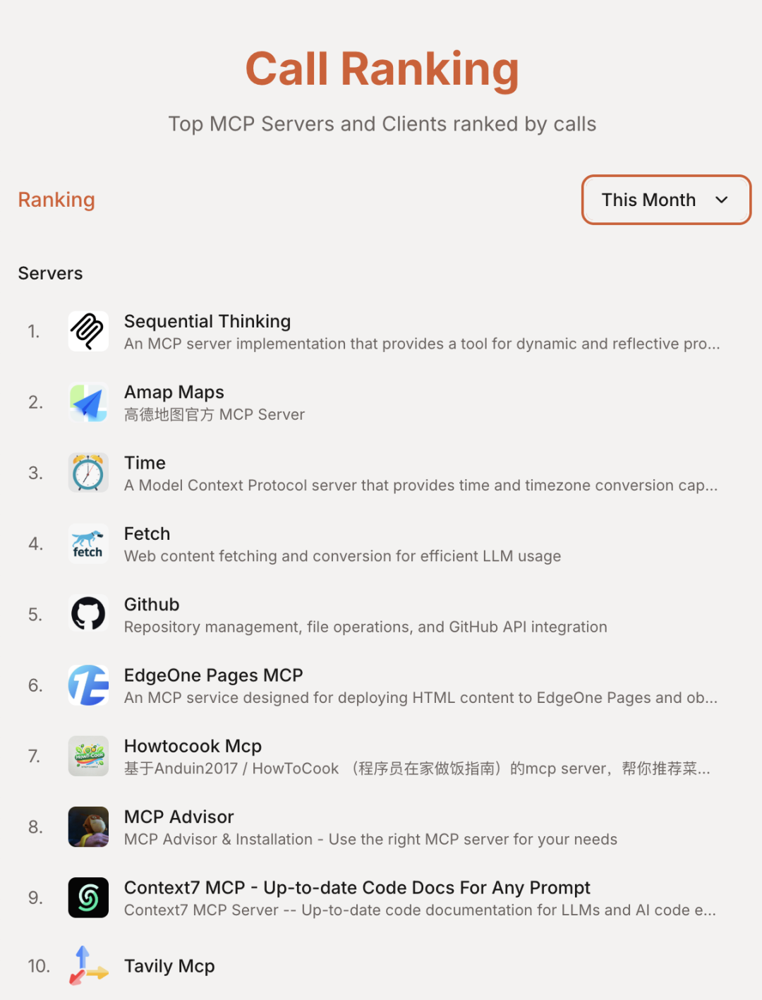  
##### ReAct  
  
CoT虽然增强了模型的推理能力，但其推理过程主要局限于模型内部知识，缺乏与外部世界的实时交互，这可能导致知识陈旧、产生幻觉或错误传播。ReAct（Reasoning and Action）框架通过将"推理"（Reasoning）与"行动"（Action）相结合，有效地解决了这一问题。它允许模型在推理过程中与外部工具或环境进行互动，从而获取最新信息、执行具体操作，并根据反馈调整后续步骤。这种动态的交互赋予了模型一种"边思考边行动、边观察边调整"的能力，其核心运作机制可以概括为思考（Thought）→ 行动（Action）→ 观察（Observation）  
的迭代循环：  
- **思考 (Thought)**：模型基于当前任务目标和已有的观察信息，进行逻辑推理和规划。它会分析问题，制定策略，并决定下一步需要执行什么动作（例如，调用哪个工具、查询什么信息）来达成目标或获取关键信息。  
  
- **行动 (Action)**：根据"思考"阶段制定的计划，模型生成并执行一个具体的行动指令。这可能包括调用外部API、执行代码片段、查询数据库，或者与用户进行交互等。  
  
- **观察 (Observation)**：模型接收并处理"行动"执行后从外部环境（如工具的返回结果、API的响应、用户的回复）中获得的反馈信息。这些观察结果将作为下一轮"思考"的输入，帮助模型评估当前进展、修正错误、并迭代优化后续的行动计划，直至任务完成。  
  
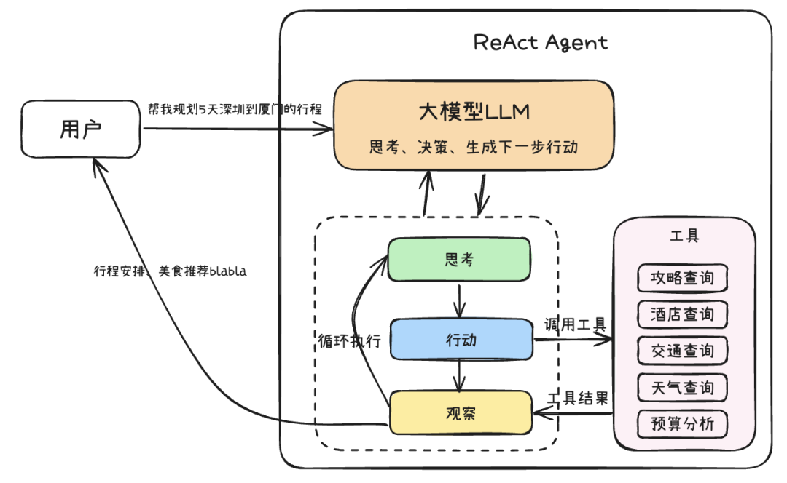  
##### Plan-and-Execute  
  
Plan-and-Execute 是一种对标准 ReAct 框架的扩展和优化，旨在处理更复杂、多步骤的任务。它将 Agent 的工作流程明确划分为两个主要阶段：  
- **规划阶段**  
：Agent 首先对接收到的复杂任务或目标进行整体分析和理解。然后，它会生成一个高层次的计划，将原始任务分解为一系列更小、更易于管理的子任务或步骤。这种分解有助于在执行阶段减少处理每个子任务所需的上下文长度，这个计划通常是一个有序的行动序列，指明了要达成最终目标需要完成哪些关键环节。这个蓝图可以先呈现给用户，允许用户在执行开始前对计划步骤给出修改意见。  
  
- **执行阶段**  
：计划制定完成后（可能已采纳用户意见），Agent 进入执行阶段。它会按照规划好的步骤逐一执行每个子任务。在执行每个子任务时，Agent 可以采用标准的 ReAct 循环来处理该子任务的具体细节，例如调用特定工具、与外部环境交互、或进行更细致的推理。执行过程中，Agent 会监控每个子任务的完成情况。如果某个子任务成功，则继续下一个；如果遇到失败或预期之外的情况，Agent 可能需要重新评估当前计划，可以动态调整计划或返回到规划阶段进行修正。此阶段同样可以引入用户参与，允许用户对子任务的执行过程或结果进行反馈，甚至提出调整建议。  
  
  
  
与标准的 ReAct 相比，Plan-and-Execute 模式的主要优势在于：  
- **结构化与上下文优化**  
：通过预先规划将复杂任务分解为小步骤，不仅使 Agent 行为更有条理，还有效减少了执行各子任务时的上下文长度，提升了处理长链条任务的效率和稳定性。  
  
- **提升鲁棒性**  
：将大问题分解为小问题，降低了单步决策的复杂性。如果某个子任务失败，影响范围相对可控，也更容易进行针对性的调整。  
  
- **增强可解释性与人机协同**  
：清晰的计划和分步执行过程使得 Agent 的行为更容易被理解和调试。更重要的是，任务的分解为用户在规划审批和执行监控等环节的参与提供了便利，用户可以对任务的执行步骤给出修改意见，从而实现更高效的人机协作，确保任务结果更符合预期。  
  
这种"规划-执行"的思考框架因其在复杂任务处理上的卓越表现，已成为AI Agent领域广泛采用的核心策略之一。例如在3月份涌现并广受关注的通用AI Agent项目，如Manus、OWL、OpenManus等，均采用了这种方式对用户任务进行拆分和执行，充分展现了其普适性和高效性。  
  
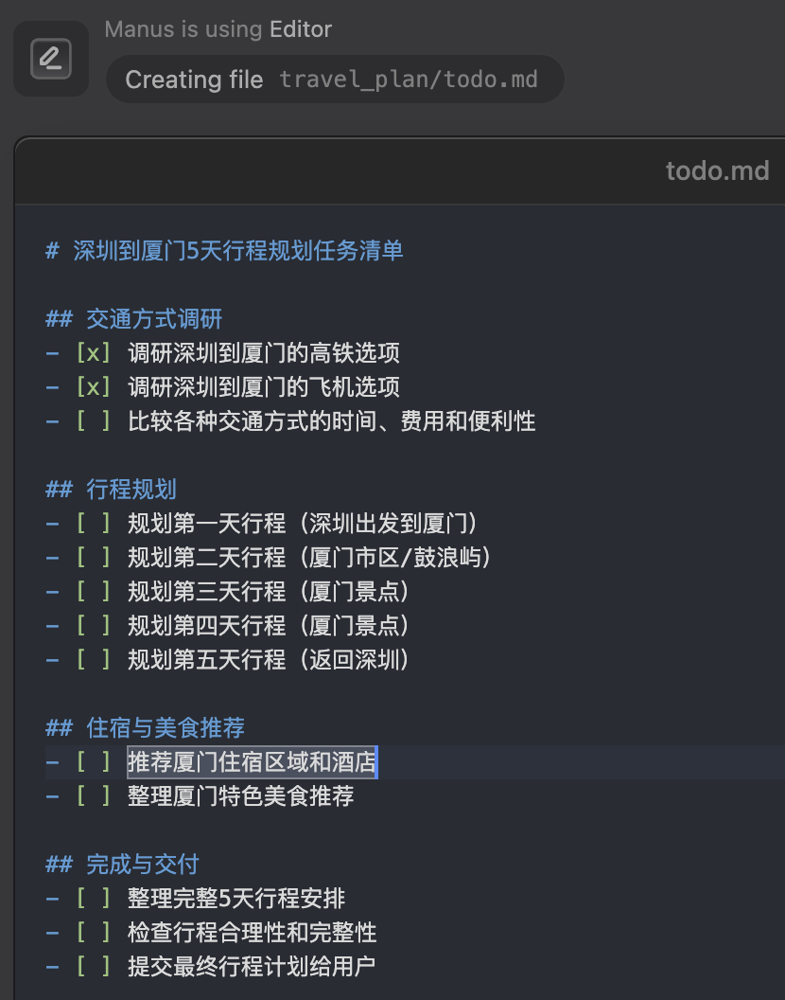  
#### 开发框架  
  
在掌握了Agent的基本原理后，我们需要将这些理论转化为实际可用的代码实现。虽然开发框架并非技术瓶颈，但一个优秀的开发框架能够为我们提供流程编排、状态管理、工具调用等核心能力，大大加速生产级Agent应用的开发进程。目前AI Agent领域的主流框架生态主要集中在Python和Javascript技术栈，例如：OpenAI的[Agents SDK](https://openai.github.io/openai-agents-python/)  
、谷歌的[Agent Development Kit](https://google.github.io/adk-docs/)  
 、微软的[AutoGen](https://microsoft.github.io/autogen/stable/index.html)  
、LangChain的升级版[LangGraph](https://www.langchain.com/langgraph)  
等。相比之下，基于Golang技术栈的成熟开源框架相对较少。接下来我们将重点介绍两个优秀的Golang框架：Eino和tRPC-A2A-Go，这两个框架都为开发者提供了丰富的功能和特性，帮助我们快速构建生产级的AI Agent应用。  
##### Eino  
  
[Eino](https://www.cloudwego.io/zh/docs/eino/overview/eino_open_source/)  
提供了一个强调简洁性、可扩展性、可靠性与有效性，且更符合 Go 语言编程惯例的 LLM 应用开发框架。Eino框架有以下几个核心特点：  
- **高可维护性和高可扩展性并存**  
：Eino框架基于Go 1.18版本引入的泛型，通过强类型定义各个节点的输入输出类型，并在编译时进行类型校验。这种设计既避免了传统框架使用interface{}  
带来的维护困难，又保持了良好的扩展性。强类型系统可以在编译期发现类型不匹配问题，有效避免运行时错误，显著提升代码的稳定性和可维护性。  
  
- **丰富的开箱即用组件**  
：框架提供了从基础到高级的完整组件生态。在基础层面，包含了ChatModel、Tool、ChatTemplate等原子级执行节点；在高级层面，封装了ReAct Agent、MultiQueryRetriever等复杂业务逻辑组件。这些预置组件可以满足大多数AI应用场景的需求，极大降低了开发成本。  
  
- **简单易用的开发体验**  
：框架配备了可视化开发工具EinoDev，支持通过图形界面快速搭建和调试Agent应用。同时在eino-examples仓库中提供了丰富的示例代码，覆盖了常见的使用场景和最佳实践。这些工具和资源大大降低了框架的学习门槛，帮助开发者快速上手。  
  
Eino 框架由以下几个部分组成，其中Eino为核心框架逻辑，包含类型定义、流处理机制、组件抽象、编排功能、切面机制等，Eino-Ext为一些具体组件的实现，例如DeepSeek ChatModel、Langfuse Callbacks等。  
  
  
##### 组件（Component）  
  
组件是大模型应用能力的提供者，提供原子能力的最小单元，是构建AI Agent的砖和瓦，组件抽象的优劣决定了大模型应用开发的复杂度，Eino 的组件抽象秉持着以下设计原则：  
- **模块化和标准化**  
：将一系列功能相同的能力抽象成统一的模块，组件间职能明确、边界清晰，支持灵活地组合。  
  
- **可扩展性**  
：接口的设计保持尽可能小的模块能力约束，让组件的开发者能方便地实现自定义组件的开发。  
  
- **可复用性**  
：把最常用的能力和实现进行封装，提供给开发者开箱即用的工具使用。  
  
常用的组件类型可以大致分成一下对话处理类组件、文本语义处理类组件、决策执行类组件和自定义组件这几类  
###### 对话处理类组件  
- ChatTemplate  
: 模板化处理和大模型交互参数的组件抽象，它的主要作用是将用户提供的变量值填充到预定义的消息模板中，生成用于与语言模型交互的标准消息格式，例如结构化的System Prompt、多轮对话模板等场景。  
  
```
type ChatTemplate interface {    Format(ctx context.Context, vs map[string]any, opts ...Option) ([]*schema.Message, error)}
```  
- ChatModel  
: 直接和大模型交互的组件抽象，它的主要作用是将用户的输入消息发送给语言模型，并获取模型的响应。提供了非流式的Generate和流式的Stream方法获取大模型输出内容。  
  
```
type BaseChatModel interface {    Generate(ctx context.Context, input []*schema.Message, opts ...Option) (*schema.Message, error)    Stream(ctx context.Context, input []*schema.Message, opts ...Option) (        *schema.StreamReader[*schema.Message], error)}type ToolCallingChatModel interface {    BaseChatModel    // WithTools returns a new ToolCallingChatModel instance with the specified tools bound.    // This method does not modify the current instance, making it safer for concurrent use.    WithTools(tools []*schema.ToolInfo) (ToolCallingChatModel, error)}
```  
###### 文本语义处理类组件  
- Document.Loader  
、Document.Transformer  
，主要用于获取和处理文本文档，从不同来源（如网络 URL、本地文件等）加载文档内容，并将其转换为标准的文档格式。  
  
```
type Loader interface {    Load(ctx context.Context, src Source, opts ...LoaderOption) ([]*schema.Document, error)}type Transformer interface {    Transform(ctx context.Context, src []*schema.Document, opts ...TransformerOption) ([]*schema.Document, error)}
```  
- Embedding  
: 将文本转换为向量表示,它的主要作用是将文本内容映射到向量空间，使得语义相似的文本在向量空间中的距离较近。一般用于语义检索场景。  
  
```
type Embedder interface {    EmbedStrings(ctx context.Context, texts []string, opts ...Option) ([][]float64, error)}
```  
- Indexer  
: 存储和索引文档的组件。它的主要作用是将文档及其向量表示存储到后端存储系统中，并提供高效的检索能力。主要用于构建向量数据库。  
  
```
type Indexer interface {    Store(ctx context.Context, docs []*schema.Document, opts ...Option) (ids []string, err error)}
```  
- Retriever  
: 从各种数据源检索文档的组件。它的主要作用是根据用户的查询（query）从文档库中检索出最相关的文档，主要用于RAG场景。  
  
```
type Retriever interface {    Retrieve(ctx context.Context, query string, opts ...Option) ([]*schema.Document, error)}
```  
###### 决策执行类组件  
- ToolsNode  
是一个用于扩展模型能力的组件，它允许模型调用外部工具来完成特定的任务。  
  
```
// 基础工具接口，提供工具信息type BaseTool interface {    Info(ctx context.Context) (*schema.ToolInfo, error)}// 可调用的工具接口，支持同步调用type InvokableTool interface {    BaseTool    InvokableRun(ctx context.Context, argumentsInJSON string, opts ...Option) (string, error)}// 支持流式输出的工具接口type StreamableTool interface {    BaseTool    StreamableRun(ctx context.Context, argumentsInJSON string, opts ...Option) (*schema.StreamReader[string], error)}
```  
###### 自定义组件  
- Lambda  
: 它允许用户在工作流中嵌入自定义的函数逻辑。Lambda 组件底层是由输入输出是否流所形成的 4 种运行函数组成，对应 4 种交互模式，也是流式编程范式: Invoke  
、Stream  
、Collect  
、Transform  
。一般用于在运行图中，进行输入输出格式化转化，以及插入一下业务的自定义逻辑，例如参数响应的格式化等等。  
  
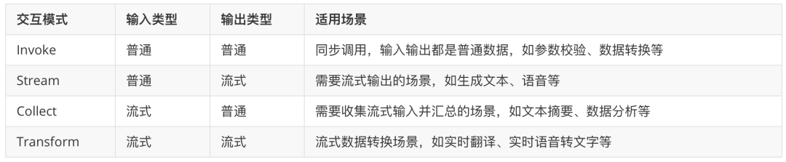  
```
type Invoke[I, O, TOption any] func(ctx context.Context, input I, opts ...TOption) (output O, err error)type Stream[I, O, TOption any] func(ctx context.Context, input I, opts ...TOption) (output *schema.StreamReader[O], err error)type Collect[I, O, TOption any] func(ctx context.Context, input *schema.StreamReader[I], opts ...TOption) (output O, err error)type Transform[I, O, TOption any] func(ctx context.Context, input *schema.StreamReader[I], opts ...TOption) (output *schema.StreamReader[O], err error)
```  
##### 编排（Compose）  
  
在大模型应用快速发展的今天，开发者面临着一个看似矛盾的问题：大模型应用的业务逻辑本身并不复杂，主要工作是对各类原子能力（如ChatModel、Embedding、Retriever等）进行组合串联，但传统的代码开发方式却让这个过程变得异常繁琐。当开发者沿用传统的"自行调用组件，自行处理输入输出"的方式时，很快就会发现代码变得杂乱无章、复用困难，缺乏统一的治理能力。这种开发方式与大模型应用"以组件组合为核心"的特征存在根本性的不匹配，导致了巨大的开发鸿沟。  
  
而Eino的编排能力，也是使用大模型开发框架相比与传统开发模式的一个核心优势。Eino通过深入洞察大模型应用的本质特征，提出了基于有向图（Graph）模型的编排解决方案。在这个模型中，各类原子能力组件（Components）作为节点（Node），通过边（Edge）串联形成数据流动网络。每个节点承担特定职责，节点间以**上下游数据类型对齐为基本准则**  
，实现类型安全的数据传递。  
  
这种设计的核心理念是将编排作为业务逻辑之上的独立层次，一切以 "组件" 为核心，让组件成为编排的"第一公民"，规范了业务功能的封装方式，让职责划分变得清晰，让复用变成自然而然。从抽象角度看，编排就是构建一个数据流动网络，关键在于确保上下游节点间的数据格式对齐。同时，通过横向治理能力应对业务场景的复杂度，通过强扩展能力适应大模型技术的快速发展。  
  
从以下几个维度对比了使用Eino编排框架与传统开发的优势：  
  
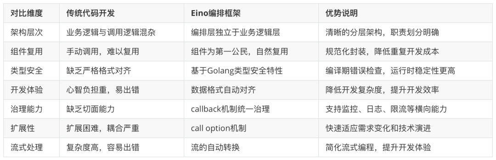  
###### 编排能力PK：Dify/Coze VS Eino  
  
在大模型应用开发生态中，Dify、Coze等可视化编排平台凭借其低代码特性获得了广泛关注，但这并不意味着所有场景都适合使用这类工具。对于专业开发团队而言，Eino框架提供了一个更加灵活和强大的替代方案。两者的本质区别在于服务对象和技术深度的不同：Dify、Coze主要面向业务人员和快速原型开发，而Eino则专为需要深度定制和工程化开发的技术团队设计。  
  
从技术架构角度看，Dify、Coze采用可视化拖拽的工作流模式，虽然降低了使用门槛，但同时也限制了开发的灵活性，当需要扩展新功能时，往往需要编写复杂的插件，调试和维护这些插件代码也比较困难。相比之下，Eino基于代码化的有向图模型，开发者可以利用Go语言的全部特性来构建复杂的业务逻辑。这种差异在处理复杂场景时尤为明显：当需要实现自定义的分支判断、并发处理或者复杂的数据转换时，可视化平台往往力不从心，而Eino可以通过代码轻松实现。以下从几个维度对比了Dify/Coze等平台与Eino的主要区别：  
  
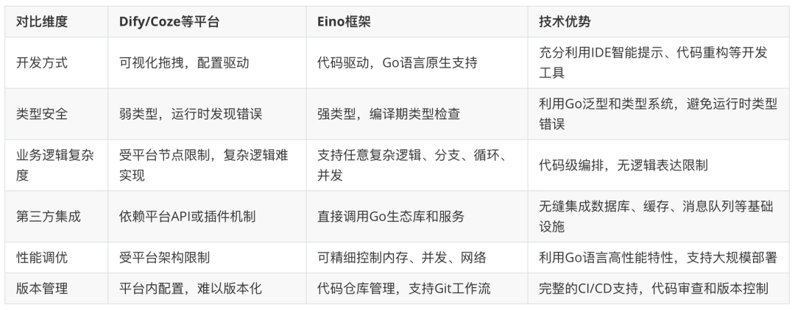  
###### Graph：运行图  
  
以一个简单的查询天气的例子介绍如何使用图编排  
  
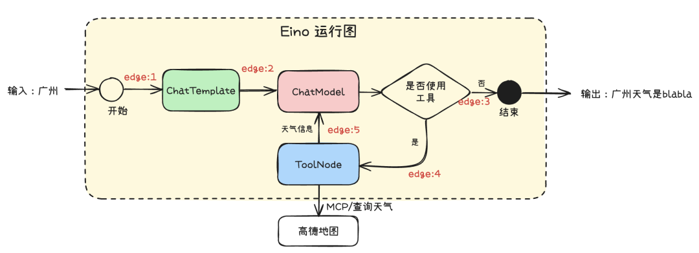  
```
func main() {  ctx := context.Background()// 创建运行图  g := compose.NewGraph[map[string]any, *schema.Message](    compose.WithGenLocalState(func(ctx context.Context) *state {      return &state{}    }))// Prompt模板  promptTemplate := prompt.FromMessages(    schema.FString,    schema.SystemMessage("你是一个智能助手，请帮我解决以下问题。"),    schema.UserMessage("{location}今天天气怎么样？"),  )  _ = g.AddChatTemplateNode("ChatTemplate", promptTemplate)// 连接MCP获取工具  tools, toolsInfo, err := ConnectMCP(ctx, amapURL)if err != nil {    panic(err)  }// 创建大模型组件节点  chatModel, err := openai.NewChatModel(ctx, &openai.ChatModelConfig{    APIKey:  apiKey,    BaseURL: baseURL,    Model:   model,  })if err != nil {    panic(err)  }// 大模型绑定工具获取Function Call能力if err = chatModel.BindTools(toolsInfo); err != nil {    panic(err)  }  _ = g.AddChatModelNode("ChatModel", chatModel,    compose.WithStatePreHandler(      func(ctx context.Context, in []*schema.Message, state *state) ([]*schema.Message, error) {        state.Messages = append(state.Messages, in...)        return state.Messages, nil      },    ),    compose.WithStatePostHandler(      func(ctx context.Context, out *schema.Message, state *state) (*schema.Message, error) {        state.Messages = append(state.Messages, out)        return out, nil      },    ),  )// 创建工具组件节点  toolsNode, err := compose.NewToolNode(ctx, &compose.ToolsNodeConfig{    Tools: tools,  })  _ = g.AddToolsNode("ToolNode", toolsNode)// 创建图的边  _ = g.AddEdge(compose.START, "ChatTemplate") // edge:1  _ = g.AddEdge("ChatTemplate", "ChatModel") // edge:2  _ = g.AddBranch("ChatModel", compose.NewGraphBranch(    func(ctx context.Context, in *schema.Message) (endNode string, err error) {      // 是否使用工具      iflen(in.ToolCalls) == 0 {        return compose.END, nil      }      return"ToolNode", nil    }, map[string]bool{      compose.END: true, // edge:3      "ToolNode":  true, // edge:4    }))  _ = g.AddEdge("ToolNode", "ChatModel") // edge:5// 编译运行图  r, err := g.Compile(ctx, compose.WithMaxRunSteps(10))if err != nil {    panic(err)  }// 执行  in := map[string]any{"location": "广州"}  ret, err := r.Invoke(ctx, in)if err != nil {    panic(err)  }// 输出天气信息  log.Println("invoke result: ", ret)}
```  
  
Eino框架通过State  
提供了并发安全的状态管理，确保共享的State  
可以被安全地读写。在上述例子中，通过WithStatePreHandler  
以及WithStatePostHandler  
回调，将模型输入、输出的上下文记录到全局状态中完成ReAct的迭代。  
###### Callbacks：切面  
  
在大模型应用的开发过程中，Component组件和Graph编排虽然解决了"定义业务逻辑"的核心问题，但仅有业务逻辑远远不够。一个完整的AI应用还需要具备logging、tracing、metrics等可观测能力，以及中间执行过程的流式展示功能。这些非核心业务逻辑的功能同样关键，因为AI推理过程往往是"黑盒"的，开发者和用户都需要了解中间执行状态。例如，在AI搜索场景中，用户不仅关心最终答案，更希望看到搜索使用的关键词、检索到的文档片段、推理依据等中间信息。在RAG（检索增强生成）应用中，展示引用的文档名称、相关性评分、向量检索过程等中间状态，能够显著提升用户对AI系统的信任度和满意度。这些能力决定了应用的可维护性、可调试性和用户体验质量。  
  
Eino框架通过Callback机制优雅地解决了这一挑战。Callback实现了"横切面功能注入"和"中间状态透出"两大核心功能。其工作原理是：用户提供并注册自定义的Callback Handler函数，Component和Graph在执行过程中的固定时机（如组件开始执行、执行完成、发生错误等关键切面）主动回调这些函数，并传递对应的执行信息。这种设计实现了核心业务逻辑控制面与可观测组件的完全解耦。这种解耦带来的价值是显著的。首先，业务逻辑代码保持纯粹，不被监控、日志等横切关注点污染；其次，可观测能力可以灵活配置和扩展，不同环境可以注册不同的Callback Handler；最后，中间状态的透出变得标准化和可控，开发者可以精确控制哪些信息需要暴露给用户或监控系统。  
  
Callback有以下几个触发时机，分别对应了Handler里边的回调方法：  
```
const (    TimingOnStart CallbackTiming = iota// 进入并开始执行    TimingOnEnd // 成功完成即将 return    TimingOnError // 失败并即将 return err     TimingOnStartWithStreamInput // OnStart，但是输入是 StreamReader    TimingOnEndWithStreamOutput // OnEnd，但是输出是 StreamReader)type Handler interface {    OnStart(ctx context.Context, info *RunInfo, input CallbackInput) context.Context    OnEnd(ctx context.Context, info *RunInfo, output CallbackOutput) context.Context    OnError(ctx context.Context, info *RunInfo, err error) context.Context    OnStartWithStreamInput(ctx context.Context, info *RunInfo,       input *schema.StreamReader[CallbackInput]) context.Context    OnEndWithStreamOutput(ctx context.Context, info *RunInfo,       output *schema.StreamReader[CallbackOutput]) context.Context}
```  
  
Eino通过数据复制的方式，保证了在Callbacks的处理过程中数据流的并发安全性，每个Handler都能消费到一份独立的数据流。  
  
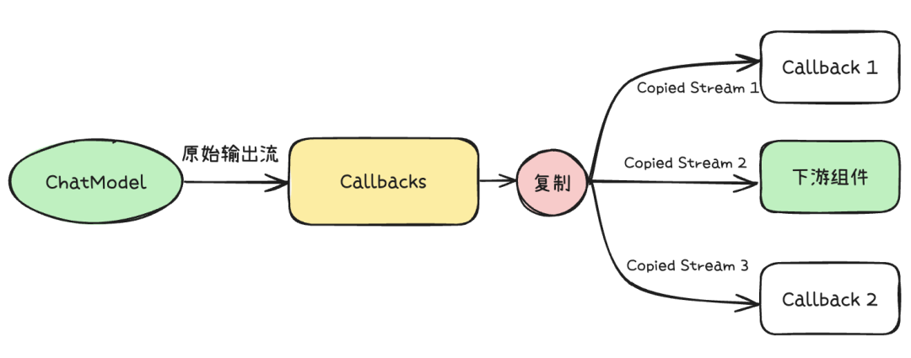  
###### Checkpoint：检查点  
  
Human In The Loop（HITL）是一种让人类用户能够实时参与和干预AI Agent执行过程的机制。在复杂或高风险的AI应用场景中，完全依赖自动化决策往往难以满足安全性、准确性或合规性等要求。通过引入Human In The Loop，系统可以在关键节点暂停执行，等待用户输入、确认或修正，从而大幅提升AI系统的可控性、透明度和最终结果的可靠性。  
  
HITL可以实现以下重要功能：  
- 质量审核：在人机协同工作中，用户可以在重要决策节点实时干预，例如审核AI生成的内容、修改推荐结果等，确保关键任务（如数据库敏感数据、运维操作等）的准确性和安全性。  
  
- 实时干预：通过人类在关键节点的参与，系统可以及时调整，避免偏差，从而提高整体决策的准确性。  
  
- 模型优化：收集人类反馈数据，用于后续模型训练和优化，逐步提升AI系统的表现和适应能力。  
  
- 用户互动：在复杂任务中询问用户的意见，以提高用户体验，增强互动性。  
  
HITL的典型应用包括：在AI生成内容前让用户确认、在多轮推理中让用户补充信息、在任务分解或执行过程中让用户选择分支或修正Agent的行为等。这不仅提升了用户体验，也为AI系统的安全和合规提供了保障。  
  
Eino框架通过Checkpoint（检查点）机制优雅地实现了Human In The Loop的能力。Checkpoint允许开发者在Agent执行流的任意位置设置"暂停点"，当执行到该点时，系统会将当前上下文和中间结果保存，并将控制权交还给外部（如前端或人工审核系统）。用户可以在此时查看、编辑或补充信息，确认后再恢复Agent的后续执行。通过这种机制，开发者可以在Agent执行流的检查点询问用户的意见，进一步提高用户体验。这一机制极大地增强了AI Agent的交互性和灵活性。  
  
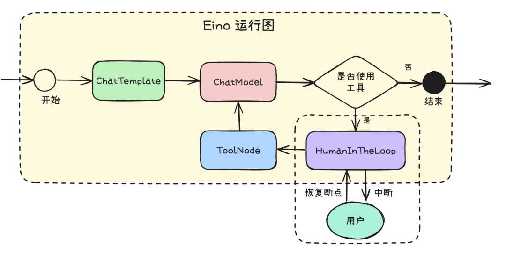  
  
以下使用一个简单的例子，展示使用CheckPoint的能力实现Human In The Loop  
的效果：  
```
func main() {  _ = compose.RegisterSerializableType[myState]("state")  ctx := context.Background()  g := compose.NewGraph[map[string]any, *schema.Message](    compose.WithGenLocalState(      func(ctx context.Context) *myState {        return &myState{}      },    ),  )  _ = g.AddChatTemplateNode("ChatTemplate", newChatTemplate(ctx))  _ = g.AddChatModelNode("ChatModel", newChatModel(ctx),    compose.WithStatePreHandler(      func(ctx context.Context, in []*schema.Message, state *myState) ([]*schema.Message, error) {        state.History = append(state.History, in...)        return state.History, nil      }),    compose.WithStatePostHandler(      func(ctx context.Context, out *schema.Message, state *myState) (*schema.Message, error) {        state.History = append(state.History, out)        return out, nil      }),  )  _ = g.AddLambdaNode("HumanInTheLoop", compose.InvokableLambda(    func(ctx context.Context, input *schema.Message) (output *schema.Message, err error) {      var userInput string      _ = compose.ProcessState(ctx, func(ctx context.Context, s *myState) error {        userInput = s.Input        returnnil      })      if userInput == "" {        returnnil, compose.InterruptAndRerun      }      if strings.ToLower(userInput) == "n" {        returnnil, fmt.Errorf("user cancel")      }      return input, nil    }))  _ = g.AddToolsNode("ToolsNode", newToolsNode(ctx),    compose.WithStatePreHandler(      func(ctx context.Context, in *schema.Message, state *myState) (*schema.Message, error) {        return state.History[len(state.History)-1], nil      }))  _ = g.AddEdge(compose.START, "ChatTemplate")  _ = g.AddEdge("ChatTemplate", "ChatModel")  _ = g.AddEdge("ToolsNode", "ChatModel")  _ = g.AddBranch("ChatModel",    compose.NewGraphBranch(func(ctx context.Context, in *schema.Message) (endNode string, err error) {      iflen(in.ToolCalls) > 0 {        return"HumanInTheLoop", nil      }      return compose.END, nil    }, map[string]bool{"HumanInTheLoop": true, compose.END: true}))  _ = g.AddEdge("HumanInTheLoop", "ToolsNode")  runner, err := g.Compile(ctx, compose.WithCheckPointStore(newCheckPointStore(ctx)))if err != nil {    panic(err)  }  taskID := uuid.New().String()var history []*schema.Messagevar userInput stringfor {    result, err := runner.Invoke(ctx, map[string]any{"name": "Alice", "location": "广州"},      compose.WithCheckPointID(taskID),      compose.WithStateModifier(func(ctx context.Context, path compose.NodePath, state any) error {        state.(*myState).Input = userInput        state.(*myState).History = history        returnnil      }))    if err == nil {      fmt.Printf("执行成功: %s", result.Content)      break    }    info, ok := compose.ExtractInterruptInfo(err)    if !ok {      log.Fatal(err)    }    history = info.State.(*myState).History    for _, tc := range history[len(history)-1].ToolCalls {      fmt.Printf("使用工具: %s, 参数: %s\n请确认参数是否正确? (y/n): ", tc.Function.Name, tc.Function.Arguments)      fmt.Scanln(&userInput)    }  }}
```  
  
当Agent需要使用工具的时候，可以通过在HumanInTheLoop  
节点里返回compose.InterruptAndRerun  
错误，让框架自动保存当前的运行状态到CheckPointStore  
里完成流程中断。当用户完成输入后，通过WithCheckPointID  
指定当前的CheckPointID重新恢复运行状态，继续往下执行之前的流程。  
  
Eino 框架为开发者提供了灵活的 Agent 能力封装，能够优雅地实现单个智能体的推理、工具调用、上下文管理等功能。而 A2A 则进一步扩展了这一能力，使得多个智能体可以通过网络协作，分工合作，共同完成复杂的任务。两者结合使用时，可以构建出既具备强大个体智能、又能高效协作的智能体生态系统，极大提升了系统的可扩展性和复杂任务的处理能力。  
#### tRPC-A2A-Go  
  
在实际的多智能体系统开发中，将 Agent 封装为支持 A2A 协议的服务具有诸多优势。首先，A2A 协议为智能体之间的通信和协作提供了统一的标准，使得不同开发者实现的 Agent 可以无缝集成、互操作，极大提升了系统的可扩展性和灵活性。其次，基于 A2A 协议封装后，Agent 可以像微服务一样独立部署、升级和维护，便于团队协作和后期扩展。再次，A2A 协议天然支持分布式和异构环境下的智能体协作，能够满足复杂业务场景下多智能体协同工作的需求。  
  
[tRPC-A2A-Go](https://github.com/trpc-group/trpc-a2a-go)  
 框架为开发者提供了完整的 A2A 协议客户端和服务端实现，帮助开发者快速将 Agent 封装为标准的 A2A 服务，兼容主流的智能体生态，显著降低了多Agent协同系统集成和运维的难度。  
  
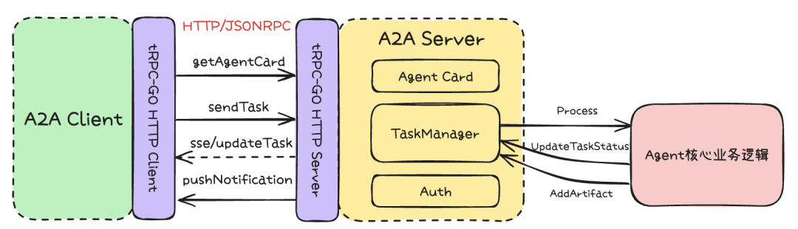  
##### A2A Server  
  
将Eino框架的Agent使用A2A协议对外提供服务有以下几个步骤：  
1. 实现任务状态同步能力，通过Callbacks切面将任务开始、任务结束，以及中间执行状态流式消息进行输出。  
  
1. 实现TaskProcessor接口处理新任务，内部通过调用graph.Stream执行运行图。  
  
```
// TaskProcessor defines the interface for the core agent logic that processes a task.// Implementations of this interface are injected into a TaskManager.type TaskProcessor interface {  // Process executes the specific logic for a task.  // It receives the task ID, the initial message, and a TaskHandle for callbacks.  // It should use handle.Context() to check for cancellation.  // It should report progress and results via handle.UpdateStatus and handle.AddArtifact.  // Returning an error indicates the processing failed fundamentally.  Process(ctx context.Context, taskID string, initialMsg protocol.Message, handle TaskHandle) error}
```  
1. 完成AgentCard描述Agent的能力，创建A2A Server  
  
```
func NewA2AServer(agent *Agent) (*server.A2AServer, error) {var err error  agentCard := getAgentCard() // 按照A2A协议标准生成AgentCard，描述Agent能力  redisCli, err := tgoredis.New("trpc.redis.deepresearch")if err != nil {    returnnil, fmt.Errorf("failed to create redis client: %w", err)  }// 创建基于Redis的任务管理器  taskManager, err := redistaskmanager.NewRedisTaskManager(redisCli, agent)if err != nil {    returnnil, fmt.Errorf("failed to create task manager: %w", err)  }  srv, err := server.NewA2AServer(agentCard, taskManager)if err != nil {    returnnil, fmt.Errorf("failed to create A2A server: %w", err)  }return srv, nil}
```  
1. 将A2A Server注册到tRPC服务上，并启动服务  
  
```
func main() {  s := trpc.NewServer()  agt, err := deepresearch.NewAgent()if err != nil {    log.Fatal(err)  }  a2aServer, err := deepresearch.NewA2AServer(agt)if err != nil {    log.Fatal(err)  }  thttp.RegisterNoProtocolServiceMux(    s.Service("trpc.a2a_samples.deepresearch.A2AServerHandler"),    a2aServer.Handler(),  )if err := s.Serve(); err != nil {    log.Fatal(err)  }}
```  
##### A2A Client  
  
创建一个A2A客户端使用A2A协议向一个Agent发起任务主要分为以下几个步骤：  
1. 创建A2A客户端  
  
```
// 客户端a2aClient, err := a2aclient.NewA2AClient(agentConfig.ServerURL, a2aclient.WithTimeout(time.Minute*10))
```  
1. 调用StreamTask发起流式任务  
  
```
taskChan, err := a2aClient.StreamTask(c, protocol.SendTaskParams{  ID:      taskID,  Message: initMessage,})
```  
1. 流式处理任务执行结果  
  
```
for v := range taskChan {  switch event := v.(type) {  case protocol.TaskStatusUpdateEvent:    handleTaskStatusUpdateEvent(c, req, ch, event)  }}
```  
### 从原理到实践：Demo解读  
  
在上文中，我们详细介绍了A2A协议的基本原理和客户端的使用方法，帮助大家理解了如何通过A2A协议实现智能体之间的高效协作。接下来，我们将结合实际Demo，从整体架构到核心模块的实现，深入剖析一个多Agent协同系统的开发过程，帮助大家将理论知识转化为可落地的工程实践。  
##### 整体架构  
  
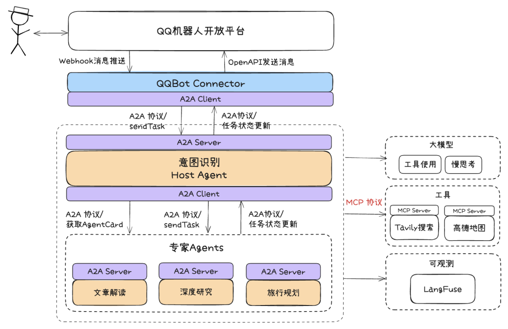  
  
如图所示，Demo整体采用了多Agent架构中常见的Supervisor模式。意图识别Agent作为"客户经理"，负责对用户的提问进行智能分类，并将任务分发给对应的领域专家Agent处理。每个Agent均通过A2A协议进行标准化封装，并集成了生态连接层（Connector），使得任何实现A2A协议的Agent都能无需修改内部逻辑，便捷地接入Cherry Studio等AI应用客户端、QQ机器人等多种平台，实现生态的无缝对接和扩展。  
  
另外，Demo接入了Langfuse的可观测组件，不仅实现了Agent内部运行流程的全链路可观测，还提供了对数据进行标注、持续优化回复效果的能力。通过可观测和数据标注，开发者可以实时查看每个Agent的任务处理状态、性能指标、异常日志等信息，并基于标注数据不断优化系统表现，提升了系统的可维护性、问题定位效率和回复质量。  
##### Agent设计  
  
使用Eino框架开发Agent会变得非常高效和简单。开发者只需专注于核心业务流程的编排与实现，无需关心底层通信、协议适配、任务调度等繁琐细节。Eino+tRPC-A2A-Go框架通过标准化的A2A协议和模块化的能力封装，极大降低了多Agent系统的开发门槛，让每个Agent都能专注于自身的智能决策与能力扩展。下面我们以Demo中的几个典型Agent为例，详细介绍它们的设计思路与实现方式，帮助大家更好地理解如何基于Eino框架快速落地多智能体协作系统。  
###### 旅行规划  
  
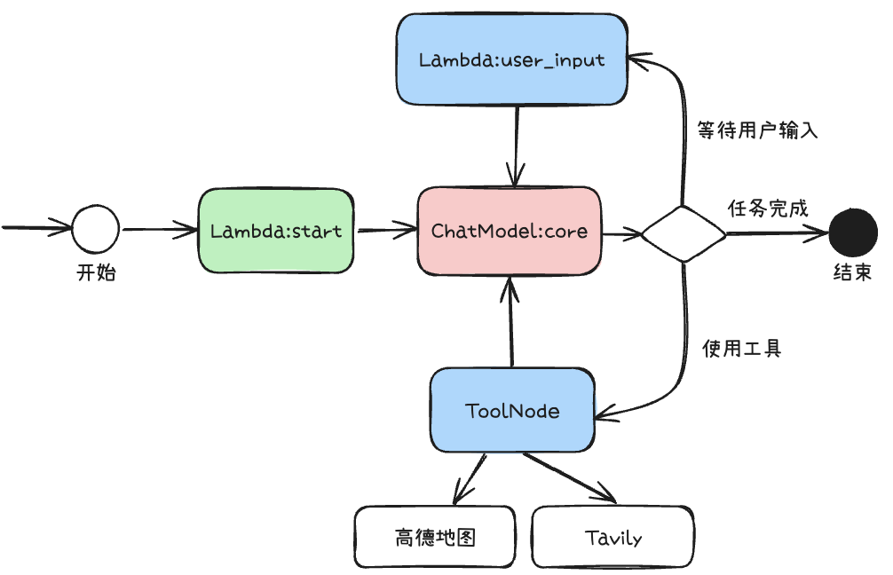  
  
旅行规划 Agent 使用经典的 ReAct 框架实现。主要集成了高德地图 MCP 能力，实现了路线规划、交通方式推荐、实时路况查询等功能，以及 Tavily 进行 AI 搜索，能够检索目的地的景点介绍、游玩攻略、美食推荐等内容。在此之上，通过增加了Lambda:user_input  
节点等待用户下一轮对于行程规划的建议和追问。  
###### 深度搜索  
  
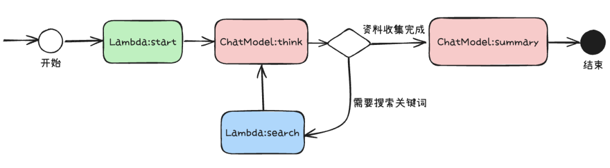  
  
深度搜索 Agent 利用大模型对复杂问题进行多角度分析，边推理边搜索。在执行流程内部，通过ChatModel:think  
进行问题分析，并判断上下文的资料是否足够回答用户问题，如果不够那么输出关键词借助搜索工具获取资料补充上下文，如果足够，通过ChatModel:summary  
模型，输出对于问题的分析总结报告。  
###### 意图识别  
  
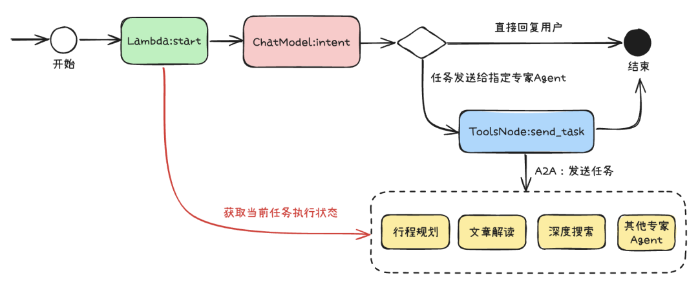  
  
意图识别Agent作为客户经理的角色，理解用户的需求，对用户上下文进行分析，判断其属于哪一类任务（如旅行规划、深度搜索等），随后将任务分发给最合适的领域专家Agent进行处理。这个能力通过Function Call让大模型实现发送任务的参数填充来实现。在工具调用节点中，通过标准化的A2A协议将任务交给专家Agent来处理，流式获取任务执行结果返回给用户。  
  
这种设计让意图识别Agent具备了高度的灵活性和可扩展性。一方面，它能够根据用户需求动态选择并对接不同类型的下游专家Agent，实现多智能体间的高效协作与任务流转；另一方面，专家Agent采用标准化A2A协议进行封装，具备天然的可插拔能力，通过AgentCard描述能力让意图识别Agent进行判断当前的任务类型，支持在系统运行时无缝添加、替换或扩展新的专家Agent，极大提升了多Agent系统的能力边界和生态丰富度。  
##### 连接生态  
  
Connector是A2A多Agent系统实现"能力复用"和"生态扩展"的关键。它的核心目标是将标准化的Agent能力，通过协议适配、接口封装等方式，快速对接到不同的外部平台和应用场景，实现"写一次，处处可用"。  
- **解耦**  
：Agent本身只关注业务逻辑和A2A协议实现，不直接依赖于任何具体平台。Connector负责协议转换、消息编解码、上下游适配，最大程度降低Agent与外部生态的耦合度。  
  
- **标准**  
：所有对接均基于A2A协议的标准输入输出格式，保证能力的可组合性和可迁移性。无论是对接IM、Web、App还是第三方API，均通过统一的协议层进行交互。  
  
- **可扩展**  
：Connector采用插件化、模块化设计，支持按需扩展新的平台适配器。只需实现对应的适配接口，即可将Agent能力无缝接入新的生态系统。  
  
通过标准化的Connector层设计，A2A多Agent系统能够轻松对接各类生态平台，实现能力的快速复用和生态的持续扩展，为智能体系统的落地和演进提供坚实的基础。  
###### 接入Cherry Studio  
  
[Cherry Studio](https://www.cherry-ai.com/)  
是一款功能强大的**开源跨平台**  
的AI桌面应用，可以与各种大型语言模型（LLMs）进行交互，旨在通过统一界面和强大的功能集成，提高用户与AI技术的交互效率和便捷性。  
  
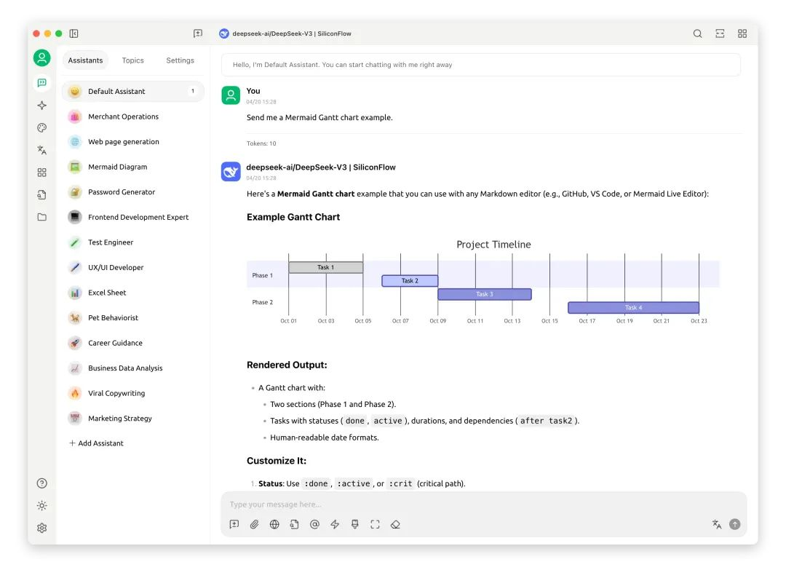  
  
通过实现 OpenAI 兼容的 Connector，将 Agent 能力以标准 chat/completion 协议对外暴露，我们可以直接在 Cherry Studio 客户端中便捷地接入和调试 Agent，实时体验其交互效果与能力表现，极大提升了开发和测试的效率与直观性。  
1. 实现chat/completion接口，获取model  
作为Agent名字，调用A2AServer，将任务执行结果，使用SSE协议流式输出到chat/completion响应里  
  
```
func (s *Server) chatHandler(c *gin.Context) {var req api.ChatRequestif err := c.ShouldBindJSON(&req); errors.Is(err, io.EOF) {  c.AbortWithStatusJSON(http.StatusBadRequest, gin.H{"error": "missing request body"})return } elseif err != nil {  c.AbortWithStatusJSON(http.StatusBadRequest, gin.H{"error": err.Error()})return }var foundAgent boolvar agentConfig config.AgentConfigfor _, agent := range config.GetMainConfig().OpenAIConnector.Agents {if agent.Name == req.Model {   foundAgent = true   agentConfig = agent   break  } }if !foundAgent {  c.AbortWithStatusJSON(http.StatusBadRequest, gin.H{"error": fmt.Sprintf("agent %s not found", req.Model)})return } ch := make(chan any)gofunc() {deferclose(ch)  initMessage := protocol.Message{   Role:  "user",   Parts: []protocol.Part{protocol.NewTextPart(req.Messages[len(req.Messages)-1].Content)},  }// 客户端  a2aClient, err := a2aclient.NewA2AClient(agentConfig.ServerURL, a2aclient.WithTimeout(time.Minute*10))if err != nil {   ch <- gin.H{"error": err.Error()}   return  }  taskChan, err := a2aClient.StreamTask(c, protocol.SendTaskParams{   ID:      taskID,   Message: initMessage,  })if err != nil {   ch <- gin.H{"error": err.Error()}   return  }for v := range taskChan {   switch event := v.(type) {   case protocol.TaskStatusUpdateEvent:    handleTaskStatusUpdateEvent(c, req, ch, event)   }  }  res := api.ChatResponse{   Model:      req.Model,   CreatedAt:  time.Now().UTC(),   Message:    api.Message{Role: "assistant", Content: ""},   Done:       true,   DoneReason: "stop",  }  ch <- res }()// 流式返回数据 streamResponse(c, ch)}
```  
1. 配置Agent名和对应的A2A服务地址  
  
```
openai_connector:  agents:    - name: deepresearch      server_url: http://127.0.0.1:10000    - name: urlreader      server_url: http://127.0.0.1:10001    - name: lbshelper      server_url: http://127.0.0.1:10002    - name: host      server_url: http://127.0.0.1:8080
```  
1. 配置Cherry Studio模型，连接 connector 服务  
  
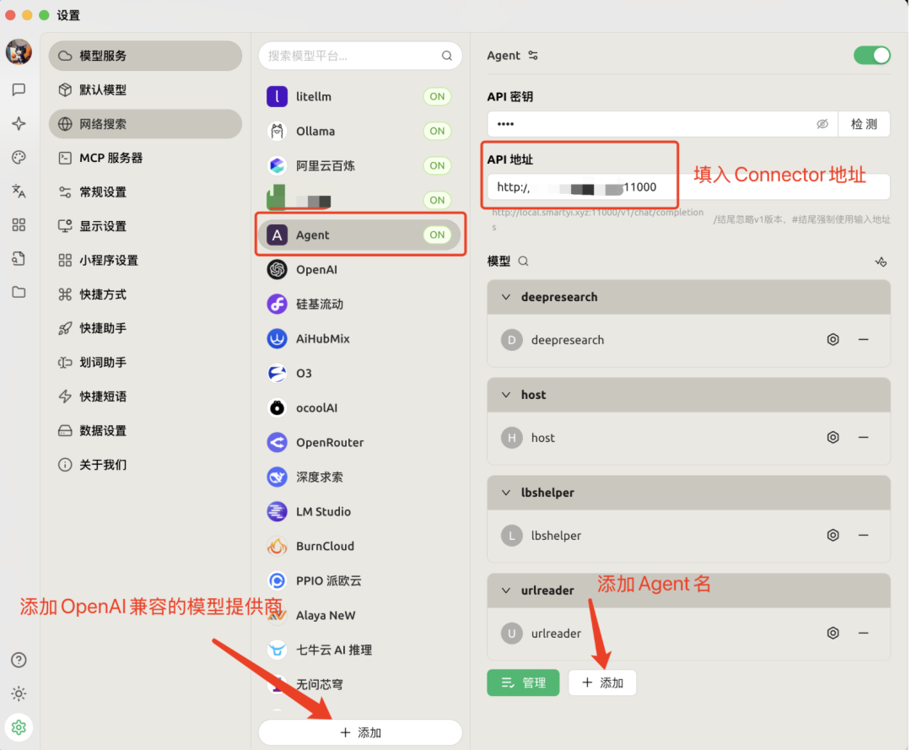  
1. 回到聊天界面即可与Agent进行对话  
  
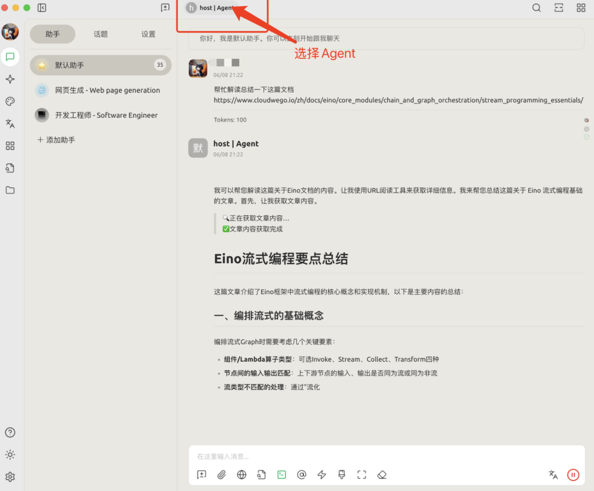  
###### 接入QQ生态  
  
通过QQBot Connector，可以轻松将Agent接入到[QQ机器人开放平台](https://bot.q.qq.com/wiki/develop/api-v2/)  
中，让更多用户在QQ中，零门槛与AI应用进行互动聊天。  
1. 注册QQ机器人，接入[BotGoSDK](https://github.com/tencent-connect/botgo)  
，接收用户给机器人发送的消息事件。  
  
1. 接收到消息后，使用A2A协议往Agent发送任务，流式接受任务执行结果状态更新。  
  
1. 调用发消息OpenAI，可以实现QQ机器人以流式的方式回复用户消息。  
  
#### Agent可观测  
  
Agent的可观测性对于保障系统的稳定性和持续优化至关重要。通过建立完善的可观测和评估体系，我们能够实时监控现网服务的运行质量，及时发现和定位故障，追踪全链路各个环境下的请求trace和耗时，为问题排查和性能瓶颈分析提供有力支撑。此外，基于对现网对话数据的质量标注，可以持续发现和归纳badcase，指导模型和业务逻辑的优化迭代，从而不断提升Agent的对话质量和用户体验。完善的可观测体系不仅有助于保障服务的可用性和可靠性，更是推动Agent"越用越聪明"、实现持续进化的基础能力。  
  
Langfuse 是一款开源的 LLM 应用可观测与分析平台，专为大模型驱动的应用（如 Agent、RAG、工具链等）设计。它帮助开发者和团队实现对 LLM 应用的全链路追踪、调试、质量评估和持续优化，是构建生产级智能体系统的"可观测性基石"。  
1. **数据看板**  
：通过Dashboard，可以实时查看LLM应用的质量、成本、延迟等多维度指标，全面监控和分析智能体系统的运行状态。  
  
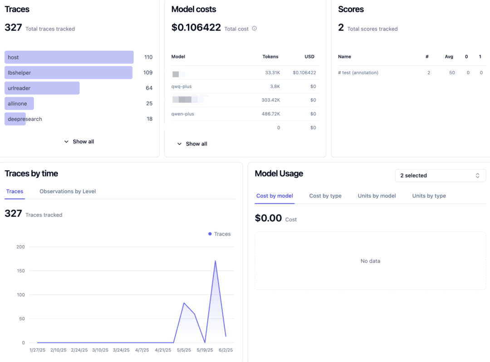  
1. **全流程追踪**  
：自动捕获 LLM 应用的每一次调用、嵌套的工具调用、上下文、API 请求、嵌入检索等所有关键步骤，形成完整的执行链路（Trace），用于分析每个环节的输入输出，定位问题。  
  
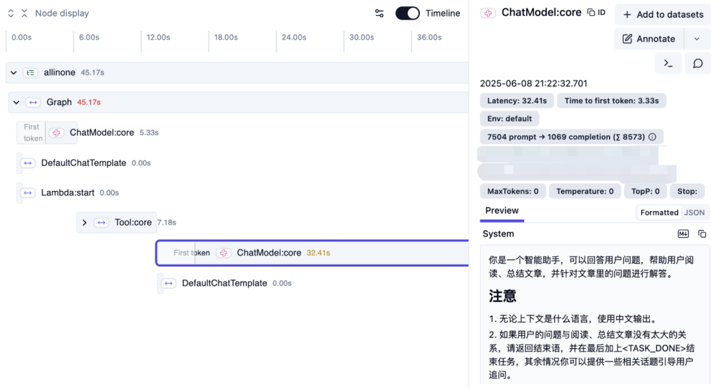  
1. **多维度质量评估**  
：支持将对话数据抽样生成数据集，便于人工标注和多维度输出质量评测。同时，内置 LLM-as-a-judge能力，可自动对对话质量进行多角度打分与分析，帮助业务高效发现并持续优化 badcase。  
  
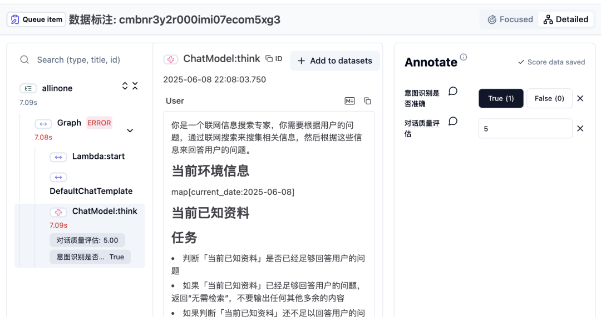  
  
Eino 框架极大简化了 Langfuse 的接入流程。开发者只需十行代码，初始化并注册 [Langfuse CallbackHandler](https://github.com/cloudwego/eino-ext/tree/main/callbacks/langfuse)  
 到 Agent，无需改动任何业务逻辑，即可实现对 Agent 的全链路可观测。这充分体现了标准化框架的工程优势。此外，Agent 也能通过类似方式，无缝切换接入公司内部的伽利略、智研等监控与研发效能平台，灵活满足不同场景的观测需求。  
```
cbh, flusher := langfuse.NewLangfuseHandler(&langfuse.Config{  Host:      cfg.Langfuse.Host,  PublicKey: cfg.Langfuse.PublicKey,  SecretKey: cfg.Langfuse.SecretKey,  Name:      cfg.Langfuse.Name,  SessionID: taskID,})defer flusher()callbackHandlers = append(callbackHandlers, cbh)
```  
### 总结  
  
AI Agent 的发展正处于爆发前夜，从最初的 LLM 聊天机器人，到具备规划、记忆、工具调用能力的智能体，再到多 Agent 协作的复杂生态，整个行业正在经历一场范式转变。本文系统梳理了 AI Agent 的核心理念、主流协议（MCP、A2A）、思考框架（CoT、ReAct、Plan-and-Execute），并结合 Golang 生态下的 Eino、tRPC-A2A-Go 等工程化框架，结合实际例子详细讲解了如何优雅地开发、编排和观测复杂的智能体系统。  
- 协议标准化是 Agent 生态繁荣的基石：MCP、A2A 等协议的出现，极大降低了工具和 Agent 的集成门槛，让"能力复用"成为可能。未来，协议的进一步融合和演进，将推动智能体生态走向真正的互联互通。  
  
- 思考框架决定 Agent 的智能上限：从 CoT 到 ReAct，再到 Plan-and-Execute，结构化的推理与行动流程，是 Agent 能否胜任复杂任务的关键。合理选择和实现思考框架，是打造高鲁棒性、高可解释性 Agent 的核心。  
  
- 工程化框架让复杂 Agent 开发变得优雅高效：Eino、tRPC-A2A-Go 等框架，通过组件化、强类型、编排与切面机制，极大提升了开发效率和系统可维护性。无论是单体智能体，还是多 Agent 协作，都能快速落地生产级应用。  
  
- 可观测与人机协同是生产级 Agent 的必备能力：只有让 Agent 的推理过程、工具调用、任务状态对用户和开发者透明，才能实现高质量的交付和持续优化。Human In The Loop 机制，则为关键场景下的安全性和可控性提供了保障。  
  
- 选择适合自身场景的协议与框架才是最优解：没有万能的协议和框架，只有最适合当前业务和团队的技术选型。理解协议的边界、框架的能力，结合实际需求做出权衡，才能真正发挥 AI Agent 的价值。  
  
AI Agent 的世界远比想象中更广阔。无论你是初入门的开发者，还是追求极致工程化的团队，只要掌握了底层原理和方法论，结合合适的工具和框架，都能在这场智能体革命中占据一席之地。希望本文能为你搭建起从原理到实践的桥梁，助你在 AI Agent 领域走得更远、更稳、更优雅。  
  
### 写在最后  
  
目前QQ AI能力也在内测中，QQ官方AI伙伴小Q现已全新升级，接入混元及Deepseek模型，轻松实现秒级回复、即问即答，同时支持深度思考及联网搜索，为你提供更全面的信息，还具备AI识图、AI画图、AI写作等多元能力。同时，QQ搜索也已接入AI，可自由切换多种模型，让你轻松实现全网冲浪！  
  
感兴趣的同学可以扫码体验，加入我们的内测群，与更多AI爱好者交流~  
- **🧭QQ AI上新指南**  
：[【腾讯文档】小Q+AI搜索——满血版AI好搭子](https://doc.weixin.qq.com/doc/w3_ARQACAY3ADcCN0OXq8CwkSPiyEC0x?scode=AJEAIQdfAAoP8GB15L)  
  
  
- **📣反馈入口**  
：[【腾讯文档】QQ AI反馈收集表](https://docs.qq.com/form/page/DZVFsZXl3VmJiUm90)  
  
  
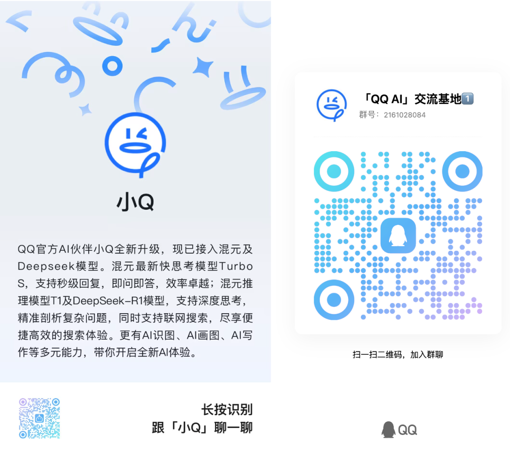  
  
  
  
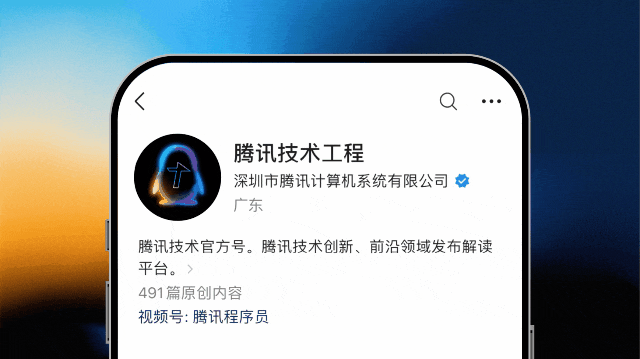  
  
  
  
  
  
