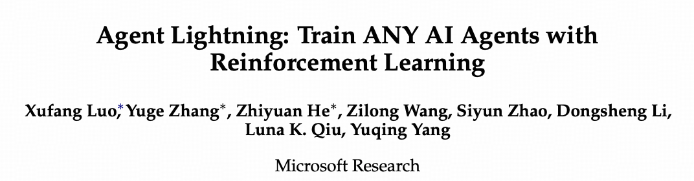
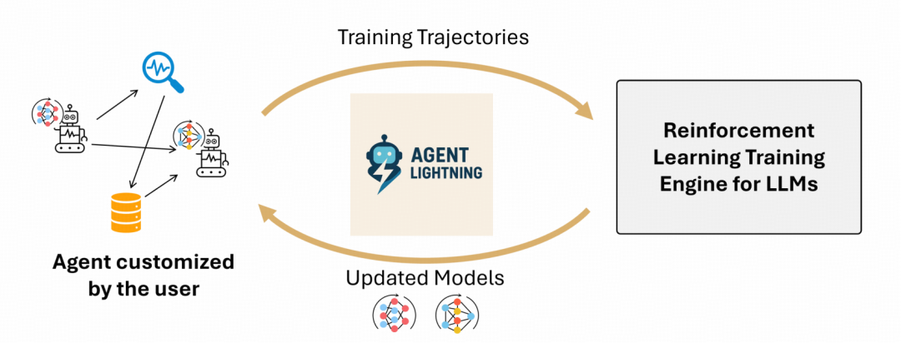
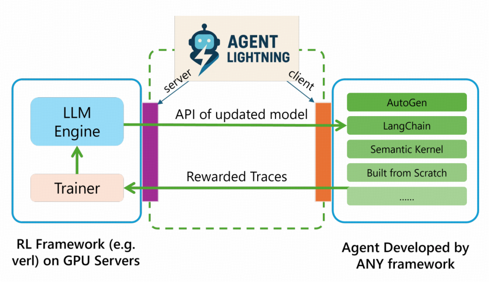
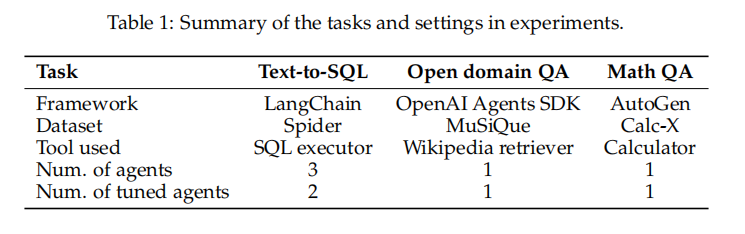
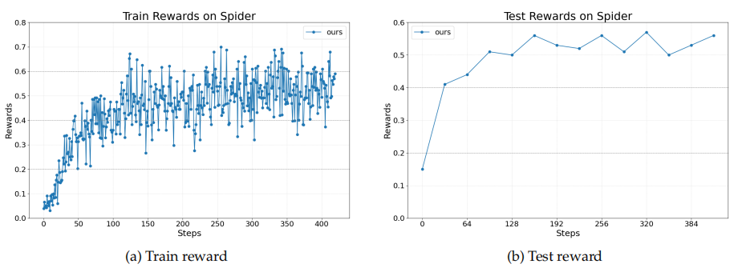
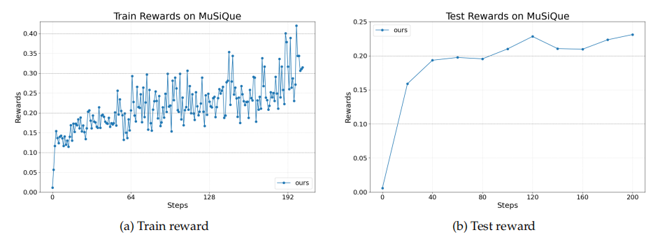
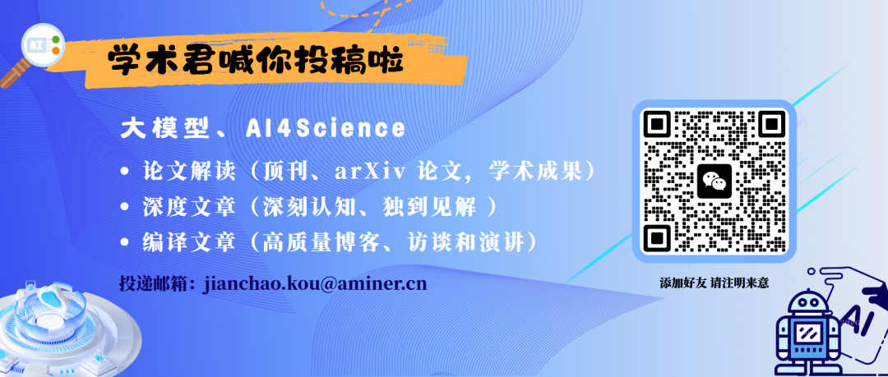

#  任意Agent皆可强化学习！微软推出Agent Lightning框架，无需修改任何代码  
 学术头条   2025-08-13 20:05  
  
  
  
  
AI Agent 已逐渐从科幻走进现实——不仅能够执行编写代码、调用工具、进行多轮对话等复杂任务，甚至还可以进行端到端的软件开发，已经在金融、游戏、软件开发等诸多领域落地应用。  
  
  
然而，当前的 AI Agent 在训练与优化环节却面临着严峻挑战，传统强化学习（RL）方法也在复杂、动态交互场景下表现不佳。  
  
  
为此，微软团队推  
出了一个灵活、可扩展的框架  
 ——   
Agent Lightning  
，其可  
对任何 AI Agent 进行基于强化学习的大语言模型（LLM）训练  
，有望重塑 AI Agent 的未来训练范式。相关研究论文已发表在预印本网站 arXiv 上。  
  
  
  
  
  
论文链接：https://arxiv.org/abs/2508.03680  
  
  
**核心贡献如下：**  
  
****- Agent Lightning 是**首个实现****Agent****与强化学习训练完全解耦的框架****，**  
能够  
无缝应用于任何 AI Agent  
，无论其实现方式如何，几乎无需进行任何代码修改。将训练与 Agent 的执行逻辑对齐，提升了 Agent 在实际应用中的性能。这使开发者能够突破静态预训练模型的局限，释放自适应学习型 Agent 的全部潜力。  
  
  
- 在算法层面，Agent Lightning **基于****Agent****的马尔可夫决策过程（MDP）建模**  
，并  
引入统一数据接口  
。该接口抽象化了不同 Agent 执行逻辑的复杂性，使 Agent 执行过程中**收集的数据可直接转换为训练轨迹**  
。此外，Agent Lightning 采用分层强化学习框架，并配备信用分配模块，将轨迹级回报分配给每次调用生成的响应。该设计与现有单轮强化学习算法无缝集成，实现高效且有效的训练。  
  
  
- 在系统层面，Agent Lightning   
引入了**“****Training-Agent****”解耦架构**  
，**实现强化学习训练与****Agent****执行的清晰分离**  
。该架构通过 Lightning Server 和 Lightning Client 实现，两者共同提供适用于任何 Agent 的标准化模型训练服务。Lightning Client 作为 Agent 运行时，透明地管理 Agent 执行并收集轨迹，无需进行代码修改。该设计使可观察性基础设施在训练场景中得以复用，确保了可扩展性（extensibility）、可伸缩性（scalability）和与各种 Agent 框架的无缝集成。  
  
### Agent Lightning：训练任意 AI Agent  
###   
  
在真实世界中，AI Agent 的运行逻辑极为复杂，绝非简单的 “一问一答” 模式。它们常常需要**多轮交互**  
，像人类对话一样循序渐进推进任务，通过**调用外部工具或 API**  
，与外部系统交互获取更多信息，依据环境反馈和当前状态灵活做出**动态决策****，**  
甚至在复杂场景中，**多个****Agent****需协同合作**  
完成任务。  
  
  
但现有强化学习训练框架，往往将强化学习训练过程与 Agent 的具体执行逻辑紧密“捆绑”，导致一系列问题，严重阻碍了强化学习在 AI Agent 大规模训练和部署中的应用。例如：  
  
- **耦合度高**  
：  
若想利用强化学习训练一个已有的 Agent，开发者往往不得不对 Agent 代码进行大规模修改，甚至重构，开发成本巨大；  
  
  
- **扩展性差**  
：  
针对特定任务设计的强化学习方法，很难直接迁移到其他类型的 Agent；  
  
  
- **数据利用率低**  
：  
Agent 在真实环境中产生的丰富交互数据，因与强化学习训练框架不兼容而难以被有效利用；  
  
  
- **多轮交互生成的上下文序列过于冗长**  
：  
增加了 LLM 计算和内存开销。  
  
  
微软此次提出的 Agent Lightning 框架的核心创新点，在于**实现了 AI****Agent****执行与强化学习训练之间的彻底解耦**  
。二者可独立运作，又能进行信息交换。  
  
  
  
  
图｜Agent Lightning 概述  
  
  
除了上述提到的**完全解耦和统一数据接口**  
之外，**LightningRL**  
 也是该研究的主要亮点之一。  
  
  
LightningRL 是微软为利用收集到的转换数据优化策略 LLM，而提出的专为 Agent 训练设计的分层强化学习算法。  
  
  
  
  
图｜LightningRL 示意图  
  
  
该算法包含**信用分配模块**  
，能够将任何 Agent 生成的轨迹分解为训练所需的转换数据，从而使强化学习能够处理复杂的交互逻辑，如多 Agent 场景和动态工作流。在信用分配过程中，高层信用分配首先将整个任务的最终奖励合理分配到任务执行过程中的每一步骤，例如在最简单实现中，可让每一次调用的奖励都等于最终奖励。  
  
  
经过高层信用分配后，低层策略更新将每一次 LLM 调用（input、output、reward）转化为一个**独立的“单次调用”强化学习问题**  
，此时可直接套用任何现成的、成熟的单次调用强化学习算法（如 PPO、DPO 或 GRPO），来更新模型参数。这种设计不仅具备灵活性和复用性，可直接利用社区中 SOTA 单次调用强化学习算法，还从根本上解决了因上下文累积导致的序列过长问题，避免了复杂易错的掩码操作。  
  
  
Agent Lightning 将计算密集型的 LLM 生成与传统编程语言编写、轻量级但多样化且灵活的应用逻辑和工具分离。  
  
  
在系统设计方面，Agent Lightning 引入了**“**  
Training-Agent”解耦架构，构建了一个适用于任意 Agent 的标准化训练服务。  
该架构由 Agent Lightning Server 和 Agent Lightning Client 组成。  
  
  
  
  
图｜Training-Agent 解耦架构  
  
****  
**Agent****Lightning Server：**  
作为强化学习训练系统的 “大脑”，承担着管理训练流程的重任，并通过类 OpenAI API 向客户端暴露更新后的模型。它负责运行强化学习训练算法、分配 GPU 资源、管理模型版本等一系列复杂且计算密集型的任务。  
  
  
**Agent****Lightning Client：**  
包含两个功能模块：一个模块负责与服务器通信，实现数据传输与接收；另一个模块运行 Agent 并执行数据收集，充当 Agent 的运行时环境。  
  
  
得益于统一数据接口，Agent 运行时能够将 OpenTelemetry 等全面的可观测性框架集成到训练过程中，用于轨迹收集。这一机制将监控基础设施与强化学习训练连接起来，使优化算法能够利用丰富的系统监控数据，从而构建更具可扩展性与灵活性的训练基础。这种 “前后端分离” 式的架构设计，彻底将 Agent 开发者从复杂的强化学习系统配置中解放出来，让他们得以专注于 Agent 本身的逻辑和创意，极大降低了 AI Agent 进化的门槛。  
  
  
### 实验结果  
###   
  
研究团队在多个任务上对 Agent Lightning 框架进行了实验验证，涵盖 Text-to-SQL、开放域问答、数学问答等。在这些实验中，Agent Lightning 均展示出稳定且持续的性能提升。  
  
  
  
  
图｜实验中任务和设置的总结  
  
****  
**通过****LangChain****实现****Text-to-SQL**  
  
****  
第一个任务采用 LangChain 实现，  
设计为多 Agent 系统架构  
。系统包含三个 Agent，工作流程如下：  
  
  
SQL writing agent 首先会生成 SQL 查询语句并执行。若查询正确，SQL executor 会返回数据库信息；若出错，则返回错误提示。随后，checking agent 评估 SQL 查询的正确性及检索信息的有效性和完整性，并决定是重写查询还是直接生成答案；若需重写，re-writing agent 将根据 checking agent 的反馈修改查询语句；若无需重写，该 agent 同时承担问答任务，利用检索到的信息和问题生成最终答案。  
  
  
在此工作流程中，  
SQL 写入（writing）、校验（checking）和重写（re-writing）均由同一 LLM 完成  
，但针对不同任务定制了专属提示，从而实现三个 Agent 协同运作。  
  
  
在训练过程中，研究团队只对其中两个进行了优化，即 SQL writing agent 和 re-writing Agent，这两个 agent 是同步进行优化的，说明 Agent Lightning 可以在多 Agent 系统中选择性地对一个或多个 Agent 进行优化。  
  
  
如图，Agent Lightning 能够稳定地提高奖励，展示了其优化涉及代码生成和工具使用的复杂多步决策的能力。  
  
  
  
  
图｜Text-to-SQL 任务的奖励曲线  
  
  
**通过****OpenAI****Agent****SDK****实现检索增强生成**  
  
****  
第二个任务是  
典型的检索增强生成（RAG）任务  
。给定一个问题和文档数据库，Agent 首先会生成自然语言查询，通过现有检索工具获取支持性文档。  
  
  
该 Agent 是使用 OpenAI Agent SDK 实现的。与之前的 Text-to-SQL 任务相比，这里的 Agent 工作流程类似但更简单。策略 LLM 需要先生成查询请求，然后根据检索到的文档决定是优化查询还是直接生成答案。  
  
  
该图展示了 Agent Lightning 在这一具有挑战性的任务上实现了稳定的性能提升，证明了其在更复杂和开放式 RAG 场景中的有效性。  
  
  
  
  
**图 | 通过****AutoGen****实现****数学****问答****与工具使用**  
  
****  
第三个任务是  
数学类问答任务  
，旨在评估 Agent 调用工具（具体指计算器）解决算术和符号问题的能力。最终的奖励取决于 Agent 是否正确回答了问题，模型的性能也通过测试集上的答案准确度进行评估。  
  
  
如图，Agent Lightning 在训练过程中持续提高了性能。这证明了它在工具增强设置中的有效性，即需要精确的外部函数调用和推理。  
  
  
  
###   
###   
### 未来方向：推动 Agent 能力迭代升级  
###   
  
在论文的最后，研究团队也探讨了未来的工作方向。  
  
  
首先，除了强化学习外，Agent Lightning 建模框架还很好地  
支持其他优化方法  
，如自动 prompt 优化。关注关键组件及其调用是 Agent 优化的主要方法，而不仅仅局限于基于强化学习的方法。为此，团队提出了“Component of Interest”（CoI）的概念，用于指定执行轨迹中受优化影响的组件子集。例如，prompt 模板渲染可视为工具调用，通过将该工具视为 CoI，Agent Lightning 可支持 prompt 优化方法。这种统一且可扩展的数据结构支持对 Agent 行为进行全面的下游优化与分析。  
  
  
其次，研究团队认为，  
开发更高效的强化学习算法  
是解决复杂 Agent 场景下模型优化的关键，包括但不限于长程信用分配、探索算法、off-policy 算法等。Agent Lightning 通过过渡来建模和组织数据，使集成额外算法更加方便。  
  
  
此外，  
支持 LLM 的强化学习基础设施持续演进  
，为与基于 Agent 的强化学习框架的协同开发提供了重大机会。一个有前景的方向是进一步分解系统组件，即将训练器、推断引擎和 Agent 工作流程分离，以解决推断瓶颈并提升大规模强化学习训练的可扩展性。探索此类架构改进可带来更高效且灵活的强化学习管道。此外，针对长程任务的优化将受益于强化学习算法与系统设计协同创新，从而实现复杂 Agent 更高效的训练。  
  
  
最后，在 LLM 高效服务方面，研究团队建议  
采用更适合 LLM 的抽象方法  
，可以优化资源利用率和响应时间。此外，通过优化服务环境和工具的资源调度，还能进一步简化操作流程，提高在多样化部署场景中的扩展能力。  
  
  
随着 Agent Lightning  框架解决了强化学习与 Agent 耦合的难题，  
强化学习有望成为 Agent 训练的标配  
。同时，Agent 在真实世界中产生的海量交互数据，将不再被闲置浪费。Agent Lightning 的统一数据接口，能够高效地将这些数据用于强化学习训练，推动 Agent 能力迭代升级。  
  
  
  
整理：小瑜  
  
如需转载或投稿，请直接在公众号内留言  
  
  
  
  
