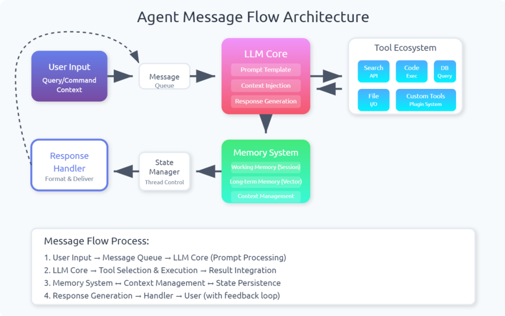
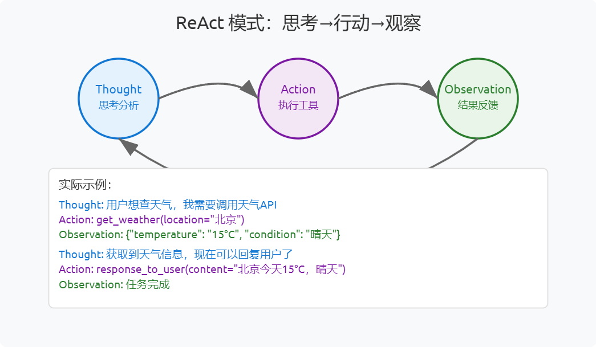
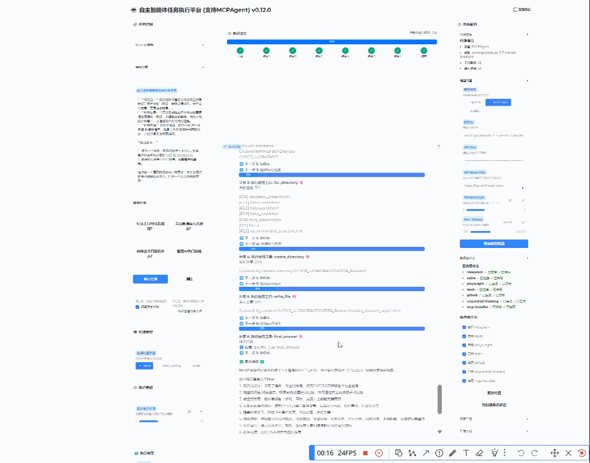
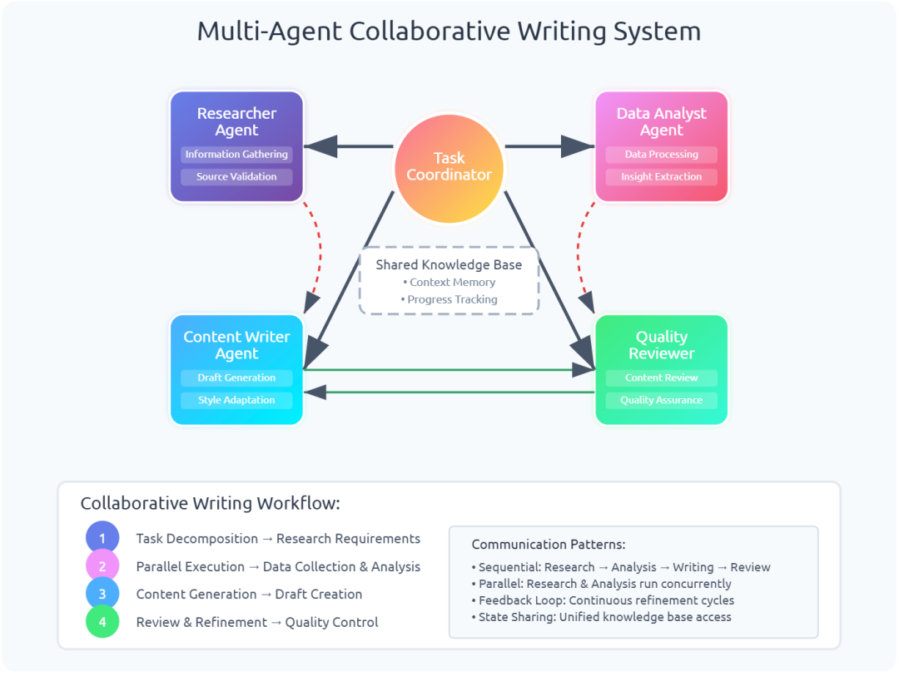

#  做了两年AI Agent，我发现99%的AI Agent项目都死在了Message Flow设计上  
原创 栗子KK  数镜智心   2025-08-09 09:01  
  
   
  
# 前言  
  
最近和几个AI创业的朋友聊天，发现一个有趣的现象：大家都在搞Agent，但聊起具体实现时，基本都在Message Flow这个环节栽过跟头。  
  
说实话，我自己也踩过这个坑。两年前刚开始做Agent产品时，觉得不就是让模型调用几个API嘛，有多难？结果发现，真正的难点不在模型调用，而在于如何设计一个稳定、可扩展的消息流架构。  
  
今天想跟大家聊聊这个话题，算是给准备入坑或者正在坑里的朋友们一些参考。  
  
  
## 消息结构设计，细节决定成败  
  
当年Chaptgpt刚出来，刚开始做的时候，我天真地以为消息结构就是简单的JSON：  
```
{  "role": "user",  "content": "帮我查一下天气"}
```  
  
结果发现，真实场景复杂太多了。你需要考虑：  
- • 工具调用结果怎么存？  
  
- • 多步推理的中间状态怎么管理？  
  
- • 错误重试时上下文怎么保持？  
  
- • 不同Agent间怎么传递状态？  
  
后来我参考了OpenAI的ChatML格式，采用了更结构化的设计：  
```
class Message:    role: str  # system/user/assistant/tool    content: str    tool_calls: Optional[List[ToolCall# 自定义字段    timestamp: datetime
```  
  
这个设计的好处是，你可以在metadata里塞各种自定义信息，比如推理步骤、置信度、甚至是调试信息。  
## Prompt构造，从简单到复杂  
  
早期我们用的是最简单的提示词拼接，就是把系统指令、历史对话、当前问题串起来。但很快发现问题：  
1. 1. Token消耗太大  
  
1. 2. 模型容易"忘记"重要指令  
  
1. 3. 多轮对话容易跑偏  
  
现在我们采用的是模板化+动态注入的方式：  
```
class PromptTemplate:    def__init__(self):        self.system_prompt = "你是一个..."        self.few_shot_examples = [...]  # 少样本示例        self.current_context = None          defbuild_prompt(self, user_input, context=None):        # 动态选择最相关的示例        relevant_examples = self.select_examples(user_input)        # 注入当前上下文        if context:            self.current_context = context        returnself._assemble_prompt(...)
```  
  
关键是要做到"该详细时详细，该简洁时简洁"。比如第一轮对话给出完整指令，后续轮次只传递必要的上下文。但是动态拼装如果修改了系统提示词也有KV Cache命中问题，以及模型不稳定问题，所以多智能体是有必要的，这是后话，后面可以详细聊。  
  
  
## 主流框架的设计哲学  
  
过去一年，我基本把市面上主流的Agent框架都试了一遍。每个框架都有自己的设计哲学：  
  
**AutoGPT系**  
：单智能体，大而全，适合演示但生产环境容易失控。最大的问题是缺乏有效的任务分解机制，经常陷入无限循环。  
  
**LangChain系**  
：模块化设计，生态丰富，但学习曲线陡峭。说实话，文档写得不够清晰，经常需要看源码才能理解。  
  
**LangGraph系**  
：图结构设计很优雅，多智能体协作机制不错。我们现在的架构很大程度上参考了它的设计。  
  
**CrewAI系**  
：角色分工明确，适合团队协作场景。但自定义程度相对较低。  
  
我觉得没有完美的框架，关键是要根据自己的业务场景选择合适的设计模式，所以框架只限于MVP验证（比如五月初我曾在公司内部用SmoleAgents框架一周时间内搭了一个类似Manus的自主智能体全栈应用，支持FunctionCall-ReAct、MCP-ReAct、CodeAct三种运行模式，如图），商业级长期迭代的项目一定要定制化智能体架构，仔细设计Message Flow。  
  
  
  
## 上下文管理，被低估的核心能力  
  
这是我踩坑最深的地方。一开始觉得，上下文管理不就是把对话历史存起来嘛？  
  
结果发现，真正的挑战在于：  
1. 1. **什么时候记住？**  
 不是所有对话都需要长期记住  
  
1. 2. **什么时候忘记？**  
 Token有限，必须选择性遗忘  
  
1. 3. **怎么高效检索？**  
 用户换个说法，系统就找不到相关记忆了  
  
1. 4. **多线程怎么隔离？**  
 不同用户的上下文不能串了  
  
我们现在的解决方案是三层记忆架构：  
- • **工作记忆**  
：当前会话的完整上下文  
  
- • **情节记忆**  
：重要事件和决策节点  
  
- • **语义记忆**  
：通过向量检索的知识库  
  
```
class MemoryManager:    def __init__(self):        self.working_memory = []  # 当前对话        self.episodic_memory = VectorStore()  # 重要片段        self.semantic_memory = KnowledgeBase()  # 领域知识      def store_message(self, message):        self.working_memory.append(message)        # 判断是否值得长期保存        if self.is_important(message):            self.episodic_memory.add(message)
```  
## 我的一些思考  
  
  
  
做了快两年Agent，尤其是企业级Agent，从workflow范式到agentic范式，最大的感受是：**技术细节决定产品体验上限**  
，复杂度不会消失，只会转移。  
  
用户不关心你用了什么模型、什么框架，他们只关心Agent是否能稳定地完成任务。而稳定性，很大程度上取决于Message Flow的设计质量。  
  
现在市面上的Agent产品，90%都卡在工程实现上很难做到“丝滑”。模型能力已经足够了，但系统架构跟不上。特别是在多轮对话、错误处理、状态管理这些"脏活累活"上，大家都在重复造轮子。  
  
我觉得，未来一两年，Agent开发会逐渐标准化（mcp\a2a\ag-gui协议的爆火，感兴趣的可以爬楼看我三月份写的mcp两篇实现文章[MCP客户端应用程序分析与技术架构解读](https://mp.weixin.qq.com/s?__biz=Mzg4MzAzNTA5Ng==&mid=2247484113&idx=1&sn=7acf508511ee77a428d79d31550d7d9b&scene=21#wechat_redirect)  
 [5ire ，一款跨平台桌面 AI 助手，MCP 客户端，技术报告](https://mp.weixin.qq.com/s?__biz=Mzg4MzAzNTA5Ng==&mid=2247484119&idx=1&sn=92078dedfdf667f0367803efde2a24ae&scene=21#wechat_redirect)  
），但上限永远在定制化。就像现在的Web开发一样，会有成熟的框架和最佳实践，但所有最佳场景适配的框架还是需要架构师去设计的。但在那之前，谁能在Message Flow设计上做得更好，谁就有先发优势。  
  
最后想说，如果你也在做Agent相关的产品，欢迎私信交流。这个领域变化太快，一个人闭门造车很容易走弯路。大家一起踩坑，总比各自踩坑要好 😄  
  
对了，你们在Agent开发中遇到过什么坑？留言区聊聊～  
  
PS：文中的框架对比基于个人实践经验，不代表绝对的优劣判断。选择合适的工具永远比追求最新的工具更重要。  
  
   
  
  
