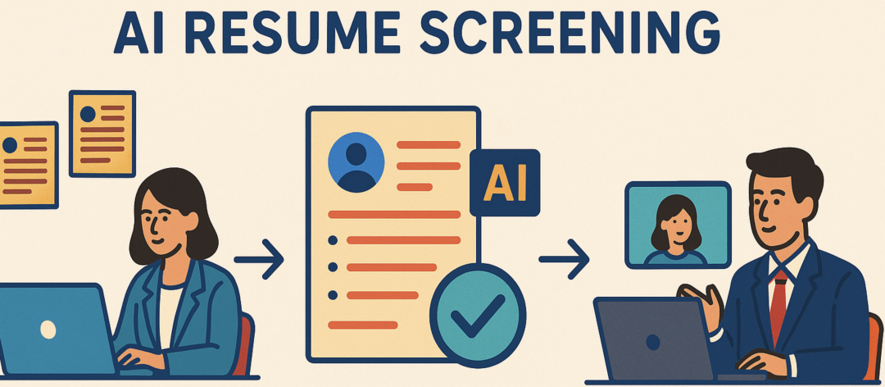
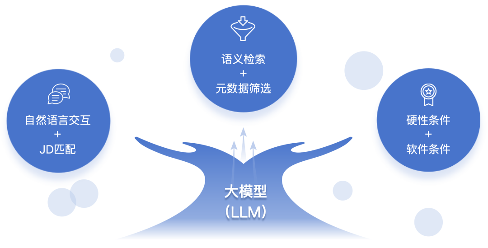
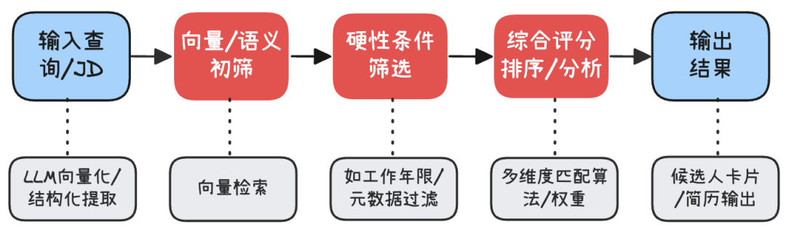
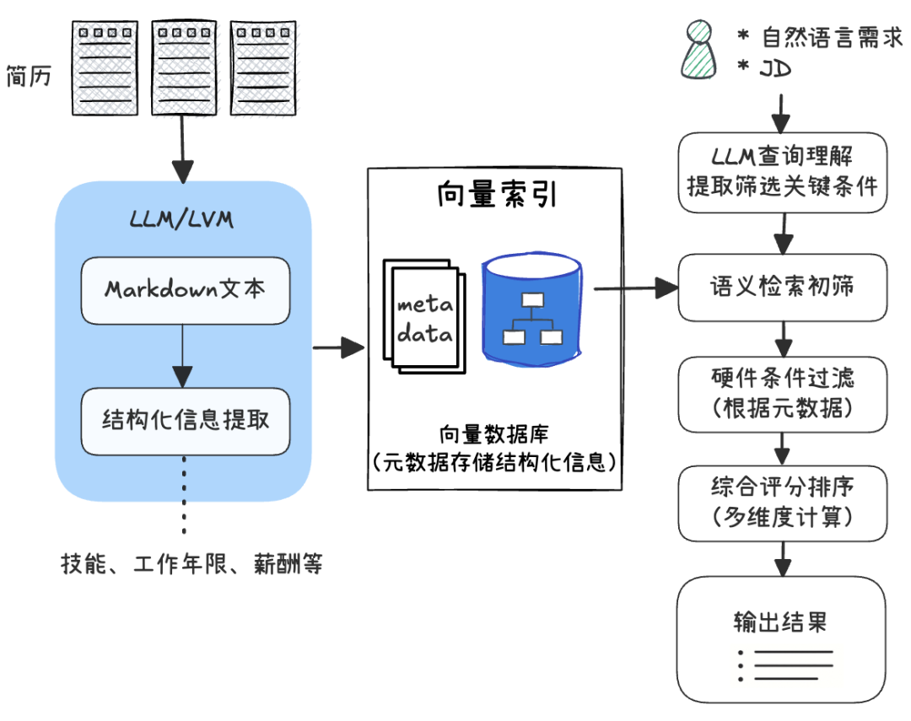
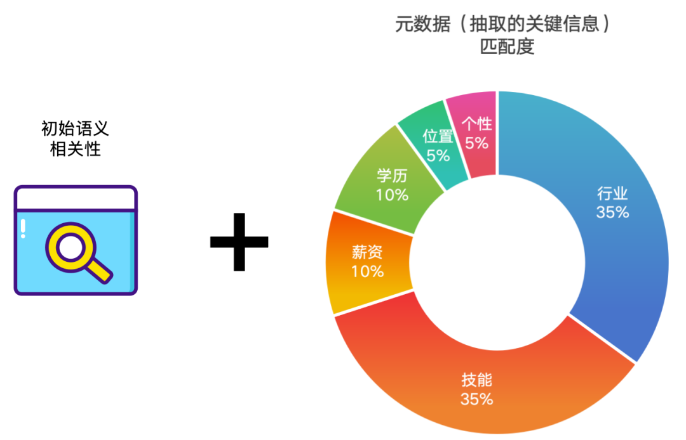
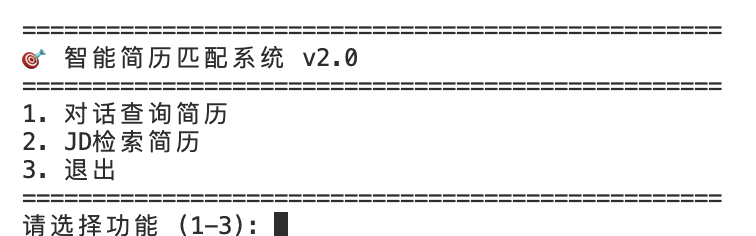
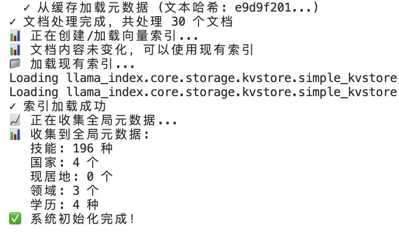
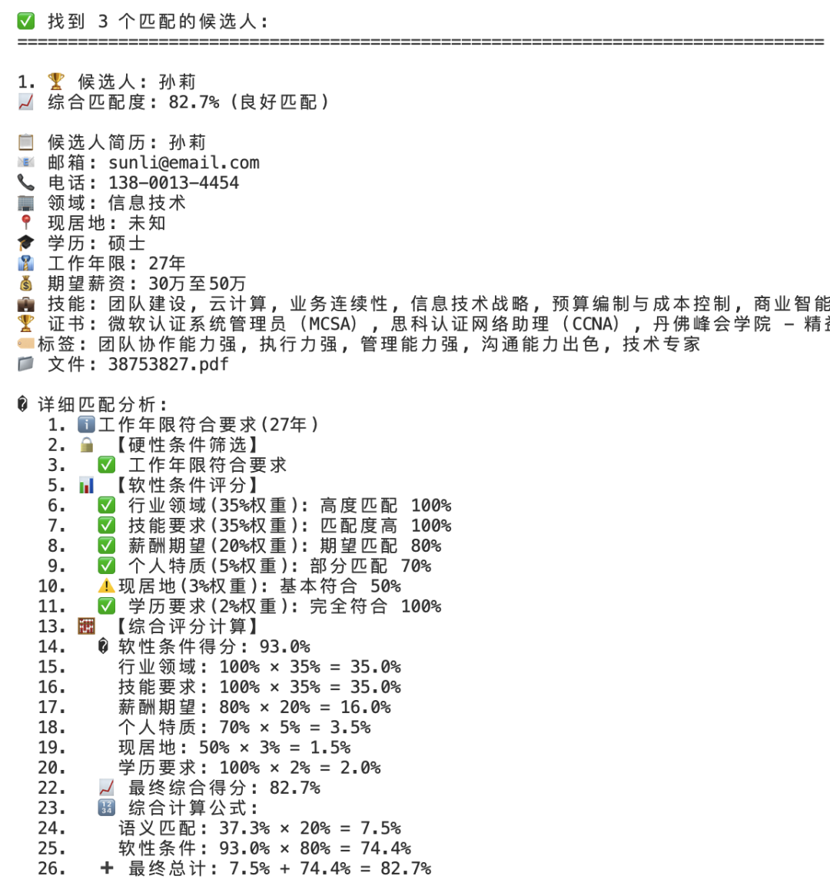
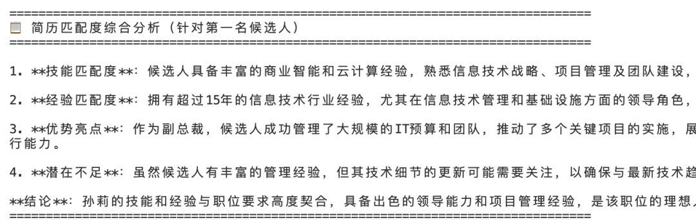
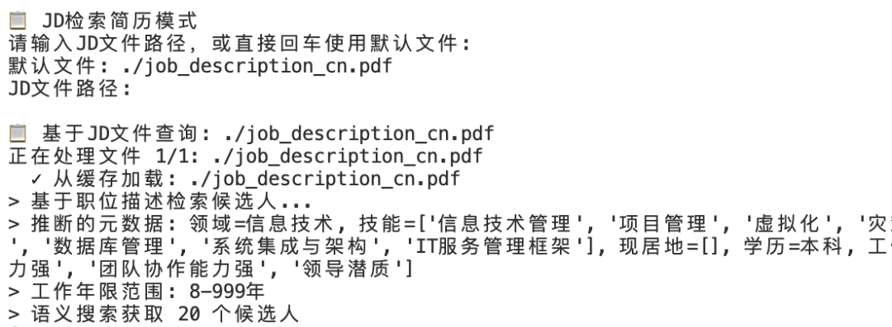

#  实战案例：从 0 到 1 搭建 LLM 智能简历筛选 Agent 系统（设计+实现）  
原创 曾经的毛毛  AI大模型应用实践   2025-08-11 09:01  
  
点击上方  
  
蓝字  
  
关注我们  
  
  
  
  
招聘流程中的简历筛选是核心环节。传统方法严重依赖人工，效率低下且容易遗漏。本文将尝试设计和实现一个基于LLM的智能简历匹配系统，通过多维度多层次的评估，理解真实的招聘需求，实现  
自然语言交互的、智能化、可量化的简历筛选过程。  
  
  
- 挑战与系统目标  
  
- 解决方案设计  
  
- 经典RAG方法的不足  
  
- 升级的方案  
  
- 系统模块架构  
  
- 关键实现要点  
  
- 测试与未来演进  
  
  
**01**  
  
挑战与系统目标  
  
传统HR（或HR管理系统）的简历匹配与筛选方法严重依赖人工筛选。存在以下挑战：  
- 效率低  
：更多的依靠HR人工筛选海量简历，耗时耗力  
  
- 不智能  
：关键词匹配，可能错过合格人选（比如采用了不同术语）  
  
- 难以量化  
：缺乏对候选人与招聘职位匹配度的深层洞察力  
  
- 无法交互  
：无法处理自然语言描述的人才需求，可交互性不足  
  
- 引入偏见  
：人工筛选可能会无意中引入个人偏见，导致评价偏差  
  
  
随着  
大模型 (LLM) 和AI时代的到来，有望通过自动化候选人匹配和提供富有洞察力的数据驱动分析来优化招聘流程，并提高工作效率，而其中最关键的环节就是智能且高效的简历匹配与筛选。  
  
我们期望基于LLM的智能简历筛选系统能够有效缓解以上痛点，实现以下核心能力：  
  
  
- 自然语言交互：能够通过自然语言交互，接受口语化的筛选需求，如"找个5年Python开发经验的后端工程师"，同时也支持JD（Job Description）匹配。  
  
- 智能信息提取：智能解析简历/招聘需求/JD文件，并提取结构化的关键信息（技能、经验、学历等），用于后续的匹配与筛选。  
  
- 量化的匹配算法：结合LLM的语义理解与更精确的结构化信息匹配规则，进行多维度的综合计算与评分。  
  
- 多层次的筛选：从简单的语义相关性、到硬性条件过滤，再到各项软性要求的综合评估，构建漏斗式的多层筛选体系。  
  
- 候选人分析  
：深入了解候选人针对招聘岗位的合适原因、优势与差距，并给出建议。  
  
  
**02**  
  
解决方案设计  
  
【经典RAG方法的不足】  
  
实现一个基于LLM的简历匹配系统最直接的思路就是借助RAG（检索增强生成）的思想：基于向量的语义检索来获得匹配的简历。流程如下：  
  
  
  
但是，正如大部分经典RAG在真实场景中的应用效果往往不尽如人意，这种简单方案在真实应用中是远远不够的。体现在：  
- 语义泛匹配，精度不足  
  
尽管相对关键词匹配有很大进步，但本质上仍然是模糊匹配。比如"3年Python经验"和"5年Java经验"可能有较高语义相似性，但技能并不匹配。  
  
  
- 无法处理一些更精确的规则与条件  
  
比如，工作年限">= 3年"这类硬性要求不太适合用语义相似度来进行筛选。同样，薪资范围"15-25K"与"期望20K"的匹配也不适合用向量完成。  
  
  
- 语义匹配缺乏直观的可解释性  
  
向量算法会给出相似度分数，但无法解释为什么匹配，这导致HR无法很好的了解候选人的具体优势和不足。这会降低HR对AI结果的信任度。  
  
  
- 容易被无关信息（噪声）所干扰  
  
考虑到简历格式与内容的多样性，关键信息容易被“稀释”，导致匹配不够精准。比如：并不太重要的兴趣爱好可能影响到匹配结果。  
  
  
【升级的方案】  
  
我们在简单的向量匹配方案上做升级，核心思想总结成三点：  
- 向量检索与结构化信息匹配规则相结合  
  
- 硬性条件过滤与软性条件评估相结合  
  
- 一个多维度的匹配度加权评分算法  
  
  
核心匹配过程是一个三阶段的筛选过程，逐步缩小候选范围，最后输出候选人：  
  
  
  
如上所示，从HR的自然语言需求或给定的职位描述（JD）出发，在借助LLM解析与提取结构化信息后（当然首先要对候选简历做向量索引）：  
- 先通过语义向量检索  
初步筛选出相对相关的简历若干份  
  
- 然后依据硬性条件  
（如工作年限不低于X年等）过滤掉不合规的简历  
  
- 再对剩余候选进行多维度匹配评分  
，按分数从高到低排序输出，同时输出评估结果的解释  
  
  
这种漏斗式的筛选流程确保了效率和准确度的平衡  
：第一阶段快速粗筛不遗漏可能相关的简历，第二阶段确保关键要求得到满足，第三阶段对符合要求者再进行精细打分排序。  
  
【系统模块架构】  
  
系统的核心模块架构如下，左侧是简历文档库及其解析处理；右侧则是输入查询与核心的筛选/输出过程：  
  
  
  
主要包含以下模块  
：  
- 文档解析与信息提取  
：通过多模态LLM（例如支持PDF的模型）将原始PDF简历解析成结构化的文本（Markdown格式），并进一步提取简历中的关键字段  
（技能、工作年限、学历等元数据）。  
  
  
- 向量索引  
：将解析后的简历内容向量化，存入向量数据库（如 ChromaDB）。同时将每份简历的元数据也存储，便于后续过滤和打分。  
  
  
- 查询理解  
：利用LLM解析HR输入的自然语言需求或JD描述，提取出筛选的关键条件  
（如要求的技能、经验年限范围、目标岗位类别等）。  
  
  
- 语义检索初筛  
：根据HR需求或JD解析结果，构建查询向量，在向量索引中进行检索，找出语义相关度最高  
的一批候选简历（例如Top-50），构成初筛名单。  
  
  
- 硬性条件过滤  
：对初筛名单的候选简历，逐一检查是否满足硬性要求（如工作年限>=X  
、必须掌握某技能  
、期望薪资在范围Y  
等），不满足者予以淘汰。  
  
  
- 综合评分排序  
：针对通过硬性筛选的候选者，从多个维度（技能匹配度、行业匹配度、工作地点、薪资匹配度、学历、个人特质等）计算匹配度的加权得分，并结合语义相关性，计算综合分数，最后按照分数高低排序输出；借助LLM同时可输出候选者的综合评价。  
  
**03**  
  
关键实现要点  
  
在这一部分，我们将深入探讨该系统在实现过程中的几个关键技术点，包括：简历解析、元数据提取、向量索引、查询理解、匹配算法以及结果生成等。  
  
【简历解析：从PDF到结构化内容】  
  
挑战  
：  
简历通常以 Word/PDF 文档形式提供，直接对 PDF 进行分析并不方便。一般先将 PDF 转换为机器可读的文本格式，并尽可能保留简历的结构和关键信息。  
  
方案  
：  
利用成熟的文档解析器/多模态大模型对PDF进行解析，并输出Markdown格式  
的文本，比如LlamaParse/RAGFlow等。  
- 选择Markdown 格式输出  
：因为它能保留文档的层次结构（标题、列表、表格等），相比纯文本，Markdown 更加结构化，利于后续LLM理解上下文层次：  
  
```
......
## 教育背景
- 本科 · 计算机科学与技术 · 清华大学 （2014-2018）

## 工作经验
- **Python后端工程师** · XYZ科技 （2018-至今）
  - 参与开发分布式后台系统，使用Django框架...
```  
- 解析结果缓存  
：PDF解析是相对耗时的操作，你需要设计了缓存机制。每份简历第一次解析后将结果保存，下次如果文件未改动则直接加载缓存。  
  
  
如何借助成熟的解析器/多模态模型将PDF甚至PPT解析成Markdown，我们在之前的文章中有过详细介绍，此处不再展开。  
  
【元数据生成：简历结构化信息提取】  
  
将简历转为Markdown只是第一步，我们还需要从中提取出关键的结构化信息  
，以方便后续匹配和过滤。比如候选人的姓名、联系方式、技能列表、工作年限、学历、期望薪资、工作地点等。  
  
通常我们可以定义一个Metadata元数据模型  
来统一表示这些字段：  
```
class Metadata(BaseModel):
    name: str                # 姓名
    email: str               # 邮箱
    phone: str               # 电话
    skills: List[str]        # 核心技能列表（最多10个）
    domain: str              # 所属领域（IT/金融/销售等）
    education: str           # 最高学历（本科/硕士/博士/专科）
    work_years: int          # 工作年限（整数）
    expected_salary: str     # 薪资（如“20-25K”）
    current_location: List[str]  # 现居地
    custom_tags: List[str]   # 个性标签（如“技术专家, 沟通能力强”等）
    ....
```  
  
利用LLM进行信息提取  
：  
编写一个提示（Prompt），让LLM根据解析后的简历Markdown来填写上述Metadata模型；这里最好是借助具有直接结构化输出能力的LLM来完成：  
```
......
    metadata = await self.llm.astructured_predict(
        Metadata,
        prompt_template,
        text=text,
    )
    # 保存到缓存
    save_metadata_to_cache(text, metadata)
```  
  
为了减少开销，你也可以为这个步骤做结果缓存，比如以简历文本内容生成哈希值作为缓存Key，提取的结果存入缓存值。  
  
注意  
：  
提取的结果往往需要规范化  
。比如把多个技能名称做同义词归一（“JavaScript”和“JS”归为同一技能）；学历需要统一成标准描述等。一种方法是通过提示词进行限定（比如学历）；另一种方法是让LLM搜集后保存，后续筛选时再使用搜集的结果做限定（比如技能）。  
  
【向量索引：用于语义检索】  
  
在完成原始简历文件的解析，并提取足够的结构化关键信息后，就可以使用传统的RAG方法创建向量索引。借助开发框架可以快速完成，以LlamaIndex为例：  
```
 #针对解析的每个文档做处理
 for... 
    document = Document(
        text=full_text,
        #设置LLM提取的元数据 
        metadata={
            'skills':...
            'country': ...
        }
    )

    processed_documents.append(document)
...  
          
print("🔄 创建新的向量索引...")
# 创建向量存储与索引 
storage_context = StorageContext.from_defaults(vector_store=self.vector_store)
index = VectorStoreIndex.from_documents(
        processed_documents, 
        storage_context=storage_context
)     

#检索器：用于语义检索   
retriever = self.index.as_retriever(similarity_top_k=SIMILARITY_TOP_K)
...
```  
  
实际应用中也需要考虑索引的缓存机制，避免不必要的重复嵌入操作。索引完成后，你就可以获得检索器，后续将用于语义检索。  
  
【查询理解：从自然语言到过滤条件】  
  
HR的筛选需求是非结构化的自然语言，系统需将其转换为可用的结构化条件。这一步同样借助LLM来完成查询意图解析  
。例如，对输入查询  
 “寻找3-5年Python后端开发经验的工程师，熟悉Django框架，有分布式系统经验”  
，  
我们希望提取出：  
- 所属行业：信息技术  
  
- 技能要求  
：Python；Django；分布式系统；后端开发  
  
- 工作年限  
：最低3年，最高5年  
  
  
实现时可以利用简历解析时相同的Metadata模型，让LLM进行结构化输出；部分信息可以利用简历解析时获得的列表做限定，比如技能列表等。  
```
{
  "min_work_years": 3,
  "max_work_years": 5,
  "skills": ["Python", "Django", "分布式系统"],
  "domain": "信息技术"
  ......
}
```  
  
【多阶段筛选：语义+硬性+评分】  
  
阶段1：语义匹配初筛  
  
使用向量检索对简历进行语义初筛。可以直接用HR查询问题或JD文本，也可以将LLM解析后的查询要点重新组织成一个查询向量，在向量数据库中检索相似度最高的若干简历。取Top-K（例如50份）形成初筛列表。  
  
在此过程中可以设定一个相似度阈值  
，低于阈值的简历不予考虑。  
  
这一步主要利用语义匹配的召回，把范围扩大，确保潜在合格者不被漏掉。  
  
阶段2：硬性条件筛选  
  
对通过语义初筛的简历，应用硬性规则进行过滤，比如（根据自身需要设定）：  
- 工作年限  
：简历中的   
work_years  
 是否在要求的[min, max]范围内。低于下限或高于上限（有些岗位也不希望候选人经验过高超出薪资等级）都直接淘汰。  
  
- 学历  
：有的岗位要求本科及以上学历等，也可以作为硬性门槛。  
  
- 语言/地域  
：比如要求英语流利，或者候选人必须在某城市，也可据此过滤。  
  
  
这一阶段注重精确匹配  
：凡是不满足硬条件的无论语义多相关都一票否决，从而保证进入下一阶段的候选人一定符合基本要求。  
  
阶段3：多维度综合评分  
  
最后剩下符合硬要求的候选人，我们需要为每个人计算一个综合匹配评分，用于排序。这里设计的综合评分机制如下：  
  
  
  
    其中关键信息的匹配考虑6个维度（权重见上图）：  
- 行业领域匹配度  
：候选人的行业/领域 (  
domain  
) 是否与职位所属领域一致或相近。完全相符计高分，不同领域则减分。  
  
- 技能匹配度  
：候选人具备的技能 (  
skills  
) 与职位要求技能的契合程度。覆盖越多要求技能，掌握程度越深入，得分越高；有超出技能，可给予奖励分。  
  
- 薪资匹配度  
：候选人的期望薪资是否在职位提供范围内。如果候选期望薪资远高于职位水平，匹配度会降低；若相近或稍低，则匹配度高。  
  
- 学历匹配度  
：候选人最高学历是否达到职位要求或高出要求。一般而言，在其他条件相似情况下，学历更高者占优势。  
  
- 地理位置匹配度  
：候选人当前所在地与工作地点要求的匹配情况。如果职位在北京，而候选人也在北京或愿意来北京，则匹配度高。  
  
- 个性标签匹配度  
：根据职位特点，需要某些软素质（如“沟通能力强”、“有管理经验”等），而候选人的简历中是否体现了这些特质标签。如果有体现则加分。  
  
  
  
  
  
  
实际应用中，每个维度的考虑都存在细致的区别，你需要精心对算法做设计。以“薪资”这个维度来说，HR和简历中对其描述可能存在非常多的表达方式：月薪/年薪、单位差异（3万/20K）、各种精确或模糊表述（10K+/2万左右/1.5-2万/面议等）；即使不匹配，也要考虑差距大小（差距较小代表有协商的可能）等。在某些维度的匹配度计算时，也可以借助LLM+精心设计的few-shot提示词来完成。  
  
  
  
  
每个  
维度评分可归一化为0~100分，然后按重要性加权求和得到一个总分。同时可以引  
入初始语义相关性分  
作为参考（向量相似度在一定程度上反映了简历与JD的整体契合度，包括一些无法结构化量化的隐性信息）。最终得分计算方法如下：  
```
......
metadata_score = (
        domain_score * 0.35 +      # 行业匹配：35%
        skills_score * 0.35 +      # 技能匹配：35%
        salary_score * 0.10 +      # 薪资匹配：10%
        education_score * 0.10 +   # 学历匹配：10%
        location_score * 0.05 +    # 位置匹配：5%
        tags_score * 0.05          # 个性标签：5%
    )

# 总匹配度 (语义20%, 元数据80%)
total_score = semantic_score * 0.2 + metadata_score * 0.8
......
```  
  
其中   
metadata_score  
 是上述6个维度评分加权后的分数，而  
semantic_score  
是向量语义相似度转化的分值（如乘100得到百分制）。这里赋予结构化匹配80%权重  
、语义匹配20%权重  
，主要是考虑到结构化信息更客观可靠，而语义匹配可作为辅助参考。  
  
综合评分阶段的产出不仅有每位候选人的总分，还包括各维度的得分明细和简单说明，便于HR理解分数背后的含义  
。  
  
【筛选结果输出】  
  
筛选和评分完成后，需要将结果以友好直观  
的形式展示出来，便于HR快速浏览。当然最简单的方式是借助元数据直接展示原始简历（pdf文件）内容，不过为了帮助使用者快速了解候选人关键信息以及评估结果，设计一种候选人匹配卡片。信息包括：  
- 基本信息/关键信息  
：  
候选人重要的基本信息，以及参与评估的关键信息。  
  
- 详细匹配结果与分析：详细解释筛选的过程、匹配算法、计算得分等。  
  
- 候选人综合评价：借助LLM对候选人的匹配情况做整体总结与建议。  
  
  
通过这样一目了然的卡片式呈现，HR可以快速了解每个候选人的优劣势：哪些方面完全符合要求，哪些方面稍有不足。  
  
  
04  
  
测试与未来演进  
  
以上我们完成了一个基于LLM的简历筛选系统的初步设计，并对其中的关键要点做了详细解释。最后我们看一下这个Demo系统的测试效果：  
  
  
  
我们准备了几十份不同行业、格式与内容的中文简历交给系统使用，并演示两种筛选方式：  
自然语言筛选或提供JD描述。  
  
在进入系统后，首先完成简历解析、元数据提取、索引准备等初始化工作：  
  
  
  
【自然语言筛选】  
  
用自然语言提出需求：“  
寻找3年以上的信息技术行业经验，有丰富的商业智能、云计算经验的工程师，硕士学历以上，年薪要求不超过50万，工作地点上海或北京”。  
  
系统解析与筛选过程如下：  
  
  
  
这里系统会输出不同阶段的筛选结果，有助于使用者在不同层面调整筛选标准。  
  
最后筛选出的候选人：  
  
  
  
系统会按照匹配度从高到低输出候选人及评估细节，对结果提供详细的解释。  
  
最后，系统会对候选人有一个综合评价与建议供HR参考：  
  
  
  
通过这个案例可见，系统有效地从多个简历中捕捉到了多个符合要求的人才  
，同时对于边缘匹配的情况（如候选人有部分条件不符）也能识别出来并合理降低排名。这种智能筛选的方式，比起人工肉眼翻阅，不仅效率提升数倍  
，而且更加客观全面。  
  
【使用JD文件筛选】  
  
使用JD文件筛选本质上与自然语言并无太大区别，只是增加了对JD文件的解析与关键信息的抽取，后续评估方法与输出效果保持一致。此处不再详细展示。  
  
  
  
【未来演进方向】  
  
以上我们借助AI技术构建了一个基于LLM的智能简历筛选与匹配系统，做了一些有针对性的设计。当然这里仍然存在较多的改进优化空间：  
- 原始文件解析与信息提取的准确性  
。比如借助知识图谱更好的识别关联技能。  
  
- 语义检索召回的精准度优化  
。比如考虑借助Rerank模型做重排。  
  
- 多维度综合评分算法的优化  
。比如对招聘中常见“优先项”做奖励评分。  
  
  
不过，智能招聘的版图远不止如此。未来，可以将其拓展为覆盖招聘全流程的AI智能体系统。让我们畅想一下：  
- 数据源拓展  
。集成在线简历爬取、多格式解析、增量更新的企业人才库机制等。  
  
- 流程自动化  
。比如：  
  
- 匹配候选人后，自动起草个性化面试邀请邮件/通知等，供HR审核发送  
  
- 根据相关人员日程，自动给出面试排期建议，甚至预定面试日程  
  
- 背景调查：自动从公开网络搜集候选人的公开信息形成报告，供HR参考  
  
- 决策支持：基于过往招聘数据，预测候选人录用后的稳定性、发展潜力等  
  
- 构建智能招聘生态  
。比如：  
  
- 招聘智能体协作：除了简历筛选Agent，还可以构建面试问题生成Agent、薪资谈判Agent，实现端到端自动化  
  
- 企业内跨平台整合：连接企业内部HR系统、招聘网站、社交网络，实现简历获取、候选人跟踪、反馈搜集的全链路打通  
  
  
相信随着LLM等AI能力的不断增强，未来的人才招聘将是人与AI协同的过程：AI高效客观的处理数据，HR专注人性化决策，两者相辅相成，实现更高的效率、准确性与公平性。  
  
  
  
**END**  
  
推荐学习本公众号最  
新出版的作品  
：  
  
📘《MCP原理揭秘与开发指南——构建可扩展的AI智能体》  
  
本书基于 2025-03-26 最新 MCP 协议规范  
 与 1.9.0 + 版本的 SDK  
 编写，全面覆盖从核心设计理念  
、协议机制解析  
到MCP 开发实践与完整源码案例  
，帮助你从根本上理解 MCP，并掌握 SDK 的高阶开发能力。  
  
请注意——  
这不是一本简单的 MCP Server使用的“工具说明书”，而是一本为MCP开发者  
编写的、以MCP SDK解析与实战为核心  
的技术指南。不仅教你用“工具”，更教你如何“打造工具”。  
  
详情点击下方链接  
  
  
识别以下名片  
  
加入公众号交流群（说明来意）  
  
  
  
  
