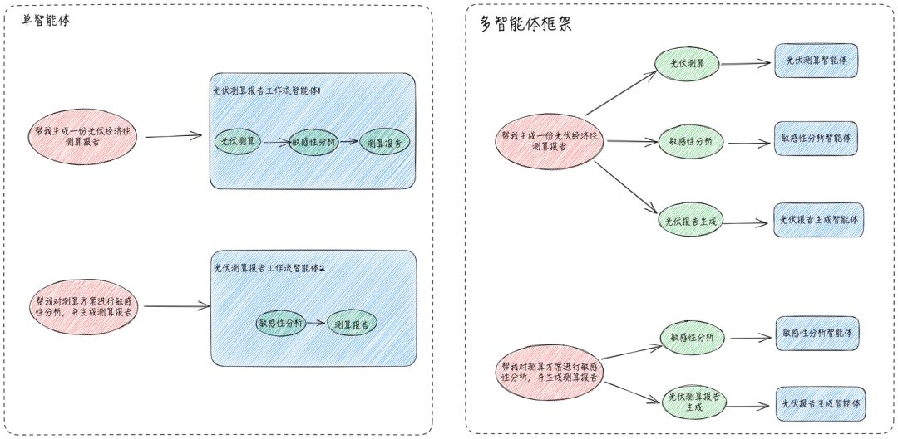
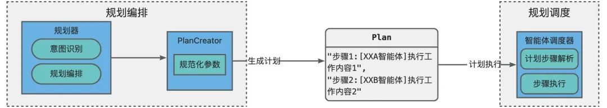
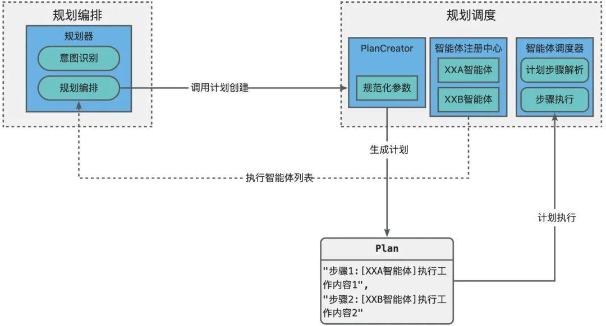
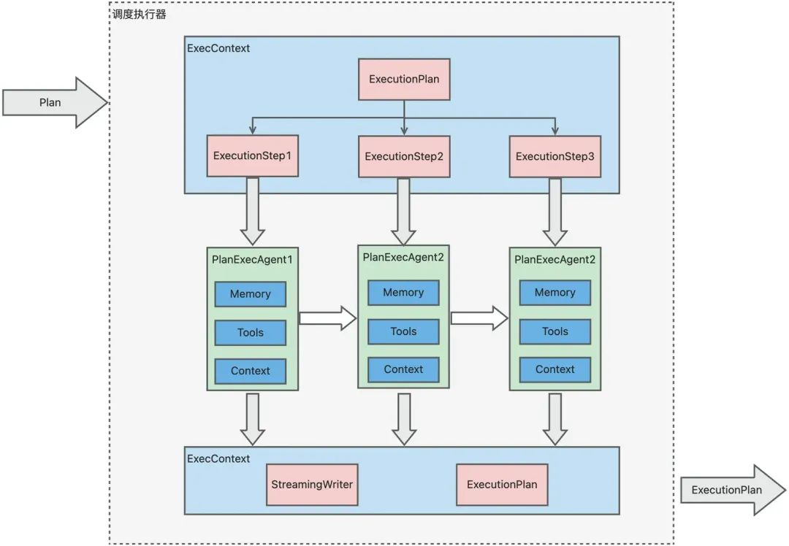
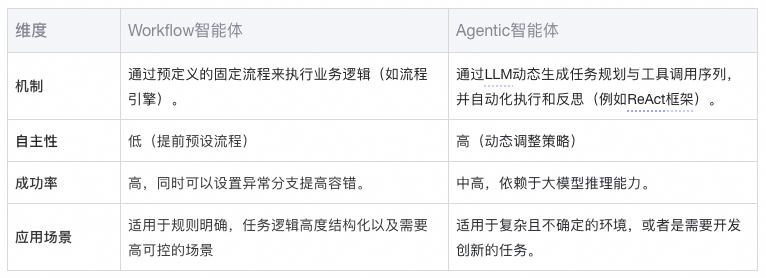

#  构建能源领域的AI专家：一个多智能体框架的实践与思考  
原创 鞘纨  阿里云开发者   2025-08-11 08:31  
  
  
  
阿里妹导读  
  
  
  
本文介绍了作者团队在能源领域构建多智能体（Multi-Agent）框架的实践经验。面对单智能体处理复杂任务时因“注意力发散”导致的效率低下问题，团队设计了一套集“规划-调度-执行-汇总”于一体的多智能体协作系统。  
#   
  
前言  
  
**项目介绍**  
  
近年来，随着Deepseek和Manus的快速发展，激发了大家对AI应用的研发热情，各种AI项目层出不穷，为我们生活增加了更多智能化能力。我们希望利用AIot可信产业团队在能源领域的专业知识，结合大模型AI，为我们客户提供24小时专业高效的能源领域专家，解决客户在综合能源领域的投前风控、设备运维以及售后运营等问题。  
  
在此背景下，我们基于多智能体框架，研发了集合各种能源专家的综合能源智能体平台。本文旨在介绍我们在多智能体框架实践过程中的一些经验，希望能给大家提供一点帮助。  
  
**为什么需要多智能体**  
  
根据业内经验，大模型在处理长提示词时，往往无法有效捕捉关键信息，导致推理结果不佳。这使得单智能体在处理复杂任务时效果不如处理简单任务，即使是类似ReAct的智能体也会出现步骤缺失或重复的问题，其中原因就在于大语言模型的“注意力发散”机制。为了解决长提示词带来的“注意力发散”，通常我们会通过将复杂任务分解为简单子任务，然后构建包含执行这些子任务节点的工作流智能体(Workflow Agent)来解决。然而在我们的业务场景下，单智能体的模式过于僵化，很难满足用户多变的任务需求，即使这个单智能体是工作流智能体。  
  
因此我们希望，能有这么一个多智能体框架，可以对用户输入的复杂任务拆分成不同的简单子任务并进行任务编排，然后将子任务作为最小执行单元交由不同类型的智能体处理，最后将处理结果汇总给到用户。举个我们业务中遇到的用例光伏测算报告生成  
来说，正常业务流程会进行：进行光伏经济性测算  
 -> 进行光伏测算的敏感性分析  
-> 生成光伏经济性测算报告  
。用户输入可能是“帮我生成一份光伏经济测算报告”，或者是“我已经有测算方案了，对已有的测算方案进行敏感性分析，并生成测算报告”，此时单智能体和多智能体处理流程如下：  
  
  
  
  
  
  
从上图可以看到，使用多智能体执行框架，既能够根据业务逻辑对复杂任务拆分，可以让智能体处理更加高效，同时通过合理的规划，多智能体协作可以灵活应对不同的客户诉求。  
  
多智能体执行框架  
  
本章将介绍我们如何去搭建这样一套多智能体框架。目前我们多智能体框架的整体调用流程图如下：  
  
  
  
  
  
  
我们将多智能体执行可以分为三个阶段：规划编排，调度执行和汇总输出，具体执行流程如下：  
  
1.[规划编排]：针对用户输入内容，  
规划器  
进行意图识别，并将复杂任务规划编排分解为不同的简单子任务，生成相应执行计划。  
  
2.[调度执行]：  
调度执行器  
解析  
规划器  
规划编排的执行计划，将子任务分发给到  
智能体注册中心  
中对应的  
智能体  
调度执行。  
  
3.[调度执行]：  
智能体通信总线  
负责不同智能体之间的相互通信，并获取智能体输出结果。在执行过程中，通信总线可以将智能体执行中间结果流式输出给前端卡片，提高用户体验。  
  
4.[调度执行]：  
智能体  
执行过程中，调度执行器会对任务执行状态进行监控，确保所有子任务顺利完成。  
  
5.[汇总输出]  
：  
总结器  
可以获取所有子任务的执行结果，并将结果汇总输出给到前端业务。  
  
以下是对执行过程中各个组件的介绍。  
  
**规划器Planner**  
  
在进行执行之前，首先需要对用户输入内容进行规划编排，这里有几个问题需要解决：  
- 如何准确识别客户意图？  
  
- 如何对用户复杂意图进行拆分规划？  
  
- 规划编排如何被有效执行？  
  
### 规划编排规范化  
  
这里我可能着重关注规划编排如何被有效执行问题，即如何规范化规划编排内容。我们知道多智能体执行逻辑主要在两个模块，负责规划编排的规划器和实际执行的多智能体调度执行器。规划器规划编排生成对应计划Plan  
，并交由调度执行器调度执行，二者之前交互如下图：  
  
  
  
  
  
  
然而在实践中我们发现，若将计划Plan  
的规范化放在规划编排阶段，会存在两个问题：  
- 由于缺少执行智能体信息，规划编排的Plan  
可能会将子任务关联不存在或过期的执行智能体，导致调度执行器无法分配子任务给到相应智能体。就像是甲方给乙方分配任务时，说“XXX这个任务你来完成”，结果XXX人家已经离职不干了，因此这里需要一个上下游沟通机制，乙方需要告诉甲方我有哪些资源才行。  
  
- 规划器无法“约束”自己的编排格式，或者是随着项目发展规划器新增了一些编排规则，导致生成的Plan  
调度执行器无法识别。就像是日常工作中规定使用中文沟通，结果甲方介绍需求时蹦出一些法语、西语、阿拉伯语词汇，乙方执行人自然无法理解。  
  
因此虽然调度执行器依赖于规划器规划编排产出的计划Plan  
进行规划调度，但为了调度执行器准确识别Plan  
内容，这里将Plan  
的规范交由调度执行器提供可能更为合适。  
  
  
  
  
  
  
这里调度执行器主要提供两个工具给到规划器：  
- 智能体列表查询工具：通过查询智能体注册中心获取当前可以执行的所有智能体列表信息，以便规划器进行规划。  
  
- 计划创建工具PlanCreator  
：规范化计划执行所需要的基本信息，主要是计划名称和计划执行步骤，其中计划执行步骤中包含了步骤序号、执行目标已经需要调度执行的智能体名称。  
  
**调度执行器Executor**  
  
在调度执行阶段，调度执行器将对计划（Plan）中的规划步骤进行解析，并构建执行有向无环图（DAG）。计划步骤作为执行DAG中的执行节点，被分配到对应的智能体执行。鉴于计划步骤之间可能存在依赖关系，调度执行器采用串行方式调用智能体执行这些规划步骤。在智能体执行之前，会根据计划步骤的内容以及当前计划的整体状态，构建当前步骤的智能体执行请求。执行完成后，智能体会更新计划步骤和计划的整体状态，并将执行结果输出到流式输出总线StreamingWriter  
。当所有计划步骤执行完毕后，调度执行器将输出执行计划ExecutionPlan  
。  
  
  
  
  
  
### 调度状态管理  
  
由于业务复杂性，规划器在进行规划编排时无法确保当前上下文信息是否满足任务执行需要。因此在具体执行到某一计划步骤时，可能会出现缺少必要信息导致步骤无法执行完成的情况下。这意味着在业务任务执行过程中可能存在与用户进行多次交互的场景。我们不能让用户每次交互后，将在计划任务从头到尾跑一遍，这会带来性能和token的巨大浪费。调度执行器需要支持在步骤执行缺少必要信息时，中断当前任务步骤，待用户补充信息后重新执行中断的调度计划。  
  
为了支持执行计划的中断和重跑，需要保证调度执行器执行和智能体执行时能否获取上次中断执行的上下文信息。智能体上下文信息管理主要利用了“聊天记忆”机制，在后续章节中具体介绍。这里主要介绍如何让调度执行器调度执行时有计划。  
  
调度执行器在解析规划编排计划时，会构建一个包含状态信息的执行计划(ExecutionPlan)，包括用户原始输入、步骤执行状态等信息。当需要中断时，调度执行器会将当前执行信息保存到ExecutionPlan中，待用户补充信息后，调度执行器会根据计划ID查询ExecutionPlan并加载执行上下文信息，根据上下文信息重跑执行计划。  
  
具体ExecutionPlan数据结构如下：  
  
```
{
  "planId": "计划ID",
  "userQuery": "用户输入内容"
  "steps": [{
    "seqNo": 0,
    "agentName": "智能体名称",
    "requirement": "步骤目标",
    "status": "步骤状态",
    "result": "执行结果"
  }],
  "context": {
    "当前执行内容key":"已识别的上下文信息"
  }
}
```  
  
- planId  
 是执行计划的唯一标识符。  
  
- userQuery  
 当前执行计划最新的用户输入内容。假如首次用户输入“帮我进行光伏测算”，此时userQuery  
为“帮我进行光伏测算”，由于缺少光伏测算参数调度中断，用户再次输入补充：“地点时杭州余杭区，进行工商业光伏测算”，此时userQuery  
为“地点时杭州余杭区，进行工商业光伏测算”。  
  
- steps  
 是一个包含所有执行步骤的数组，每个步骤包含以下字段：  
  
- seqNo  
 步骤执行序列号，而是在执行计划中步骤的唯一标识。  
  
- agentName  
 计划步骤对应的执行智能体名称，由规划器根据智能体列表规划编排得到。  
  
- requirement  
 该步骤中执行的操作内容和需求目标，由规划器规划编排得到。  
  
- status  
 是步骤的当前状态（例如：completed, in_progress, not_started，interrupted, failed）。  
  
- result  
 是步骤执行的结果，包括成功与否的信息以及相关数据。  
  
- context  
 执行计划的上下文内容，包含用户多次交互中已识别的执行信息，确保不会因为多次交互导致之前关键信息丢失。  
  
### 智能体通信  
  
根据上面计划步骤执行流程，我们知道不同步骤之间存在一定依赖关系，意味着当前执行智能体既需要知道上一步智能体的输出结果，同时也需要将自己的执行输出告知下一步执行智能体。因此这里需要定义一套智能体通信规范协议，确保兼容各执行智能体之间不同的业务逻辑输入输出，同时执行智能体依然保持独立解耦。  
  
在此之前我们也调研了其他开源框架的做法，例如  
Spring Alibaba  
的OpenManus  
框架，它的实现方式是将执行步骤之前所有的步骤执行结果汇总为字符串消息作为当前执行上下文输入给到执行智能体，由智能体的LLM去解析这个字符串消息提取本次执行所需信息。然而这种方式在我们实践中发现存在几个问题：  
  
1.信息失真问题  
：  
由于所有步骤的执行结果都被汇总成一个字符串，中间由经过了一道大模型信息提炼的错成，可能导致最终结果输出时出现关键信息丢失问题。  
  
2.结构化保持与额外token消耗  
：  
汇总后的字符串无法保持输出结果的结构化，这意味着智能体在解析时不得不重新识别和解析数据结构，这不仅增加了智能体的负担，还导致了额外的token消耗。  
  
3.上下文限制问题  
：  
大型语言模型在处理输入时存在上下文长度的限制。当输出结果过长，超过了模型的上下文窗口限制时，模型可能无法正确理解或处理这部分信息，从而影响执行效果。  
  
4.文件输出场景的适用性问题  
：  
对于需要输出文件（如光伏测算报告文件等）的场景，使字符串输出这种方式显得尤为不适用。  
  
基于上述问题，我们意识到需要探索更加高效、精确且适应多种数据形式的解决方案，以应对更为复杂的业务场景。我们保留了OpenManus  
框架的智能体通信方式，并且对其输出结果进行了结构化规范：  
  
```
{
  "recordId": "记录ID",
  "output": "智能体输出结果",
  "status": "智能体执行状态",
  "context": {
    //输出上下文
  }
}
```  
  
- output  
是执行智能体的输出结果，依然会汇总等计划当前执行步骤结果中。  
  
- recordId  
是执行记录ID。在需要输出文件或输出内容超过LLM prompt限制的场景下，可以通过工具调用将输出结果持久化，后续智能体执行时根据执行记录ID调用工具获取输出结果。  
  
- context  
为智能体输出的上下文信息。对于一些结构化信息，为了避免重复解析工作，可以将其放至context  
输出到下游执行智能体。  
  
这样，调度执行器在拿到  
智能体执行结果AgentExecResult  
后  
，会将AgenExecResult  
作为上下文输入给到下一步执行智能体，下游执行智能体根据协议解析，避免关键信息丢失以及解析重复开销。  
### 结果实时性  
  
如何确保流式输出不会因为步骤执行而中断？  
  
怎么确保流式输出结果有序？输出的结构化。  
  
工具调用时增加一些流式输出  
  
由于涉及LLM推理以及外部工具调用，因此智能体执行比较耗时，再加上目前调度执行器使用的串行方式调度计划步骤，导致一次计划执行的整体响应耗时可能达到几分钟。用户在输入后，需要几分钟才能看到结果，这在交互体验上无疑是灾难性的。  
  
排查了调度执行器调用联路，我们发现耗时主要还是集中在大模型调用上，而现在几乎所有的大模型调用是具备流式输出能力的，那么是否可以将调用执行器调用智能体时，整合智能体中所有的大模型输出流，实现类似下面效果的调度执行流式响应。  
  
  
  
这样虽然整体响应耗时长的问题依然不可避免，但用户可以实时地看到智能体思考过程以及输出结果，对客交互体验更为友好。同时采用流式输出方式，也可以避免大量数据一次性返回，减少IO压力。在和前端通信的场景下，不能只是简单大模型流式输出合并给到前端，我们还需要解决以下几个问题：  
  
1.流式输出的有序性  
。  
我们知道步骤的执行是有序的，在非流式场景下往往采用类似JSON的结构化输出，因此步骤执行结果自然有序。但在流式场景下，输出结果都是文本片段输出，如果出现像DAG并发执行，可能会出现文本片段乱序，导致前端客户端无法知道这是哪一个步骤的执行返回。  
  
2.结构化结果如何流式输出  
。  
对于步骤执行结果，前端页面通常需要结构化展示，因此即使后端结果流式返回，前端依然需要等待全部结果获取后才能进行结构化解析。  
  
为此我们在设计智能体通信总线时，在其中封装了写入流StreamingWriter  
，同时和前端定义一套DSL，流式输出时需要遵循这套DSL协议进行输出，具体DSL结构如下：  
  
```
{
  "index": "步骤序号",
  "content": "流式文本内容",
  "agentChatResponse": {
    "content": "流式提示信息",
    "intent": "结构数据类型",
    "data": {
      //结构化结果
    }
  }
}
```  
  
- index  
: 流式结果中新增下标字段，与执行步骤序号关联，确保输出结果有序。  
  
- content  
: 适合流式输出的文本信息，例如大模型思考过程，抑或是智能体执行过程中间信息。  
  
- agentChatResponse  
: 智能体步骤执行结果，这个往往是在步骤执行中断或执行完成时才会返回。其中包含：  
  
- content  
: 执行结果的流式输出信息。  
  
- intent  
: 执行结果的结构化数据类型，前端可以根据该字段选择对应结构化解析逻辑。  
  
- data  
: 结构化执行结果。  
  
  
  
  
  
除了上述操作，可能还会遇到工具不支持流式调用，同时步骤执行涉及到多个工具调用导致调用耗时增加的情况。此时我们也可以在工具调用的过程中增加一些调用信息，避免因为工具调用阻塞流式结果返回。  
  
**执行智能体**  
  
执行智能体就像是日常工作中的领域助手专家，主要负责解决规划编排拆解后的简单子任务。这里主要介绍下多智能体框架下，我们怎么去构建一个高效的业务执行智能体。  
### Workflow or Agentic  
  
Workflow和Agentic是目前构建智能体时，需要去考虑的两种模式。二者的定义和区别如下：  
  
  
  
可能有些人不把WorkFlow当作是智能体，认为其智能化程度比较低。诚然，通过AI自动解决问题是我们的最终目标。但我们在做工程化时，还是需要结合目前实际业务场景来看，而不是一味追求“fancy”的智能化。  
  
回归到实际业务上，我们需要的是能否帮助用户进行能源决策的专家助手，例如光伏经济性测算、敏感性分析或者是逆向寻优，而这些场景实际上已经有一套明确且可以结构化的业务逻辑，因此workflow智能体更适合作为业务执行的智能体。实际上，在项目探索阶段我们也尝试过ReAct智能体，然后实践下，无论是成功率、性能乃至最终效果都还是不如workflow智能体。下文中未特别说明的智能体均指workflow工作流智能体。  
### 智能体上下文  
  
在工作流智能体执行过程中，除了执行计划ExecutionPlan中的上下文信息，工作流各个执行结点也需要通信，以便在上游结点识别解析的关键信息能否传递给到下游结点。实际上，不仅仅是工作流智能体，ReAct模式的智能体也同样存在这个问题：有些工具调用的上下文信息不方便直接作为工具调用结果返回，但又可能是下游工具调用需要的信息，例如一些授权token类的信息。  
  
因此智能体内部，也需要有一个执行上下文管理机制。这里我们实现了基于内存的智能体上下文管理类，并且工具调用返回时，除了工具调用结果，同时也会返回工具调用的上下文信息。这样像是大模型调用结果或者是工具调用结果，我们可以放到智能体记忆中，而工具调用上下文信息则放到智能体内存上下文中，传递给到下游执行结点执行。  
### 多智能体记忆  
  
多智能体之间怎么确保记忆相互独立？  
  
记忆的持久化？  
  
为什么不共享记忆  
  
关于智能体记忆，我们上介绍智能体上下文或者是调度执行器的状态管理都有提到，因为在涉及这类上下文相关的机制中，记忆能力是个避免不了的话题。通过有效的记忆管理，可实现与大模型多轮对话的效果。  
  
我们将智能体记忆分为两个模块，一个是作为大模型调用切点的MemoryAdvisor  
,主要负责智能体调用大模型的记忆能力增强。还有一个模块是AgentChatMemory  
,主要负责智能体调用记忆的管理。  
  
在一次实际调用过程中，二者在其中的角色和作用如下：  
- 在调用前，MemoryAdvisor  
将当前用户输入prompt  
中的UserMessage  
插入AgentChatMemory  
，之后查询AgentChatMemory  
中的前N条记忆，构建最终调用的prompt  
给到大模型调用。  
  
- 在调用后，MemoryAdvisor  
会将大模型返回结果作为AssistanMessage  
插入AgentChatMemory  
作为最新记忆保存。  
  
具体调用流程图如下所示：  
  
  
  
  
  
  
通常在设计智能体记忆时，我们往往只关注记忆在用户和会话维度上的隔离。然而在实现多智能体框架下的智能体记忆时，我们使用{agentName}_{userId}_{converstaionId}  
的规则作为记忆检索和存储key，确保了即使在同一个用户的同一会话下，不同智能体的记忆也可以相互独立。这是因为不同智能体之间业务逻辑相差很大，如果不同智能体之间存在记忆共享，就会想我们日常处理工作这样出现记忆混乱。此外，由于记忆管理通常有Message  
数量限制，多智能体共享记忆的话也会导致智能体记忆的效果不佳。  
  
除了执行智能体拥有自己独有记忆外，我们也在避免记忆检索key直接与执行计划planId挂钩。这样当用户多轮对话涉及到跨执行计划场景时，例如“其他参数不变，将地址更换到上海市后重新进行测算”，执行智能体也可以正确理解客户意图并执行。虽然不同执行计划的记忆相互独立，看起来可以提高智能体执行的专注度，但出于功能完备性角度我们还是放弃了执行计划记忆隔离。  
  
需要注意的是，由于SystemMessage  
对大模型而言，具有限定本轮对话角色限制的其特殊作用。因此在和大模型交互时，一次对话最好确保只会存在一个SystemMessage  
。我们在实现AgentChatMemory  
的检索和新增记忆消息时，可以对历史消息列表做检查，过滤掉可能存在的历史SystemMessage  
消息，避免额外的SystemMessage  
消息被组装到大模型对话中。  
### 自主控制的工具调用  
  
对于执行智能体而言，通过大模型FunctionCall能力进行工具调用决策是一个普遍的需求。在我们业务中，就有通过大模型服务决策调用光伏测算工具以及测算报告生成工具等场景。虽然很多大模型框架已经集成了大模型FunctionCall以及自动执行工具调用的能力，然而出于工具调用安全以及流程控制(例如ReAct框架)考虑，我们还是希望自主控制工具调用与否。  
  
1.首先，如果我们只用了一些大模型框架，需要手动关闭工具自动调用。这些框架一般都有关闭入口，以Spring AI为例：  
  
```
ChatOptions chatOptions = ToolCallingChatOptions.builder()
    .toolCallbacks(...)//调用工具列表
    .internalToolExecutionEnabled(false) //关闭工具自动执行
    .build();
```  
  
  
2.人工解析大模型FunctionCall返回结果，如果是兼容OpenAI  
的协议，这部分信息通常在返回结果的toolCalls中，包括需要调用的函数名以及入参信息。我们可以根据这些信息进行工具调用。  
  
3.在工具调用结束后，我们需要根据调用结果手动构建工具调用消息ToolResponseMessage  
，并将其保存到记忆中，以便多轮对话场景下大模型的识别回复。需要注意的是，大模型FunctionCall返回的AssistanMessage  
消息与工具调用ToolResponseMessage  
消息中的toolCalls信息存在关联，因此人工构建的toolCalls按照以下规则构建，否则可能导致后续大模型调用异常，以OpenAI  
协议为例：  
- tool_call_id  
为工具调用唯一ID，AssistanMessage  
与ToolResponseMessage  
消息中的tool_call_id  
必须要保持一一对应。  
  
- ToolResponseMessage  
中的role需要为tool  
。  
  
- ToolResponseMessage  
中的content  
为工具执行结果。  
  
**总结器Finalizer**  
  
在调用执行器执行计划完成后，在输出阶段总结器Finalizer对执行计划结果进行汇总输出给到用户。智能体执行的一些后置操作也可以放在总结器中，例如资源释放以及中间过程信息和执行计划状态的持久化工作。  
  
总结  
  
**个人思考**  
  
在这次多智能体框架搭建过程中，个人的一些心得体会：  
- 对智能体搭建而言，尽量减少对大模型的依赖，往往越简单的设计越高效  
。  
越简单的设计不仅能够减少开发和维护的复杂度，降低出错的风险，还能显著提升智能体的响应速度和性能表现。一开始，我们也尝试依赖于大模型来做一些业务逻辑的决策，然后事实证明，如果你本身已经拥有了经过行业证明的明确流程，实在没必要本末倒置，使用大模型再去进行流程决策。  
  
- 尽量将智能体执行过程透明化  
。  
在整个多智能体执行过程中，多采用日志打印方式输出执行过程信息，尤其是步骤执行前后的执行计划状态，智能体每一轮调用前后上下文，大模型思考过程和结果输出以及工具调用出入参等关键信息，这有助于执行问题排查以及智能体优化工作。  
  
- 不要只是去使用框架，多去了解框架底层的细节  
。  
我们项目使用了Java Spring技术栈，而spring ai封装了ChatModel  
、ChatClient  
等大模型调用相关组件，避免了很多重复开发工作，因此在我们项目中得到广泛使用。这也让我们踩了不少坑，除了之前说的工具调用消息构造问题，还遇到spring ai流式调用时记忆为空，以及使用OpenAIChatModel  
与Qwen3模型的使用兼容等等问题。有些问题如果你不深入到框架代码细节，往往会解决问题时会比较茫然。作为一个技术人，当你多去了解一些开源项目的底层代码，这对个人的架构设计也很有帮忙。  
  
**一些可优化点**  
- 工作流编排框架  
。  
目前我们智能体开发时，工作流结点编排逻辑还是硬编码在代码中，我们希望能进一步将工作流编排逻辑沉淀到更底层的框架中，使得执行智能体开发人员可以更专注于其业务逻辑开发工作，提高智能体研发效率。在Java Spring生态中，也有像是  
embabel  
这样的开源项目，里面有些关于workflow智能体抽象也值得去调研学习。  
  
- 基于DAG图的规划调度  
。  
就像是LangChain  
到LangGraph  
的升级一样，我们也希望能够将目前串行执行的链式调度升级成并发执行的基于有向无环图调度。当然从项目工程的角度而言，这个优化项优先级其实不高，因为在目前性能效率未遇到瓶颈的情况下，引入并发执行也会带来更高复杂度和不稳定性。  
  
- 基于记忆召回的长期记忆  
。  
由于prompt  
长度限制，多轮记忆设置了召回最大数。如果我们希望对话关联历史记忆超过了最大召回轮数，此时可以考虑向量化记忆方式进行存储和召回，并将召回的记忆消息注入到SystemMessage  
中，为大模型调用提供更多上下文信息。  
  
参考文献：  
  
1.大模型中的注意力机制：原理、应用与变体：  
https://zhuanlan.zhihu.com/p/1890707372265173007  
  
2.Building effective agents：  
https://www.anthropic.com/engineering/building-effective-agents  
  
****  
**快速部署 Dify，高效搭建 AI 应用**  
  
  
Dify 让您无需编程即可快速构建 AI 应用。然而，本地私有化部署往往维护成本高且可靠性不足。本方案介绍如何在阿里云构建云原生高可用架构，实现 Dify 的快速部署，助力企业高效搭建 AI 应用。  
  
  
点击阅读原文查看详情。  
  
  
  
  
