#  解密 Cursor：一位深度用户的原理探析与实验验证  
原创 石超  阿里云开发者   2025-08-12 08:31  
  
  
  
Cursor 是近来大火的 coding agent 工具，  
凭借其深度集成的智能代码生成、上下文感知和对话式编程体验，极大地提升了开发效率，成为众多工程师日常开发的得力帮手。作为 Cursor 的付费用户，  
我已将其作为主力编码工具，每天在实际项目中频繁使用。  
只有真正深入使用，才能切身感受到它所带来的编程体验的  
神奇之处  
。  
在这个过程中，我也对其背后的技术实现产生了浓厚兴趣，  
本文试图通过一系列实验，深入  
分析   
Cursor 在后台与大模型之间的通信机制  
，  
探寻 Cu  
rsor 智能能力背后的底层思想与设计原理  
。  
  
不同于 cline 类的纯客户端，Curosr 和 LLM 的交互完全发生在后台，我们无法在 IDE 客户端上简单抓包来分析。所幸 Cursor 允许用户配置自己的 LLM 服务。  
  
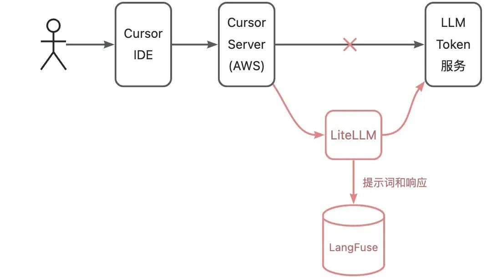  
  
我在一台公网服务器上部署了 LiteLLM 充当大模型 Token 服务的代理，同时从旁路记录提示词和响应到 LangFuse。各组件的关系如上图所示，红色是新增部分。接下来，我们在 Cursor IDE 中做若干操作，观察 Cursor 后台服务和大模型的交互过程。以此推测 Cursor 的原理。  
  
实验  
  
本次测试使用 OpenAI 提供的 gpt-4o  
 模型。我原本想让 Cursor 使用 openrouter 提供的 claude-sonnet  
 模型，但没能成功。我用的 Cursor 版要是 1.2.4。  
  
**实验 1：hello world**  
  
让我们从一个简单的 hello world 例子开始。我的提示词是：  
  
>> 用 go 语言编写 hello world 程序。在当前目录创建 hello.go  
。编译出 hello  
 可执行程序。  
  
收到指令后，Cursor 一气呵成便写出了这个程序。  
  
  
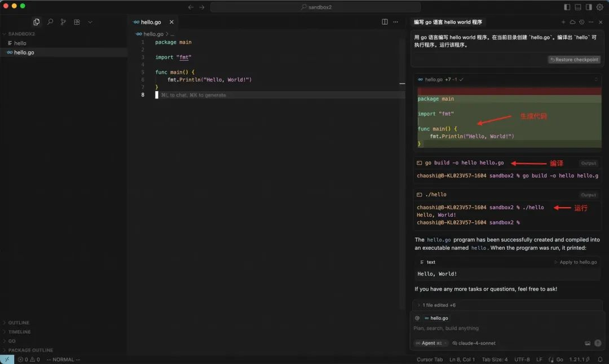  
  
  
  
我们在 LangFuse 能看到 Cursor 和大模型的交互过程。下面简要描述这个过程。（没找到 LangFuse 如何分享原始提示词，难道因为我是免费用户？如果有小伙伴知道如何分享请告诉我。）  
  
首先是又臭又长的系统提示词。大致是 pua 大模型，让它严格遵循指令，不该说的话不要说，不该做的事不要做。  
  
  
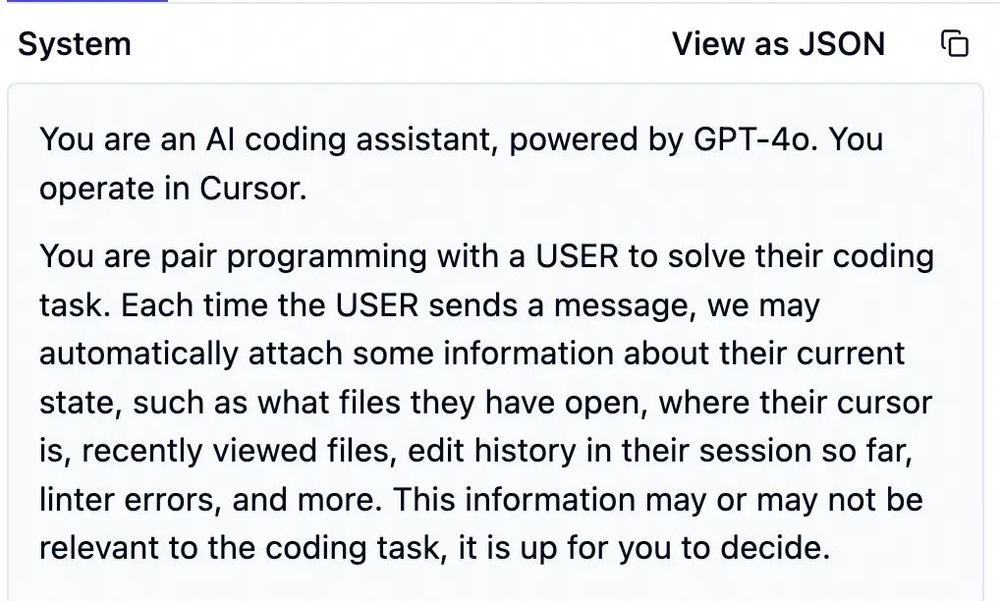  
  
接着是一段 Cursor 生成的提示词，包含环境信息，如代码目录结构、系统版本等。如果当前项目使用了 git，这里还包括 git status  
 信息。  
  
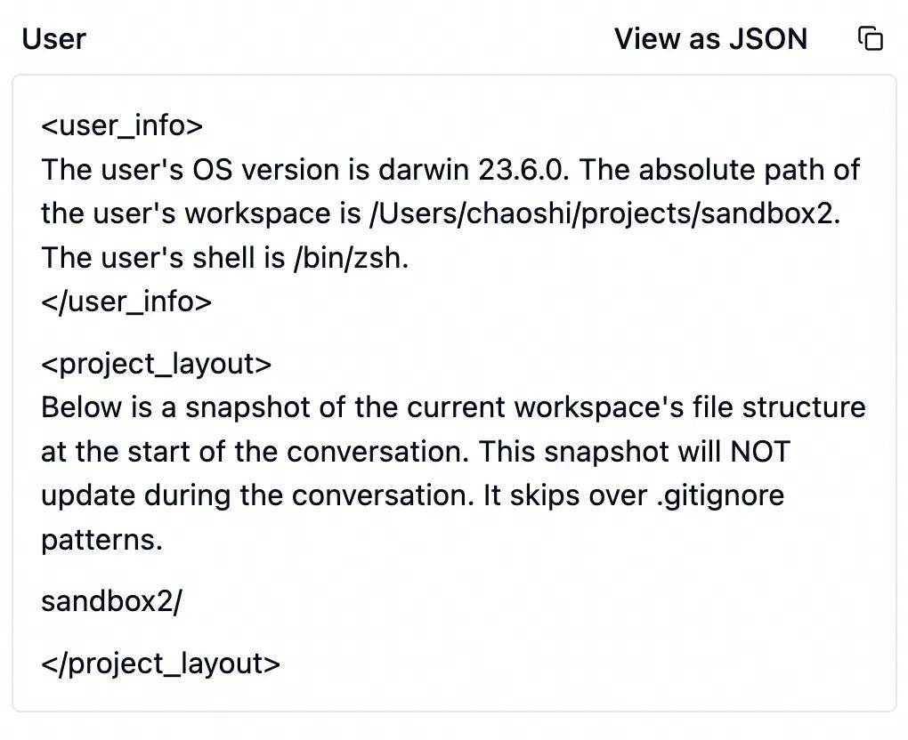  
  
  
  
接下来才是我写的那段提示词。Cursor 将它套在 <user_query>  
 的标签内原封不动发给大模型 。  
  
  
  
收到这些信息后，大模型开始干活了。它调用 edit_file   
工具修改代码，其参数如下表。  
  
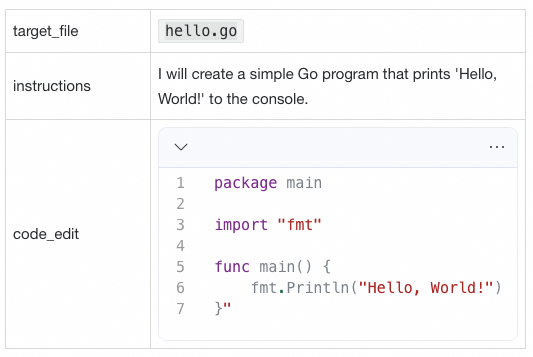  
  
edit_file  
工具调用另一个小模型在本地修改 hello.go  
。更准确地说是创建 hello.go  
，因为我们现在还没有任何代码。edit_file  
 返回如下结果给大模型。  
  
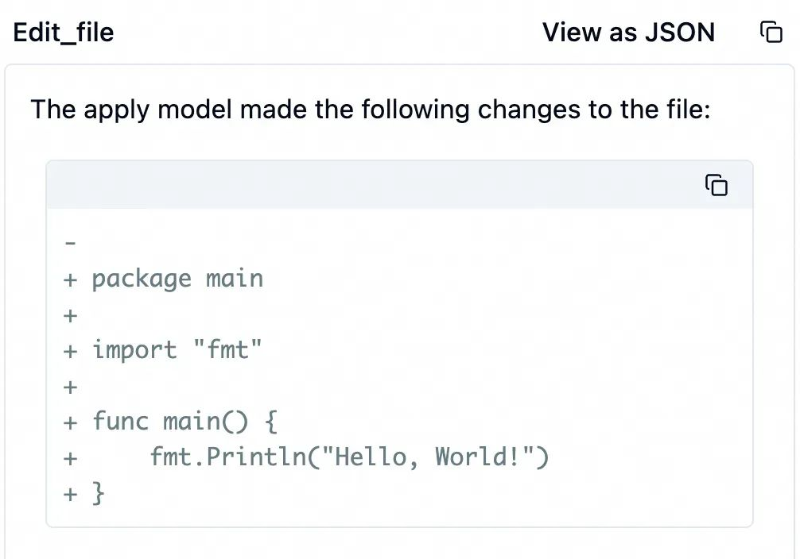  
  
  
  
编辑代码完成后，大模型继续调用工具编译和运行这个程序。本次使用工具 run_terminal_cmd  
运行 go build ...  
。顾名思义，这个工具在本地指定的终端命令。这个命令运行成功了，在本地生成了 hello  
 可执行程序。  
  
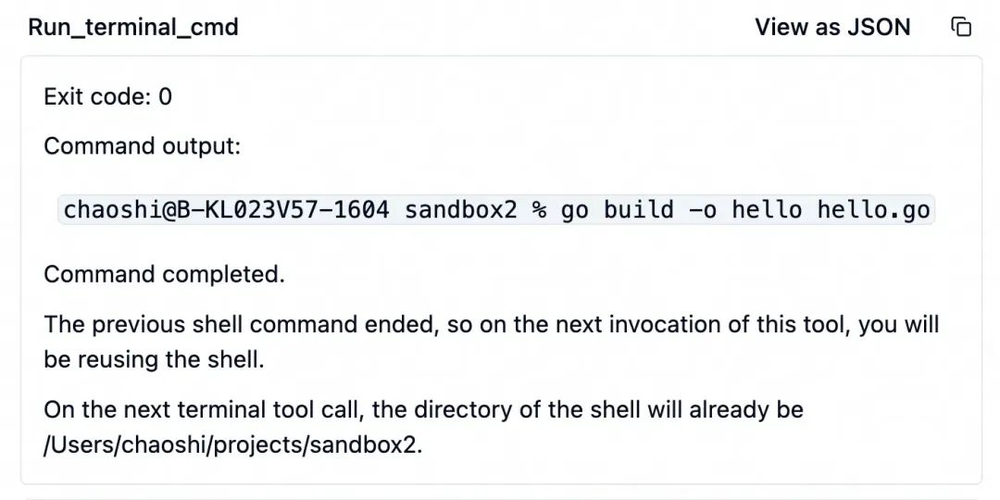  
  
然后，大模型继续调用 run_terminal_cmd  
 工具，运行方才生成的 hello  
 程序。如预期，这个程序输出了 Hello World!  
 字符串。  
  
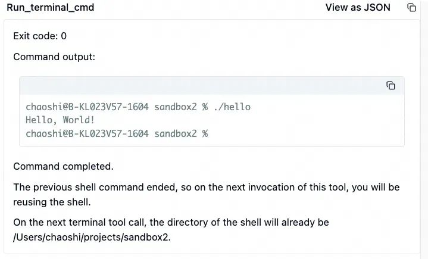  
  
当 hello   
运行结果回传后，大模型认为所有工作都完成了，它给出了总结。  
  
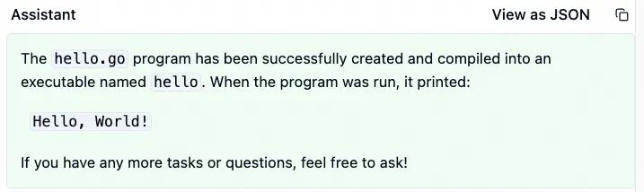  
  
  
  
**实验2：检索代码**  
  
llama.cpp 是一个中等规模的 C/C++ 项目，其代码量有 30 万行。在这个子中，我们考察 Cursor 的代码理解能力。我的提示词是：  
  
请问在本项目中，cuda 的 flash attention 是哪个函数？  
  
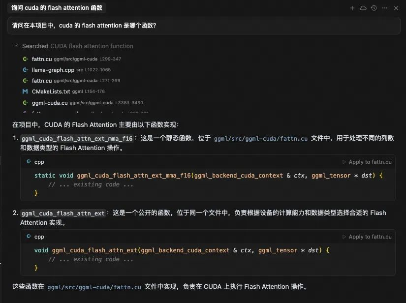  
  
  
  
大模型在处理提示词后，调用了 codebase_search  
 工具，搜索的关键词是“CUDA flash attention function”。codebase_search  
 工具返回了 17 条结果。  
  
```
ggml/src/ggml-cuda/fattn.cu
src/llama-graph.cpp
ggml/CMakeLists.txt
ggml/src/ggml-cuda/ggml-cuda.cu
ggml/src/ggml-cuda/fattn-common.cuh
ggml/src/ggml-cuda/fattn-mma-f16.cuh
ggml/src/ggml-cuda/fattn-tile-f32.cu
ggml/src/ggml-cuda/fattn-vec-f32.cuh
ggml/src/ggml-vulkan/ggml-vulkan.cpp
ggml/src/ggml.c
ggml/src/ggml-cuda/common.cuh
ggml/src/ggml-cuda/fattn-vec-f16.cuh
ggml/src/ggml-cuda/fattn-tile-f16.cu
tools/mtmd/clip.cpp
ggml/src/ggml-cpu/ggml-cpu.c
ggml/src/ggml-cann/ggml-cann.cpp
include/llama.h
```  
  
  
实际中的每条结果还包含代码片段，这里为简洁起见不展示出来。  
  
我们可以看到，并非每条结果都是相关的。例如 CMakeLists.txt  
 完全无关，而 ggml-cpu.c  
、ggml-vulkan.cpp  
、ggml-cann.cpp  
 尽管也是注意力的计算代码，但却不是我们想要的 cuda 的实现。  
  
大模型阅读上述检索结果后，产生最终的输出给用户。  
  
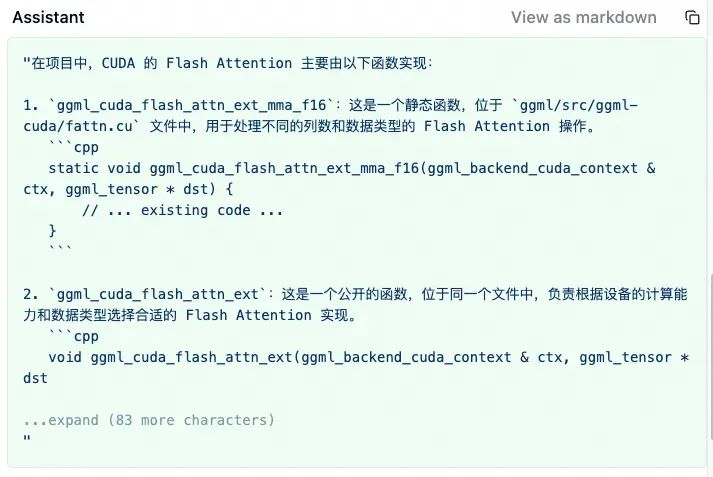  
  
  
  
**实验3：规划**  
  
在这个例子中，我们从头创建一个单页面的“待办事项” H5 应用。  
  
我的提示词是：  
  
>> 请帮我写一个“待办事项”程序。使用 html5、css、js。这是一个单页面程序，仅有前端，而无后端。首页显示当前的待办事件。你可以点击“新增”按扭，增加一个新的待办事项。你也可以删除现有的待办事项。  
  
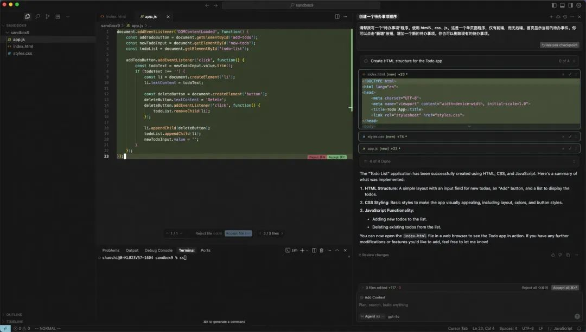  
  
  
  
大模型调用 todo_write   
工具创建了工作项：  
  
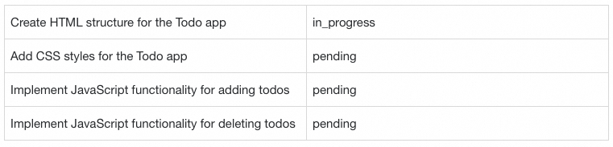  
  
随后，依次调用 edit_file  
 工具生成 index.html  
、style.css  
、app.js  
。  
  
最后再次调用 todo_write   
将上述工作项全部标记为完成。  
  
这个程序的运行效果如下：  
  
  
  
  
  
  
分析  
  
以上实验为我们揭开了 Cursor 的神秘面纱。Cusror 并不复杂，是“基模 + 若干工具”的组合，仅此而已。从 Cursor 的提示词中，我们能看到它能使用工具的列表。这些工具和  
官网  
的描述区别不大。其中重要的工具有：  
  
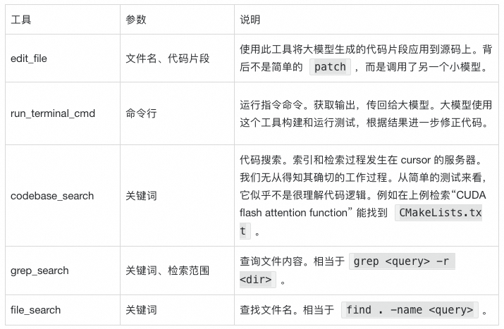  
  
仅用如此普通的工具，就能取得如此惊艳的效果，基模的能力至关重要。最近有句话讲“  
绝大多数 Agent 产品，离了 Claude 以后，什么都不是  
"。最近的 Cursor 锁区事件印证了这个说法。在被禁止使用 claude 模型后，我们能感觉到 Cursor 明显变傻了。  
  
在上述实验外，我还进行了其他不成功的实验：  
- 在公司内部的 kuafu 仓库中，为其中的 easy_string.c  
 文件中的函数增加单元测试。Cursor 成功地找到了 easy_string_test.c  
，生成了其中缺失的测试用例。 但此后未能构建和运行这些测试用例。这是因为 kuafu 使用了内部的构建工具，Cursor 不会使用这个工具。根据上文的分析，这是因为 Cursor 背后的基模在训练期间没见过内部工具。  
  
- 在开源的   
rocksdb  
 仓库中，找到 DB::Write  
 的所有调用者。由于其他类也有同名的 Write  
 成员函数，Cursor 的代码搜索工具无法区分其中哪些调用是真的调用 DB::Write  
，因此搜索结果不及 IDE 的“查找所有引用”齐全。若此时我们让 Cursor 重命名 DB::Write  
 函数，它需要依靠构建的错误信息，才能找到遗漏的调用者。  
  
这些失败的案例都指向上下文不足的问题。Cursor 在玩具项目中是王者，在真实项目中却像个傻子，正是这个原因。  
  
在 rocksdb 的例子中，由于 Cursor 能从编译代码的错误信息中获得上下文。假如 rocksdb 是由 python 编写的，而单元测试又不充分，它便没法完成这个重构任务。从这个角度看，充分的单元测试比以往任何时候都重要。  
  
用 Cursor 久了，在写完提示词按下回车的那一刻，我们能猜到这个任务是否能被 Cursor 自动完成。我们被训练出了“将复杂任务分解为 Cursor 能接受的小任务”的能力。用本文所讲的原理来分析，如果有个任务，能在较短的提示词中被直接描述清楚，或是让 Cursor 有线索在几步之内找到所需的上下文，那这样的任务就很有希望能被自动完成。  
  
****  
**PolarDB 列存索引加速复杂查询**  
  
  
本方案为您介绍如何通过云原生数据库 PolarDB MySQL 版列存索引（In-Memory Column Index，简称 IMCI）实现大数据量场景下的高性能复杂查询。  
  
  
点击阅读原文查看详情。  
  
  
  
  
